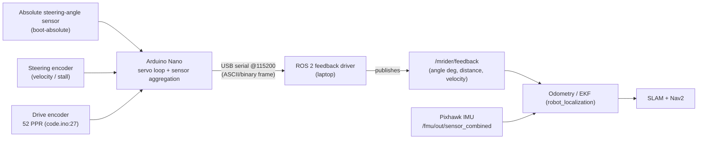
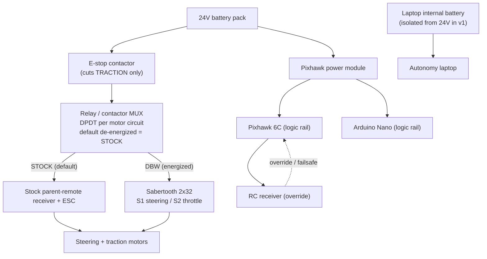

# MRider System Architecture

MRider ("MITT" — Michigan Intelligent Transportation Tech) converts a kids' ride-on
electric vehicle into a drive-by-wire (DBW), self-driving-ready research and education
platform. This document defines the **system architecture**: the command path from the
autonomy laptop down to the motors, the feedback path back up, the power tree, the
safety/authority chain, and the timing contract that binds them together.

It is the top of the design-document tree. Subsystem detail lives in the sibling
documents, cross-linked throughout:
[`dbw.md`](dbw.md) (drive-by-wire core),
[`safety.md`](safety.md) (failsafe matrix, authority arbitration),
[`vehicle.md`](vehicle.md) (chassis selection),
[`sensors.md`](sensors.md) (camera/LiDAR/IMU/GNSS),
[`calibration.md`](calibration.md) (zeroing and extrinsics),
[`software.md`](software.md) (ROS 2 stack),
[`bom.md`](bom.md) (bill of materials).

**Audience:** researchers reproducing the platform and students learning autonomous-vehicle
engineering. Where a design choice is made, it is recorded as a short ADR
(Decision / Alternatives / Rationale).

---

## 1. Design provenance and reuse posture

MRider is the 4th generation of the author's platform line:
AVCS Kit (IEEE AFRICON 2017) → Ridon Vehicle (Energies 2021) → OSCAR/thesis platform
(2022) → **B-MROVER** (`jrkwon/mrover`, ROS 2 Humble). The governing principle is
**reuse before invent**: the validated B-MROVER PX4 + ROS 2 recipe is the default, and new
design is introduced only where the new vehicle or a demonstrated gap demands it.

The one genuinely new control problem is the **closed-loop steering-angle servo**. PX4
supplies EKF/IMU fusion, RC override, failsafe logic, and (optionally) GNSS/RTK — it does
**not** supply a steering position loop. MRider assigns that loop to the Arduino Nano as a
local "smart servo" (ADR-E in [`dbw.md`](dbw.md)), which is the principal architectural
departure from verbatim B-MROVER reuse.

All B-MROVER claims below were verified against the local checkout at
`/mnt/data/projects/mrover`; concrete file paths are cited inline.

---

## 2. Component inventory

| # | Component | Role in MRider | B-MROVER lineage |
|---|-----------|----------------|------------------|
| 1 | **Autonomy laptop** | On-board computer. Runs ROS 2 Humble: perception, SLAM, Nav2, EKF, the Micro-XRCE-DDS agent, and the feedback driver. Master of the USB feedback link. Powered by its own internal battery (no 24V→19V rail in v1). | Same on-board-laptop topology as B-MROVER. |
| 2 | **Pixhawk 6C (PX4)** | Flight-controller-as-rover-controller. Receives `MANUAL_CONTROL` over MAVLink, runs the rover mode, emits steering as **servo-PWM** and throttle as **motor-PWM**, hosts the IMU used by the EKF, arbitrates **RC override** and failsafes. | Same FC + PX4 rover recipe (`dev_ws/src/mrover/mrover/mavlink_bridge.py`). |
| 3 | **Sabertooth 2x32** | Dual-channel motor driver. **S1** drives the steering gearmotor (from the Nano); **S2** drives the paralleled rear traction motors (from PX4). Configured in **independent R/C (PWM) mode** so the two channels have independent masters with no shared serial bus. | B-MROVER uses the Sabertooth 2x32 for steering + throttle DC motors. |
| 4 | **Arduino Nano** | **Smart-servo controller** + sensor reader. Reads the servo-PWM steering setpoint from PX4, reads the absolute steering-angle sensor and the motor encoders, closes the steering **position loop locally at ≥100 Hz**, and drives Sabertooth S1. Streams all feedback to the laptop over **USB serial @115200**. | B-MROVER Nano is a *passive* encoder reader (I2C slave `0x02` / USB 115200, `code/code.ino`). MRider promotes it to an active controller. |
| 5 | **Relay/contactor MUX** | Authority arbitration. A DPDT relay per motor circuit selects **STOCK** vs **DBW** source. Default (de-energized) = STOCK, so a power loss reverts to the parent remote. | New (B-MROVER has no stock-remote coexistence requirement). See [`safety.md`](safety.md). |
| 6 | **RC transmitter + receiver** | Live manual override in DBW mode. RX binds to the Pixhawk; PX4 handles RC override + RC-loss failsafe. This is the *live* human override; the relay MUX is *reversibility*, not live dual authority. | Standard PX4 RC override. |
| 7 | **Absolute steering-angle sensor** | Boot-absolute steering column angle (pot vs magnetic — ADR in [`dbw.md`](dbw.md)). Read by the Nano; enables a closed position loop and mapping-grade odometry with no homing. | New — fixes the B-MROVER weakness of incremental-only steering. |
| 8 | **Motor encoders** | Incremental encoder on the drive-motor shaft (52 PPR, `code/code.ino:27`) for distance/velocity; incremental encoder on the steering path for velocity/stall detection. | B-MROVER `code/code.ino` (throttle encoder 52 PPR + steering encoder). |
| 9 | **Sensors** | Minimum set: one front camera + one 2D LiDAR; Pixhawk internal IMU; optional GNSS/RTK. Detailed in [`sensors.md`](sensors.md). | B-MROVER camera + YDLidar + PX4 IMU. |
| 10 | **24V battery pack** | Traction + logic source. Feeds the Sabertooth (traction) and, via the Pixhawk power module, the FC/servo logic. Laptop is **not** on this rail in v1. | Same 24V class. |

---

## 3. Command path (laptop → motors)

The autonomy stack produces a normalized steering + throttle command. Steering rides the
`MANUAL_CONTROL.roll` channel and throttle rides `MANUAL_CONTROL.throttle`, exactly as in
B-MROVER — verified in `mavlink_bridge.py:120-126`, where `msg.roll` is documented
"*for ROVER is STEERING/SERVO*" and `msg.throttle` "*for ROVER is FORWARD/THROTTLE*".
PX4 then emits steering as a **servo-PWM** output that the Nano consumes like a hobby servo,
and throttle as a **motor-PWM** output straight to Sabertooth S2.

**There is exactly one steering-command datapath.** There is *no* direct laptop→Nano
steering setpoint; the Nano only ever sees the PX4 servo-PWM. RC override therefore covers
steering *through PX4*. This single-path rule is the pinned ADR-E datapath in
[`dbw.md`](dbw.md) and a hard acceptance gate.

```mermaid
flowchart LR
    subgraph LAPTOP["Autonomy laptop — ROS 2 Humble"]
        AUT["Perception / SLAM / Nav2<br/>behavior-cloning policy"]
        CMD["/mrider/cmd<br/>(steer, throttle)"]
        MC["ManualControlSetpoint<br/>/fmu/in/manual_control_setpoint"]
        AGENT["Micro-XRCE-DDS agent"]
        AUT --> CMD --> MC --> AGENT
    end

    AGENT -- "XRCE-DDS / USB" --> PX["Pixhawk 6C (PX4 rover)"]
    PX -- "MAVLink MANUAL_CONTROL<br/>roll = STEER, throttle = THROTTLE<br/>(mavlink_bridge.py:120-126)" --> PXOUT["PX4 output mixer"]

    PXOUT -- "servo-PWM<br/>(steering angle setpoint)" --> NANO["Arduino Nano<br/>smart-servo loop >=100 Hz"]
    PXOUT -- "motor-PWM (throttle)" --> S2["Sabertooth S2"]

    NANO -- "steering effort (PWM)" --> S1["Sabertooth S1"]
    S1 --> STEERM["Steering gearmotor"]
    S2 --> DRIVEM["Rear traction motors (paralleled)"]

    RC["RC transmitter"] -. "override / failsafe<br/>via RX bound to Pixhawk" .-> PX
```

**Key command-path facts** (detailed contract in [`dbw.md`](dbw.md)):

- Upstream channel: `ManualControlSetpoint` on `/fmu/in/manual_control_setpoint`
  (`mavlink_bridge.py:79-82`); `roll` = steering, `throttle` = throttle
  (`mavlink_bridge.py:122-123`).
- Steering setpoint reaches the Nano **only** as PX4 servo-PWM — the fast servo loop stays
  off the laptop ↔ XRCE ↔ MAVLink chain.
- Sabertooth in **independent R/C (PWM) mode**: S1 master = Nano, S2 master = PX4. Two
  independent PWM inputs, no shared serial bus, no channel-arbitration conflict.

---

## 4. Feedback path (sensors → ROS 2)

MRider **reroutes feedback off MAVLink**. In B-MROVER, encoder feedback arrives as a MAVLink
`WHEEL_DISTANCE` message and is unpacked in `wheel_distance_callback_mavlink`
(`mavlink_bridge.py:231-260`), which maps the raw count to ±22.5° and republishes a
`Control` message on the `/rover` topic (`mavlink_bridge.py:76`). MRider **replaces** that
path: the Nano — which already holds the encoders and the absolute angle sensor — streams
feedback directly to the laptop over **USB serial @115200**, where a ROS 2 driver publishes
`/mrider/feedback`. This is classified **ADAPTED/REPLACED** (not reuse) in the
[`software.md`](software.md) lineage table.

Rationale: the Nano is the natural aggregation point once it owns the servo loop, and a
direct USB link removes a MAVLink round-trip from the odometry path, lowering latency and
decoupling feedback rate from the FC telemetry budget.

**Key feedback-path facts:**

- Transport: Nano → **USB serial 115200** (primary). I2C slave mode (`0x02`) is retained in
  firmware as an option for a future companion-computer topology (`code/code.ino`), but the
  laptop is the master in v1.
- MRider publishes `/mrider/feedback`; lineage traces to B-MROVER
  `mrover_control/msg/Control.msg` (fields `timestamp, throttle, steer, steer_angle`) — see
  [`software.md`](software.md).
- The B-MROVER `WHEEL_DISTANCE` → `/rover` path (`mavlink_bridge.py:231-260`) is **not**
  reused as-is; it is the reference for the mapping math (count → ±22.5°) only.

---

## 5. Power tree and safety/authority chain

Power and authority are one diagram because the **relay MUX and E-stop sit on the traction
rail**: the MUX chooses who commands the motors, and the E-stop cuts their power. The full
per-rail current analysis, brownout isolation, and FMEA live in [`safety.md`](safety.md);
this is the block-level view.

**Authority arbitration (safety-critical).** The stock parent-remote receiver and the
Sabertooth must never drive the motors simultaneously. The DPDT relay MUX selects one source
per motor circuit; **de-energized default = STOCK**, so any loss of DBW power reverts to the
parent remote. The *live* manual override in DBW mode is the **RC transmitter bound to the
Pixhawk** (standard PX4 RC override + failsafe) — "parent-remote fallback" is reversibility
via the relay, not live dual authority.

**E-stop semantics.** The E-stop cuts **traction power only**. The steering column is
non-self-centering, so which rail the steering motor sits on determines freewheel-vs-hold on
power loss — that assignment is specified explicitly in [`safety.md`](safety.md). Traction-cut
plus freewheel steering is acceptable at ≤ walking speed during bring-up; the bring-up
protocol (wheels-off bench test first) is in [`safety.md`](safety.md).

**Power isolation.** The laptop runs on its own internal battery (no 24V→19V conversion in
v1). Logic rails (Pixhawk, Nano) are isolated from traction sag through the Pixhawk power
module so motor brownout cannot reset the controllers — quantified in the
[`safety.md`](safety.md) per-rail table.

---

## 6. Timing / heartbeat contract

Every control link has a rate and a loss behavior. These are the system-level numbers; the
numeric interface contract (normalization, serial fields, encoder PPR) is pinned in
[`dbw.md`](dbw.md).

### 6.1 Rates and timeouts

| Link / loop | Direction | Nominal rate | Timeout / failsafe | Owner |
|-------------|-----------|--------------|--------------------|-------|
| Setpoint stream (`MANUAL_CONTROL`) | laptop → PX4 | **≥ 10 Hz** | PX4 offboard/RC-loss failsafe on timeout → hold/disarm | PX4 |
| Steering servo loop | Nano-local | **≥ 100 Hz** | on servo-PWM loss, hold last / center per config | Arduino Nano |
| Encoder / odometry feedback | Nano → laptop | **≥ 20 Hz** | driver flags stale `/mrider/feedback`; EKF coasts on IMU | ROS 2 driver |
| PX4 IMU (`sensor_combined`) | PX4 → laptop | **≥ 100 Hz** (EKF input) | EKF degrades; Nav2 slows/stops | robot_localization |
| RC override | RX → PX4 | RC frame rate (~50 Hz) | RC-loss failsafe (PX4) | PX4 |

### 6.2 Link-loss behavior

| Loss scenario | Detected by | System behavior |
|---------------|-------------|-----------------|
| Setpoint stream stalls (< 10 Hz) | PX4 | PX4 failsafe: hold/disarm; motors to safe state |
| Servo-PWM to Nano lost | Nano (no valid pulse) | Nano holds last commanded angle or centers per config; stops driving S1 on sustained loss |
| USB feedback lost | ROS 2 driver | `/mrider/feedback` marked stale; EKF coasts on IMU; Nav2 halts on timeout |
| RC link lost | PX4 | PX4 RC-loss failsafe (hold/return per params) |
| DBW logic power lost | Relay MUX (de-energizes) | Reverts to **STOCK** (parent remote) |
| E-stop pressed | Traction contactor | Traction power cut; steering freewheels/holds per rail assignment |
| Traction brownout | Power isolation | Logic rails hold (Pixhawk power module); controllers do not reset |

The full failsafe matrix (≥ 5 scenarios × behavior) and the ≥ 8-row FMEA are in
[`safety.md`](safety.md); this table is the architecture-level summary.

---

## 7. B-MROVER files reused (verified locally)

| B-MROVER artifact | Path (in `/mnt/data/projects/mrover`) | Reuse in MRider |
|-------------------|----------------------------------------|-----------------|
| MAVLink ↔ ROS 2 bridge | `dev_ws/src/mrover/mrover/mavlink_bridge.py` | Command path reused (`:79-82`, `:120-126`); feedback path (`:231-260`) **ADAPTED/REPLACED**. |
| Nano firmware | `code/code.ino` | Encoder-read logic reused; extended to smart-servo (52 PPR `:27`, I2C `0x02`, 115200). |
| Control message | `dev_ws/src/mrover/mrover_control/msg/Control.msg` | Lineage for `/mrider/feedback` (fields `timestamp, throttle, steer, steer_angle`). |
| Platform notes | `Note/overview.md`, `projects/vehicle_setup.md` | Vehicle-modification recipe reference ([`vehicle.md`](vehicle.md), [`dbw.md`](dbw.md)). |
| ROS 2 stack config | `config/` (EKF, SLAM, Nav2) + `neural_net/` | Detailed in [`software.md`](software.md). |

---

## 8. Architecture ADR (summary)

- **Decision.** Pixhawk-based DBW on a 24V ride-on; Arduino-local steering-angle servo
  ("smart-servo" datapath: `MANUAL_CONTROL.roll` → PX4 servo-PWM → Nano → Sabertooth S1);
  relay-MUX authority with RC-via-PX4 live override; feedback rerouted Nano → USB →
  `/mrider/feedback`.
- **Alternatives.** Arduino-only DBW (loses PX4 EKF/failsafe/RC and the B-MROVER stack);
  laptop-side or PX4-internal steering loop (latency/teachability — ADR-E in
  [`dbw.md`](dbw.md)); keeping feedback on MAVLink `WHEEL_DISTANCE`.
- **Rationale.** Maximizes reuse of the validated stack while assigning the one new control
  problem (steering angle servo) to the layer that solves it best (local MCU). The single
  pinned steering datapath removes authority ambiguity; the relay MUX preserves reversibility
  without unsafe dual authority.
- **Consequences.** Multi-board integration to document for students; Nano firmware grows
  from sensor reader to servo controller; higher BOM cost — see [`bom.md`](bom.md).

---

*Cross-references:* [`dbw.md`](dbw.md) · [`safety.md`](safety.md) · [`vehicle.md`](vehicle.md) ·
[`sensors.md`](sensors.md) · [`calibration.md`](calibration.md) · [`software.md`](software.md) ·
[`bom.md`](bom.md)
