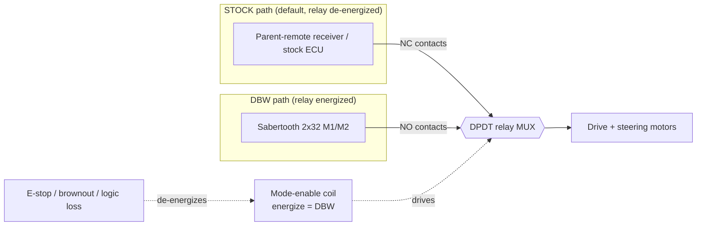

# MRider Drive-By-Wire (DBW) Design

This is the core drive-by-wire design document for MRider. It specifies how a stock kids' ride-on car (MITT) is converted into a computer-steerable, computer-throttled platform while reusing the validated `jrkwon/mrover` Pixhawk + PX4 + Sabertooth recipe wherever possible, and departing from it only where the new vehicle or a validated gap demands it.

Sibling documents: [architecture.md](architecture.md) (system block diagram, command/feedback flow), [vehicle.md](vehicle.md) (chassis selection), [safety.md](safety.md) (failsafe matrix, authority arbitration, FMEA), [sensors.md](sensors.md), [calibration.md](calibration.md) (zeroing, counts→degrees, ticks→distance), [software.md](software.md) (ROS 2 stack), [bom.md](bom.md).

Read for two audiences: exact numbers and file citations for researchers; short "why" explanations for students. Every design choice is recorded as an ADR with **Decision / Alternatives considered / Rationale / Consequences**.

---

## 1. Scope and reuse baseline

MRider reuses the mrover control chain almost verbatim on the command side and departs from it on the steering-servo and feedback side:

| Layer | mrover (baseline) | MRider | Status |
|---|---|---|---|
| Command transport | laptop → Micro-XRCE-DDS → PX4 → MAVLink `MANUAL_CONTROL` | same | **REUSED** (`mavlink_bridge.py:120-126`) |
| Steering channel | `MANUAL_CONTROL.roll` = STEERING/SERVO | same | **REUSED** (`mavlink_bridge.py:123`) |
| Throttle channel | `MANUAL_CONTROL.throttle` = FORWARD/THROTTLE | same | **REUSED** (`mavlink_bridge.py:124`) |
| Sabertooth drive | 2x32, S1←PX4 PWM pin2, S2←PX4 PWM pin7 | 2x32, **S1←Nano PWM**, S2←PX4 PWM | **ADAPTED** (`vehicle_setup.md:54-55`) |
| Steering angle sensing | incremental quadrature encoder on steering (`code.ino:36-39`) + relative WHEEL_DISTANCE auto-ranging (`mavlink_bridge.py:243-252`) | **absolute sensor on column** + motor incremental encoder | **REPLACED** (see ADR B) |
| Steering position loop | none on-vehicle (open-loop servo output) | **Nano-local closed loop ≥100 Hz** | **NEW** (see ADR E) |
| Drive distance | 52 PPR encoder on drive shaft (`code.ino:27`) | same method, wheel-diameter cal | **REUSED** (see ADR C) |
| Feedback path | Nano → I2C slave 0x02 → PX4 encoder module → `WHEEL_DISTANCE` → `Control.msg` (`mavlink_bridge.py:231-260`) | Nano → **USB serial 115200** → ROS 2 node → `/mrider/feedback` | **REPLACED** (see [software.md](software.md)) |

The two REPLACED rows are the honest "new work" of MRider. They exist because mapping and navigation need an *absolute* steering angle with a *closed position loop*, which the pure mrover recipe does not provide (its steering angle is a relative encoder value auto-ranged into ±22.5° at runtime, `mavlink_bridge.py:243-252`).

---

## 2. Steering actuation design

### 2.1 Actuator

The stock steering column is mechanically linked to the front wheels but has **no servo** — it is turned by hand (or, on RC models, by a stock DC gearmotor driven by the parent remote). MRider drives the column with a **DC gearmotor equipped with an incremental encoder**, coupled to the existing steering linkage, and driven by **Sabertooth 2x32 channel 1 (M1 output)**.

The gearmotor is sized from a measured column torque (Section 2.2) with a **≥2× margin**. If a suitable geared DC motor with the required torque and a shaft encoder cannot be sourced, the fallback is a **12 V automotive wiper motor** (high stall torque, built-in worm gearing that resists back-driving) with an external encoder or an absolute sensor on the column — see the wiper-motor fallback note in Section 2.4.

### 2.2 Torque-measurement procedure (before sizing the gearmotor)

Torque required to steer an unmodified column is unknown and vehicle-specific (tire scrub, caster, king-pin friction). Measure it, do not guess:

1. Put the vehicle on the ground at full load (laptop + LiDAR + payload) so tire scrub torque is realistic. Repeat on the target operating surface (carpet/asphalt).
2. Attach a **spring scale** (fish/luggage scale, 0–20 kg) to the steering-wheel rim (or to the tie-rod arm if driving the linkage directly).
3. Pull tangentially and record the **peak force `F` (N)** needed to turn the wheels from center to full lock **while stationary** (worst case — moving eases it).
4. Compute stall torque at the column: `τ_column = F × r`, where `r` is the lever radius (wheel rim radius, or the effective linkage arm).
5. **Size the gearmotor for ≥ 2 × τ_column** at its rated (not stall) torque, referred through the chosen gear/coupling ratio. The 2× margin covers surface variation, aging friction, and dynamic loads.
6. Record `F`, `r`, `τ_column`, chosen motor, and gear ratio in [calibration.md](calibration.md) and the [bom.md](bom.md) line item.

> Rule of thumb from the ride-on ecosystem: a 24 V two-seater on carpet typically needs on the order of a few N·m at the column; a wiper motor (often 10–30 N·m stall) is comfortably oversized, which is why it is the safe fallback.

### 2.3 Why the Sabertooth drives the steering motor as an effort command

The Sabertooth outputs a **bidirectional motor drive** (PWM-controlled H-bridge). The Nano does not command "go to angle X" to the Sabertooth; it commands a **signed effort** (drive left / drive right / stop) that is the *output* of the Nano's position loop. Angle regulation lives entirely in the Nano (ADR E). This keeps the Sabertooth a dumb, fast power stage — exactly its role in mrover.

### 2.4 Wiper-motor fallback

If the encoder-gearmotor path is blocked at build time, substitute a wiper motor on Sabertooth S1. Consequences: (a) the wiper's internal worm gear is largely non-back-drivable, so on power loss the steering **holds** rather than freewheels — this changes the E-stop analysis and **must** be re-evaluated against [safety.md](safety.md) §steering-on-power-loss; (b) wiper motors rarely have a usable shaft encoder, so the **absolute column sensor becomes the sole angle source** and the motor-side incremental encoder (for stall/velocity) is lost — acceptable because ADR B already makes the absolute sensor authoritative.

---

## 3. ADR E — Steering control-loop location (the key DBW decision)

**Decision.** Close the steering **position loop on the Arduino Nano** ("smart-servo"), locally, at **≥100 Hz**, against the absolute column sensor. The upstream interface is unchanged from mrover: the laptop sends a normalized steering command in `MANUAL_CONTROL.roll`; PX4 converts it to a **servo-PWM output**; the Nano reads that PWM exactly as a hobby servo would, closes the loop, and drives Sabertooth **S1**.

**Pinned datapath (exactly one, no alternates):**

```
laptop /mrider/cmd  ──XRCE-DDS──▶  PX4 (ManualControlSetpoint.roll, [-1000,+1000])
        (mavlink_bridge.py:120-126, roll = STEERING/SERVO, line 123)
                                          │
                                PX4 rover: roll → servo output
                                          │  servo PWM 1000–2000 µs (1500 µs = 0°)
                                          ▼
                              Arduino Nano  ── reads PWM like a hobby servo
                                          │  ── closes position loop ≥100 Hz vs. absolute column sensor
                                          │  ── outputs signed effort as PWM
                                          ▼
                              Sabertooth 2x32  S1 (input) → M1 (output) → steering gearmotor
```

There is **no** direct laptop→Nano steering-setpoint path. Because the steering command flows through PX4, an **RC transmitter bound to the Pixhawk covers steering** through PX4's standard RC override and failsafe — see [safety.md](safety.md) authority arbitration.

**Setpoint rate vs. loop rate (important nuance).** The PX4 servo output frame arrives at the PX4 PWM rate (≈50 Hz for a standard servo output, configurable higher). The Nano's control loop runs faster (≥100 Hz): each loop iteration reads the *most recent* captured setpoint pulse and the *current* absolute angle, and updates the effort. Setpoint refresh (~50 Hz) and control loop (≥100 Hz) are decoupled — this is what "reads it exactly as a hobby servo would" means.

**Alternatives considered.**
- **E2 — close the loop in the laptop `ros2_control` hardware interface** (max reuse of mrover's `carlikebot_system.cpp`). The servo loop would cross USB/serial each cycle, adding latency and jitter that scales with laptop load. **Fallback acceptance bound:** if E1 is ever abandoned at build time, E2 is acceptable **only if** measured setpoint→actuation latency is **≤ 30 ms at p95 over ≥ 60 s of logged operation**; reject E2 if exceeded.
- **E3 — close the loop inside PX4** (custom PX4 rover/servo module). Removes the laptop from the loop but requires PX4 C++ module work, is the hardest to teach, and couples the steering controller to PX4 release churn. Rejected.

**Rationale.** The one genuinely new control problem (steering angle servo) is placed in the layer that solves it best: a dedicated MCU with direct, deterministic access to the absolute sensor and the motor driver, off the laptop↔XRCE↔MAVLink chain. It also doubles as the honest core of the education tier ("here is a position controller you can read in 100 lines of C").

**Consequences.** The Nano's role grows from mrover's *passive sensor reader* to an *active servo controller* — an explicit, documented departure from verbatim reuse. Firmware complexity rises (PWM input capture + PID + motor output added to the existing encoder reader). The upstream ROS 2 / PX4 interface is unchanged, so the rest of the mrover stack is unaffected.

---

## 4. ADR (Sabertooth control mode) — independent R/C (PWM) mode, per-channel masters

**Decision.** Configure the Sabertooth 2x32 in **independent R/C (PWM) input mode**. Each channel has its **own independent PWM signal source**:

| Sabertooth | Signal input | Driven by | Motor output | Function |
|---|---|---|---|---|
| Channel 1 | S1 | **Arduino Nano** PWM (steering effort) | M1 | steering gearmotor |
| Channel 2 | S2 | **PX4** PWM (throttle) | M2 | drive motors (paralleled) |

**Alternatives considered.**
- **Packetized serial mode** (single serial master addresses both channels over one wire). Rejected here: it requires **one** master to own the bus. Two independent masters (Nano for steering, PX4 for throttle) cannot share a packetized serial line without an arbiter, which would reintroduce exactly the latency/coupling ADR E avoids.
- **Analog mode** (0–5 V). Rejected: less standard from both PX4 and the Nano than PWM; PWM matches mrover and hobby-servo conventions.

**Rationale — why there is no bus conflict.** In R/C (PWM) mode the two channels are electrically **separate signal inputs** (S1 and S2 are distinct pins with a common ground). There is no shared address space and no shared wire — each is a one-way PWM line from its own master. This is precisely why the plan can split ownership (Nano owns steering, PX4 owns throttle) without an arbiter. Contrast with packetized serial, where a single wire carries addressed packets and only one master may transmit.

**Consequences.** MRider departs from mrover, where **both** S1 and S2 were fed from the PX4 PWM board (`vehicle_setup.md:54-55`, S1←pin2, S2←pin7). Here S2 keeps that PX4 source, but S1 is rerouted to the Nano. The common ground between Nano, PX4, and Sabertooth signal grounds must be tied (documented in [architecture.md](architecture.md) power tree). R/C mode also gives the Sabertooth its own signal-loss timeout (motors stop if PWM disappears), a free layer of the failsafe stack ([safety.md](safety.md)).

---

## 5. ADR B — Steering angle encoding

**Decision.** **Absolute angle sensor mounted on the steering column**, read by the Arduino Nano, **plus** the steering motor's incremental encoder for velocity and stall detection. The absolute sensor is authoritative for angle; the incremental encoder is auxiliary.

**Alternatives considered.**
- **B2 — incremental encoder on the steering motor only** (the pure mrover recipe: `code.ino:36-39` reads a quadrature encoder on the steering, and `mavlink_bridge.py:243-252` auto-ranges a relative `WHEEL_DISTANCE` value into ±22.5°). Rejected: it **requires homing on every boot**, loses its absolute reference on any linkage slip or power glitch, and is fragile for a second, less careful driver (the education audience). mrover's runtime min/max auto-ranging (`min_value=-600`, `max_value=180`, `mavlink_bridge.py:47-50`) is exactly this weakness — the "center" drifts with the observed range.

**Rationale.** Mapping and Nav2 need a repeatable, boot-stable angle. An absolute sensor on the column gives angle-at-power-on with no homing dance, survives linkage slip, and is the near-universal choice in the ride-on-conversion ecosystem. Keeping the motor incremental encoder as well costs nothing (the Nano already has the interrupt pins per `code.ino:53-60`) and gives free stall/velocity signals.

**Consequences.** Two angle sensors on one axis (sensor fusion is trivial: absolute = truth, incremental = rate). The absolute sensor's mounting and range must match the column's mechanical travel — which is its own ADR (§6). Calibration gains a "counts→degrees" step for the absolute sensor ([calibration.md](calibration.md)).

---

## 6. ADR (angle-sensor technology) — potentiometer vs. AS5600-class magnetic encoder

**Decision.** Use a **single-turn conductive-plastic potentiometer geared/coupled 1:1 to the steering column** as the absolute angle sensor, unless bench measurement shows the column's total travel exceeds the pot's usable electrical range, in which case fall back to a **hall/magnetic multi-turn** solution. Pin the pot as the default because MRider's steering travel is small (±22.5° at the road wheels, `mavlink_bridge.py:250`).

**Alternatives considered.**
- **AS5600-class magnetic rotary encoder** (I²C, 12-bit, contactless, no wear). Attractive (frictionless, digital), **but it is single-turn (0–360° absolute)**. If the *column* (not the road wheel) rotates more than 360° across its lock-to-lock travel — common when the steering is geared down — the AS5600 wraps and loses absolute meaning. It would then need mounting on a shaft that sees ≤360°, or an added reduction, adding mechanical complexity.
- **Multi-turn magnetic / hall-array absolute encoder.** Solves the wrap problem but is markedly more expensive and less student-friendly.

**Rationale.** A potentiometer's absolute range maps monotonically across *whatever* travel the mounting shaft sees (as long as it stays within one mechanical/electrical turn), which directly avoids the single-turn wrap failure. For a ±22.5°-road-wheel column, a pot on the column (or on a low-reduction take-off) stays well inside one turn, is a few dollars, is trivially teachable (voltage ∝ angle), and is the ecosystem default. Its only real drawbacks — wiper wear and analog noise — are acceptable at MRider duty cycles and are filtered in firmware.

**Consequences.** One Nano ADC channel is consumed. Analog reading needs light filtering (median + low-pass) and a ratiometric reference (pot fed from the Nano's regulated rail so supply drift cancels). The pot's dead-band/end-stops must sit outside the ±22.5° working range; verified during zeroing ([calibration.md](calibration.md)). If a future chassis gears the column past one pot turn, switch to the multi-turn magnetic option (this ADR's escape hatch).

---

## 7. Throttle path

The stock vehicle has **two rear drive motors**. Per the mrover recipe and the chosen 24 V two-seater, the two rear motors are **electrically paralleled onto Sabertooth channel 2 (M2 output)**, driven by a **PX4 PWM output on S2**. Throttle command originates as `MANUAL_CONTROL.throttle` (`mavlink_bridge.py:124`, FORWARD/THROTTLE), so throttle is entirely a reused mrover path — no Nano involvement.

Paralleling is acceptable because the two motors are mechanically coupled through the ground and share a load; the consequence for **odometry** (only one shaft is instrumented) is handled in ADR C. Verify the **paralleled stall current against the Sabertooth's 32 A/channel rating** in [vehicle.md](vehicle.md); if the pair can exceed 32 A stalled, current-limit in the Sabertooth config or select lower-draw motors.

---

## 8. ADR C — Drive distance encoding

**Decision.** A **quadrature/Hall incremental encoder on the drive-motor shaft** (the mrover **3.15 mm → 5 mm shaft-adapter** method, `vehicle_setup.md:70-72`), read by the Nano at **52 PPR** (`code.ino:27`), converted to distance with a wheel-diameter calibration ([calibration.md](calibration.md)). Odometry is **fused with the IMU in the EKF** to bound error.

**Alternatives considered.**
- **C2 — magnetic ring / hall array on the wheel hub** (true wheel odometry, immune to gearbox backlash and drivetrain slip between motor and wheel). Rejected as the default: it is a **more invasive, per-vehicle mechanical mount** on the hub, against the "minimally invasive" principle. Kept as the upgrade path if odometry proves inadequate.

**Rationale.** Instrumenting the motor shaft reuses mrover's proven encoder + adapter method and mounts inside the drivetrain rather than on the wheel. It is minimally invasive and cheap.

**Consequences (stated explicitly).** The two rear motors are paralleled on one channel and **only one motor shaft is observed**. Motor-side measurement therefore inherits: (a) **gearbox backlash** between the encoder and the wheel, (b) **wheel slip** and tire deformation, and (c) **differential wheel speed** in turns (only one side measured). These bias raw odometry; the **EKF (robot_localization / PX4)** fuses the wheel encoder with the IMU (and GNSS when present) to bound drift. This is documented so students understand *why* the odometry is fused rather than trusted raw.

---

## 9. Pixhawk 6C / PX4 rover configuration and version pinning

- **Flight controller:** Pixhawk 6C (Holybro), matching mrover (`Note/overview.md:106`, `vehicle_setup.md:32` — tested on PX4/PX6C).
- **Airframe:** PX4 **Rover** (Ackermann/rover) frame, so `MANUAL_CONTROL.roll`→steering servo and `.throttle`→drive mapping holds as in `mavlink_bridge.py:122-124`.
- **Transport:** Micro-XRCE-DDS. mrover pins **Agent v2.4.2** (`vehicle_setup.md:103`), TELEM2 = `/dev/ttyS2`, `SER_TEL2_BAUD` typically **2000000** (`vehicle_setup.md:128,132`). Client auto-start via SD `etc/extras.txt` (`vehicle_setup.md:146-153`).
- **Custom firmware:** mrover uses a forked PX4 with a custom wheel-encoder module: `jomidokunMain/PX4-Autopilot` branch **`wheelEncoder`**, started with `encoder start -X 4` (`vehicle_setup.md:87,129`). **MRider re-evaluates this dependency:** because MRider reroutes feedback to Nano→USB (§1, ADR B/software.md), the custom `WHEEL_DISTANCE` PX4 module is **no longer required for steering feedback**. It may be dropped in favor of a stock PX4 rover build (simpler to maintain and teach), or retained if drive-encoder-via-PX4 is still wanted. **Pin the exact PX4 version and QGroundControl parameter file used** in [software.md](software.md) so results reproduce; do not float on `main`.
- **Bridge:** the laptop-side `mavlink_bridge.py` node is reused as-is for the command path (`manual_control_callback_uros`, lines 106-126); the feedback callback (`wheel_distance_callback_mavlink`, 231-260) is **not** reused for steering (see software.md reuse table).

---

## 10. Arduino Nano firmware interface

The Nano firmware grows from the mrover encoder reader (`code/code.ino`) to add the steering servo loop (ADR E). Two interfaces are defined: the **primary USB serial** (the MRider transport) and the **retained I²C register map** (kept for a future companion-computer topology).

### 10.1 Primary transport — USB serial, 115200 baud

`code.ino:13` pins **115200 baud**. MRider uses USB serial as the primary transport (laptop is master). The stock mrover firmware currently prints human-readable lines (`code.ino:82-89`); MRider defines a **line-framed ASCII protocol** (SKKU-style, easy to teach and debug), one message per `\n`:

**Nano → laptop (feedback, ≥20 Hz):**
```
F,<steer_deg>,<steer_counts>,<drive_ticks>,<drive_rpm>,<setpoint_deg>,<status>\n
```
- `steer_deg` — absolute steering angle from the column sensor, degrees (float, +left/−right per calibration)
- `steer_counts` — raw absolute-sensor counts (for calibration/debug)
- `drive_ticks` — cumulative drive-encoder ticks (int32, 52 PPR)
- `drive_rpm` — drive motor RPM (as computed in `code.ino:74`)
- `setpoint_deg` — the steering setpoint the Nano is currently tracking (decoded from PX4 servo PWM)
- `status` — bitfield: bit0 steering-setpoint-valid (PWM present), bit1 steering-at-limit, bit2 stall-detected

**laptop → Nano (optional/diagnostic only):** the steering setpoint does **not** travel this link (ADR E: it comes via PX4 servo PWM). This channel carries only non-time-critical config, e.g. `C,PID,<kp>,<ki>,<kd>\n` or `C,ZERO\n` (capture current column position as center during calibration). Keeping the live setpoint off USB is deliberate — it preserves the single pinned datapath.

### 10.2 Retained I²C register map (from `code.ino`, verified)

Kept for a future I²C companion-computer topology; **not** the primary path in v1. Slave address **`0x02`** (`code.ino:3`), device ID **`'N'`** (`code.ino:4`). Registers exactly as in firmware (`code.ino:6-10`, `129-163`):

| Register | Addr | Returns (byte layout from `I2CReq_IRQ`) |
|---|---|---|
| `EncoderID` | `0x00` | 1 byte: `'N'` (`code.ino:134-137`) |
| `EncoderData` | `0x01` | 4 B drive count/PPR (MSB-first) + 2 B rpm/PPR + 4 B steering raw value (`code.ino:139-155`) |
| `EncoderPPR` | `0x02` | 2 B pulses-per-rev = **52** (`code.ino:157-160`) |

> Note: the stock firmware transmits drive count **already divided by PPR** (`code.ino:141-144`) and the steering value as a **raw incremental** count (`code.ino:149-152`). MRider's ADR B replaces that raw steering value with the absolute-sensor angle; the I²C map is retained structurally but its steering field's *meaning* changes to absolute counts. This is the same REPLACED status as the USB feedback.

### 10.3 New firmware blocks added for ADR E

1. **PWM input capture** on an interrupt pin: measure the PX4 servo pulse width (1000–2000 µs), map to setpoint degrees.
2. **Absolute-sensor read**: ADC read of the column pot, median+low-pass filter, counts→degrees (calibration.md).
3. **Position PID** at ≥100 Hz: error = setpoint − measured, output = signed effort.
4. **Motor output**: effort → PWM on the S1 line to the Sabertooth (1500 µs = stop, ±toward each lock).
5. **Safety interlocks**: if PWM setpoint absent (status bit0 = 0) → hold last safe / center per safety.md; at mechanical limit → clamp effort toward center only.

---

## 11. Relay-MUX authority wiring and 3-tap connector spec

### 11.1 Purpose

The stock parent-remote receiver and the Sabertooth **cannot both drive the motors at once**. A **DPDT relay/contactor MUX** selects STOCK vs. DBW mode per motor circuit. **Default (de-energized) = STOCK**, so any power/logic failure reverts to the safe, factory-controlled vehicle. The live manual override *within* DBW mode is an RC transmitter bound to the Pixhawk (PX4 RC override + failsafe) — detailed in [safety.md](safety.md). "Parent-remote fallback" therefore means *reversibility* (relay drops to stock), not live dual authority.

### 11.2 MUX diagram



- **NC (normally closed) contacts** route the **stock** controller to the motors when the coil is de-energized.
- **NO (normally open) contacts** route the **Sabertooth** to the motors when the coil is energized (DBW mode).
- Any event that drops the coil (E-stop, logic-rail brownout, deliberate mode switch) reverts to STOCK. Steering-motor power-rail assignment and freewheel-vs-hold behavior on this transition are pinned in [safety.md](safety.md).

### 11.3 3-tap connector spec (minimally invasive)

Following mrover's connector-tap approach (`vehicle_setup.md:5-23`), three inline connectors let MRider intercept the stock harness reversibly:

| Tap | Intercepts | MUX side | Notes |
|---|---|---|---|
| **Throttle tap** | stock throttle motor leads | NC→stock ECU, NO→Sabertooth M2 | paralleled rear motors (§7) |
| **Steering tap** | stock steering motor leads | NC→stock ECU, NO→Sabertooth M1 | MRider adds the gearmotor if the column had none |
| **Power tap** | 24 V battery pack | feeds Sabertooth B+ and the isolated logic rail | fused; brownout isolation per [safety.md](safety.md) / architecture.md power tree |

All three are keyed inline connectors so the stock wiring is restorable without cutting — the "reversible modification" principle. Unplug the three taps and the vehicle is factory-stock.

---

## 12. Numeric interface contract

This is the pinned, testable contract for the DBW interface. Values marked (mrover) are verified against the local checkout.

| Parameter | Value | Source / rationale |
|---|---|---|
| Steering angle range (road wheels) | **±22.5°** | `mavlink_bridge.py:250` (`map_value(..., -22.5, 22.5)`) |
| Upstream steering command | `MANUAL_CONTROL.roll` ∈ **[−1000, +1000]** | `mavlink_bridge.py:123` (roll = STEERING/SERVO) |
| Setpoint normalization | roll [−1000,+1000] → ±22.5°; PX4 servo out **1000–2000 µs**, **1500 µs = 0°** | ADR E; hobby-servo convention |
| Throttle command | `MANUAL_CONTROL.throttle` ∈ **[−1000,+1000]** (legacy [0,1000]) | `mavlink_bridge.py:124` |
| Servo (steering) loop rate | **≥ 100 Hz** on the Nano | ADR E |
| Setpoint refresh rate (PX4 servo PWM) | **≈ 50 Hz** (configurable higher) | standard servo PWM; decoupled from loop rate |
| Command/heartbeat stream rate | **≥ 10 Hz** MANUAL_CONTROL/offboard setpoint | timing contract; PX4 failsafe on timeout |
| Command-loss failsafe | PX4 RC-loss / offboard-loss → hold/stop per [safety.md](safety.md) | PX4 rover failsafe |
| Feedback rate (Nano→USB) | **≥ 20 Hz** | odometry/telemetry needs |
| Drive encoder resolution | **52 PPR** | `code.ino:27` |
| Nano serial baud | **115200** | `code.ino:13` |
| Nano I²C address (retained) | **0x02**, device ID `'N'` | `code.ino:3-4` |
| Sabertooth mode | **independent R/C (PWM)**; S1←Nano, S2←PX4 | ADR §4 |
| Serial protocol (Nano→laptop) | `F,steer_deg,steer_counts,drive_ticks,drive_rpm,setpoint_deg,status\n` | §10.1 |

---

## 13. Cross-checks and open follow-ups

- Torque measurement on the actual chosen chassis → sets gearmotor spec and the wiper-motor fallback decision (§2.2).
- Paralleled drive-motor stall current vs. Sabertooth 32 A/channel → [vehicle.md](vehicle.md).
- Absolute-sensor total travel vs. one pot turn → confirms pot vs. magnetic (§6).
- PX4 version + QGC parameter file pin, and the keep/drop decision on the custom wheel-encoder firmware → [software.md](software.md).
- Steering-motor power-rail assignment (which rail → freewheel vs. hold on E-stop) → [safety.md](safety.md).

**mrover citation verification (this doc):** every mrover claim cited above was re-read against the local checkout at `/mnt/data/projects/mrover`. All verified. The two intentional departures — S1 signal source (Nano vs. mrover's PX4 pin2) and steering feedback path (USB vs. mrover's I²C→WHEEL_DISTANCE) — are labeled ADAPTED/REPLACED rather than reuse, so they are not counted as mrover reuse.
