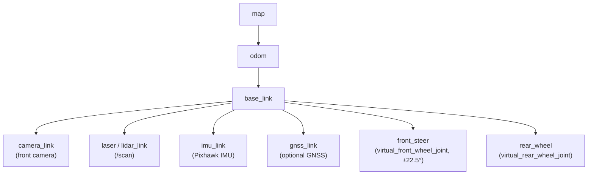
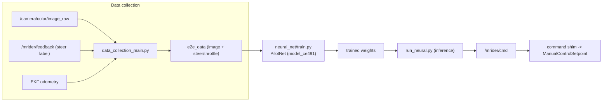

# MRider Software Design

This document specifies the **ROS 2 software stack** for MRider: which B-MROVER
(`jrkwon/mrover`) packages are reused verbatim, which are adapted, and which are new; the
topic/interface contract between the autonomy laptop and the vehicle; the TF tree and
Ackermann kinematics; the SLAM / Nav2 / EKF configuration plan; and the data-collection +
end-to-end neural-network pipeline for behavior cloning.

It is a sibling of [`architecture.md`](architecture.md) (system architecture),
[`dbw.md`](dbw.md) (drive-by-wire + numeric interface contract),
[`safety.md`](safety.md), [`sensors.md`](sensors.md), [`calibration.md`](calibration.md),
[`vehicle.md`](vehicle.md), and [`bom.md`](bom.md).

**Target:** ROS 2 **Humble** (B-MROVER's validated distro), PX4 rover via
Micro-XRCE-DDS. All reuse claims were verified against the local checkout at
`/mnt/data/projects/mrover`; file paths are cited inline.

---

## 1. Reuse posture

The guiding rule is **reuse before invent**. B-MROVER already provides the MAVLink bridge,
robot_localization EKF, slam_toolbox mapping, Nav2 navigation, the ros2_control CarlikeBot
interface, the data-collection recorder, and the Keras end-to-end training/inference
pipeline. MRider keeps these and changes exactly two things:

1. **The feedback datapath** — moved off MAVLink `WHEEL_DISTANCE` onto a direct
   Nano → USB → `/mrider/feedback` link (see §2, ADR-SW1). This is the one reclassification
   the plan calls out explicitly.
2. **Kinematic and frame parameters** — re-parameterized for the new (TBD) chassis, and two
   B-MROVER config artifacts corrected (§4).

Everything else is reused or lightly adapted.

---

## 2. ROS 2 stack: reused / adapted / new

Legend: **REUSE** = used essentially as-is; **ADAPT** = kept but reconfigured/retargeted;
**NEW** = MRider-authored.

| Subsystem | B-MROVER artifact (verified path) | Status | MRider change |
|-----------|-----------------------------------|--------|---------------|
| MAVLink ↔ ROS 2 command bridge | `dev_ws/src/mrover/mrover/mavlink_bridge.py:79-126` | **REUSE** | Upstream steering/throttle path unchanged: `ManualControlSetpoint` on `/fmu/in/manual_control_setpoint` (`:79-82`); `roll`→STEER, `throttle`→THROTTLE (`:122-123`). |
| **Encoder feedback path** | `mavlink_bridge.py:231-260` (`wheel_distance_callback_mavlink`) → `Control` on `/rover` (`:76`) | **ADAPT / REPLACE** | MRider **does not** carry feedback over MAVLink `WHEEL_DISTANCE`. Feedback comes Nano → USB serial 115200 → new driver → `/mrider/feedback`. The B-MROVER count→±22.5° mapping (`:250-253`) is reference math only. **Not counted as reuse.** |
| Micro-XRCE-DDS agent | `agent_config.xml` (domainId 10) | **REUSE** | Same XRCE transport; domain ID configurable. |
| PX4 message set | `dev_ws/src/px4_msgs/` | **REUSE** | `ManualControlSetpoint`, `SensorCombined`, `VehicleAttitude`, `SensorGps`. |
| Robot-localization EKF | `dev_ws/src/mrover/config/ekf.yaml` | **ADAPT** | Reuse dual-EKF structure (local `odom` + global `map`+GPS) and `two_d_mode`; retarget inputs (§4), fix magnetic declination. |
| SLAM (slam_toolbox) | `dev_ws/src/mrover/config/slam/mapper_params_online_async.yaml` | **ADAPT** | Reuse CeresSolver online-async mapping; reconcile `base_frame` (§4.1). |
| Nav2 | `dev_ws/src/mrover/config/slam/nav2_params.yaml` | **ADAPT** | Reuse NavFn planner + costmaps; re-evaluate DWB controller for Ackermann (§4.3); re-parameterize `robot_radius`/velocities. |
| ros2_control hardware interface | `dev_ws/src/mrover/description/ackermann/control/ros2_controls_real.xacro` | **REUSE** | CarlikeBot: front steer = **position** command, rear drive = **velocity** command — matches the smart-servo angle-setpoint model ([`dbw.md`](dbw.md)). |
| Bicycle steering controller | `dev_ws/src/mrover/config/ackermann/carlike_controllers.yaml` | **ADAPT** | `BicycleSteeringController`; re-parameterize `wheelbase`/`wheel_radius` for real chassis (§3.2). |
| URDF / xacro | `dev_ws/src/mrover/description/ackermann/robot_core2_urdf.xacro` | **ADAPT** | Reuse Ackermann structure; replace placeholder dimensions with measured chassis values (§3.2). |
| LiDAR driver | `dev_ws/src/ydlidar_ros2_driver/`, `config/ydlidar_params.yaml` | **REUSE/ADAPT** | Reuse if YDLidar retained; swap driver if a different LiDAR is chosen ([`sensors.md`](sensors.md)). |
| Data-collection recorder | `dev_ws/src/data_collection/data_collection/data_collection_main.py:69-71` | **ADAPT** | Reuse ROS 2 recorder (Control + Odometry + Image); retarget `vehicle_control_topic` to `/mrider/feedback`. |
| End-to-end NN training | `neural_net/net_model.py`, `neural_net/train.py`, `drive_train.py` | **REUSE** | Keras PilotNet-class models unchanged. |
| End-to-end NN inference | `dev_ws/src/run_neural/run_neural/run_neural.py` (+ `run_neural_rn.py`) | **REUSE** | Runtime inference node; output → `/mrider/cmd`. |
| Feedback driver (Nano ↔ ROS 2) | — | **NEW** | Parses Nano USB serial frames → `/mrider/feedback`; the one genuinely new node ([`dbw.md`](dbw.md) serial protocol). |
| Command shim | — | **NEW (thin)** | Maps `/mrider/cmd` → `ManualControlSetpoint` (roll/throttle) if the policy/Nav2 output is not already in that form. |

### ADR-SW1 — Reroute feedback off MAVLink

- **Decision.** Publish vehicle feedback from a new ROS 2 driver reading the Nano USB serial
  link, on `/mrider/feedback`; retire the MAVLink `WHEEL_DISTANCE` → `/rover` path.
- **Alternatives.** Keep `wheel_distance_callback_mavlink` (`mavlink_bridge.py:231-260`) and
  feed encoders up through PX4 as B-MROVER does.
- **Rationale.** Once the Nano owns the steering servo loop it already aggregates the
  absolute angle sensor and both encoders; a direct USB link removes a MAVLink round-trip
  from the odometry path (lower latency, feedback rate decoupled from FC telemetry budget)
  and gives a single, teachable serial contract. **Consequence:** the B-MROVER
  `WHEEL_DISTANCE` feedback code is retired, not reused.

---

## 3. Interfaces, topics, and kinematics

### 3.1 Topic / interface contract

| Topic | Type | Direction | Notes |
|-------|------|-----------|-------|
| `/mrider/cmd` | steering + throttle command | policy/Nav2 → command shim | Normalized steer + throttle; shim converts to `ManualControlSetpoint`. |
| `/fmu/in/manual_control_setpoint` | `px4_msgs/ManualControlSetpoint` | shim → PX4 (XRCE) | `roll` = STEER, `throttle` = THROTTLE (`mavlink_bridge.py:122-123`). |
| `/mrider/feedback` | MRider feedback msg (lineage below) | Nano driver → stack | Steering angle (deg), drive distance/velocity from encoders. |
| `/fmu/out/sensor_combined` | `px4_msgs/SensorCombined` | PX4 → EKF | IMU (`mavlink_bridge.py:71`). |
| `/scan` | `sensor_msgs/LaserScan` | LiDAR → SLAM | slam_toolbox `scan_topic: /scan`. |
| `/camera/color/image_raw` | `sensor_msgs/Image` | camera → recorder/NN | Data-collection default (`config/data_collection/rover_template.yaml`). |
| `wheel/odometry` | `nav_msgs/Odometry` | odom → EKF | EKF `odom0` input (`ekf.yaml`). |
| `odometry/gps` | `nav_msgs/Odometry` | navsat → map-EKF | EKF `odom1` (global), optional GNSS. |

**Feedback message lineage.** `/mrider/feedback` descends from
`dev_ws/src/mrover_control/msg/Control.msg`, whose verified fields are:

```
uint64  timestamp     # microseconds since system start
float64 throttle
float64 steer
float64 steer_angle
```

MRider retains `timestamp`, `steer_angle` (degrees, the absolute-sensor reading), and adds a
drive-distance/velocity field derived from the 52-PPR drive encoder (`code/code.ino:27`). The
exact wire format (ASCII vs binary frame over USB 115200) is pinned in the serial-protocol
section of [`dbw.md`](dbw.md).

### 3.2 Ackermann kinematic parameters

The chassis is **TBD** ([`vehicle.md`](vehicle.md)), so kinematics are **parameterized**.
B-MROVER's values are the reference model, to be replaced with measured values after purchase
and set once in [`calibration.md`](calibration.md).

| Parameter | B-MROVER reference (verified) | Source | MRider action |
|-----------|-------------------------------|--------|---------------|
| Steering range | **±22.5°** | `robot_core2_urdf.xacro:26` (`steer_limit_deg=22.5`); cross-confirmed by the bridge count→±22.5° map (`mavlink_bridge.py:251-253`) and `steering_angle_max: 22.5` (`config/data_collection/rover_template.yaml`) | Keep as design target; re-verify mechanical limit on real column ([`calibration.md`](calibration.md)). |
| Wheelbase | `0.325` m (controller) / placeholder `1.3` m chassis in URDF | `carlike_controllers.yaml:13`; `robot_core2_urdf.xacro:15` | Measure on real chassis; set `wheelbase`. |
| Track (wheel separation) | `wheel_separation_w = 0.4` m (sim placeholder) | `robot_core2_urdf.xacro:9-10` | Measure; set track. |
| Wheel radius | `0.1397` m | `robot_core2_urdf.xacro:19` | Measure; also drives `robot_radius` sanity in Nav2. |
| Steer joint type | `revolute`, limits ±22.5° | `robot_core2_urdf.xacro:148-156` (`virtual_front_wheel_joint`) | Keep. |
| Drive joint type | `continuous` | `robot_core2_urdf.xacro:187-193` (`virtual_rear_wheel_joint`) | Keep. |

> **Note (honest caveat):** B-MROVER's URDF mixes a simulation chassis (`chassis_length=1.3`)
> with a much smaller controller `wheelbase=0.325`; these are simulation artifacts, not a
> real measurement. MRider treats **all** dimensions as placeholders until measured. The one
> value that is consistent across three independent files — the **±22.5° steering range** — is
> adopted as the design target.

### 3.3 TF tree

MRider follows REP-105: `map` → `odom` → `base_link` → sensor frames. The `map`→`odom`
transform is published by the global (map) EKF / SLAM; `odom`→`base_link` by the local EKF;
sensor frames are static (URDF).



Extrinsics (camera/LiDAR → `base_link`), IMU alignment, and steering zero are established in
[`calibration.md`](calibration.md).

---

## 4. SLAM / Nav2 / EKF configuration plan

Grounded in B-MROVER's existing configs, with three specific corrections MRider must make.

### 4.1 robot_localization EKF — `config/ekf.yaml`

B-MROVER runs a **dual-EKF** setup (verified):

- `ekf_filter_node` (local): `world_frame: odom`, fuses `odom0: wheel/odometry` (vx, vy,
  vyaw) and `imu0: imu/data` (yaw, vyaw, ax). `two_d_mode: true`, `frequency: 30.0`,
  `sensor_timeout: 0.1`, frames `map`/`odom`/`base_link`.
- `ekf_filter_node_map` (global): `world_frame: map`, adds `odom1: odometry/gps` (x, y) plus
  a `navsat_transform` node for GNSS fusion.

**MRider plan:**
- Keep the dual-EKF structure and `two_d_mode` (planar ride-on).
- Retarget `odom0: wheel/odometry` to odometry derived from `/mrider/feedback` (bicycle model
  from steer angle + drive distance) — an odometry node converts feedback → `wheel/odometry`.
- Keep `imu0: imu/data` sourced from the Pixhawk (`/fmu/out/sensor_combined` → `imu/data`).
- **Correction:** `navsat_transform.magnetic_declination_radians` is set for **Lisbon** in
  B-MROVER (`ekf.yaml`, `# For lat/long of Lisbon, Portugal`). MRider must set the local
  (Ann Arbor) declination — tracked in [`calibration.md`](calibration.md). GNSS is optional
  ([`sensors.md`](sensors.md)); the map-EKF runs GNSS-free until a receiver is added.

### 4.2 slam_toolbox — `config/slam/mapper_params_online_async.yaml`

Verified: `solver_plugin: CeresSolver`, `mode: mapping`, `odom_frame: odom`, `map_frame: map`,
`scan_topic: /scan`, `resolution: 0.05`, `max_laser_range: 10.0`, `transform_publish_period:
0.02`.

**MRider plan:** reuse as-is for mapping; switch `mode` to `localization` (with a saved map)
for repeat runs. **Correction:** `base_frame: base_footprint` here, but the EKF uses
`base_link`. MRider must reconcile these to one convention (recommend `base_link` throughout,
or add a static `base_link`→`base_footprint` transform) so TF stays consistent.

### 4.3 Nav2 — `config/slam/nav2_params.yaml`

Verified plugins: controller `FollowPath: dwb_core::DWBLocalPlanner` (`max_vel_x: 0.26`,
`max_vel_theta: 1.0`, `max_vel_y: 0.0`), planner `GridBased: NavfnPlanner`
(`expected_planner_frequency: 20.0`), recoveries `spin`/`back_up`/`wait`, `robot_radius:
0.1397`.

**MRider plan:** reuse NavFn planner and costmap layers; re-parameterize `robot_radius` and
velocity limits for the real (larger) chassis. **Design note (ADR-SW2 below):** DWB is a
diff-drive/omni-oriented local planner; on a true Ackermann vehicle with a ±22.5° steering
limit, a curvature-aware controller (e.g., Regulated Pure Pursuit) is often a better fit.
MRider keeps DWB as the reused default for first bring-up and flags RPP as the evaluation
alternative.

#### ADR-SW2 — Nav2 local controller for Ackermann

- **Decision.** Start with B-MROVER's DWB (reuse), evaluate Regulated Pure Pursuit as a
  swap after basic navigation works.
- **Alternatives.** DWB only (max reuse, but ignores the non-holonomic turning constraint);
  RPP from the start (better kinematic fit, less directly reused).
- **Rationale.** Reuse-first for bring-up velocity; the ±22.5° minimum-turn-radius constraint
  is real and may make DWB paths infeasible, so RPP is pre-registered as the fallback with a
  concrete trigger (path-tracking error or infeasible commands during turning tests).

---

## 5. Data collection + end-to-end NN pipeline

MRider reuses B-MROVER's behavior-cloning pipeline nearly verbatim.

### 5.1 Data collection

`dev_ws/src/data_collection/data_collection/data_collection_main.py` (ROS 2) subscribes
(verified `:69-71`):

- `Control` on `vehicle_control_topic` (steering + throttle label),
- `Odometry` on `base_pose_topic` (pose/velocity),
- `Image` on `camera_image_topic` (front camera),

and records synchronized samples to `e2e_data`. Config
`config/data_collection/rover_template.yaml` sets `camera_image_topic:
/camera/color/image_raw`, `vehicle_control_topic: /rover`, `steering_angle_max: 22.5`, and the
image crop/size.

**MRider change:** retarget `vehicle_control_topic` from `/rover` to **`/mrider/feedback`**
(the new steering-angle-labeled source), and `base_pose_topic` to the EKF odometry output.
The legacy ROS 1 `data_collection_board.py` (rospy / `ScoutControl`) is **not** used.

### 5.2 End-to-end model

`neural_net/net_model.py` defines Keras models (verified): `model_ce491` is the classic
PilotNet architecture (Conv 24→36→48→64→64 with a normalization `Lambda x/127.5−1.0`, then
Dense 100→50→10→`num_outputs`), plus `model_agribot` and `model_jaerock` variants and a
ResNet inference path (`run_neural_rn.py`). Config `config/neural_net/rover_template.yaml`:
`num_outputs: 1` (steering; optionally throttle), input image `160×160×3`, selectable
`network_type`.

**Pipeline (reused):** `neural_net/train.py` / `drive_train.py` train from `e2e_data`;
`dev_ws/src/run_neural/run_neural/run_neural.py` runs inference at drive time and emits
commands. In MRider the inference output feeds **`/mrider/cmd`** → command shim →
`ManualControlSetpoint`, so the learned policy uses the exact same steering datapath as
Nav2 and teleop (single pinned path, [`dbw.md`](dbw.md)).



---

## 6. PX4 / firmware pinning and fallback

- **PX4 version pin.** MRider pins the PX4 rover firmware version and the parameter set that
  B-MROVER validated (rover mode, `MANUAL_CONTROL` handling, servo-PWM steering output, RC
  override + failsafe). The exact version tag and a parameter export are recorded in
  [`dbw.md`](dbw.md)/[`calibration.md`](calibration.md) at bring-up, so the
  `MANUAL_CONTROL.roll`→servo-PWM behavior is reproducible and not subject to upstream drift.
- **XRCE-DDS.** Micro-XRCE-DDS agent, domain ID from `agent_config.xml` (default 10); QoS per
  the bridge's `qos_profile` (`mavlink_bridge.py:71-86`).
- **Arduino-direct fallback.** If a PX4 rover `MANUAL_CONTROL`/servo-PWM quirk blocks
  bring-up, the fallback is to drive the Nano steering setpoint directly (Arduino-direct),
  bypassing the PX4 servo-PWM emission, with PX4 retained for IMU/EKF/RC. This trades the
  single-pinned-path property for schedule risk reduction and is documented as the contingency
  in [`dbw.md`](dbw.md) (ADR-E fallback).

---

## 7. Software ADR summary

| ID | Decision | Rationale |
|----|----------|-----------|
| ADR-SW1 | Reroute feedback Nano→USB→`/mrider/feedback`; retire MAVLink `WHEEL_DISTANCE` path | Nano already aggregates sensors once it owns the servo loop; lower latency, single serial contract. |
| ADR-SW2 | Nav2: DWB first (reuse), RPP as pre-registered Ackermann swap | Reuse-first bring-up; ±22.5° turn constraint may need a curvature-aware controller. |
| — | Reuse EKF/SLAM/Nav2/NN configs, re-parameterize for real chassis | Maximize reuse of the validated stack; only measured values and 2 config artifacts change. |
| — | Pin PX4 version + params; Arduino-direct fallback | Reproducibility; schedule-risk contingency. |

**Config corrections MRider must make (found during verification):**
1. SLAM `base_frame: base_footprint` vs EKF `base_link` — reconcile to one convention (§4.2).
2. `navsat_transform` magnetic declination set for Lisbon — set local value (§4.1).
3. Nav2 DWB controller — re-evaluate for Ackermann kinematics (§4.3).

---

*Cross-references:* [`architecture.md`](architecture.md) · [`dbw.md`](dbw.md) ·
[`safety.md`](safety.md) · [`sensors.md`](sensors.md) · [`calibration.md`](calibration.md) ·
[`vehicle.md`](vehicle.md) · [`bom.md`](bom.md)
