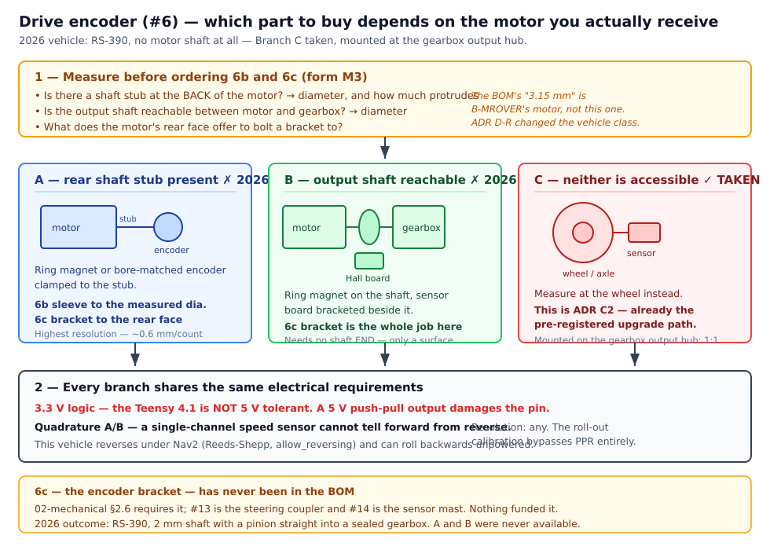

# 1. BOM & Sourcing

**Goal:** acquire every part before touching the vehicle, at a known cost.

Order the components for Tier 1 and confirm long-lead items (vehicle, LiDAR, gearmotor) are
in hand. Cross-check quantities and connectors against the bill of materials.

- **Prerequisites:** budget decided; Tier 1 vs. Tier 2 timing understood.
- **Specification:** [design/bom.md](../design/bom.md)
- **Expected outcome:** all line items received; totals reconciled against the BOM.

> [!WARNING]
> **Draft — not yet validated on hardware**
>
> This checklist is derived from [bom.md](../design/bom.md). No MRider build has been
> sourced yet, so vendor availability, current prices, and connector compatibility are
> **unconfirmed**. Prices in the BOM are estimates as of July 2026 and vary by retailer,
> coupon, and stock — verify at purchase.

---

## 1.1 Two purchase tiers, bought at different times

The BOM is split so the **perception spend follows the DBW gates**. If the steering loop fails
its accuracy gate at [bring-up Stage 1](../design/safety.md#6-bring-up-protocol-staged-wheels-off-first),
you have not yet bought Tier 2.

| Tier             | What it covers               | When to order |     Line items | With ~10% contingency |
| ---------------- | ---------------------------- | ------------- | -------------: | --------------------: |
| **Tier 1** | Vehicle + DBW core + gamepad | Week 1        |           $678 |                 ~$745 |
| **Tier 2** | LiDAR, camera, IMU           | By week 10    |           $168 |                 ~$185 |
| **Both**   |                              |               | **$846** |       **~$930** |

This is down from ~$1,570 in the previous revision. The Tier 1 figure was also **corrected on 2026-08-10** — it had been published as $773 while its line items summed to $638, the vehicle price drop never having been re-added. See
[bom.md § Change record](../design/bom.md#change-record-why-the-total-fell-from-1570-to-1035)
for where the money went and what was deferred rather than deleted.

> [!TIP]
> **Already have an mrover rig?**
>
> Reusable: **Sabertooth 2x32**, drive encoder + shaft adapter, 3D-printed enclosures
> (though the controller cases need rework), and the laptop — roughly **−$173**.
>
> **Not reusable:** the Pixhawk 6C, PM02, Arduino Nano, and USB-TTL adapter. MRider's
> controller is a single Teensy 4.1
> ([D3](../design/adr-dbw-architecture-review.md#46-decision-adopted-2026-08-07)). Those
> parts remain useful for other projects; this is a deliberate architectural departure, not
> a write-off.
>
> With a used vehicle, lab-reused Sabertooth and encoder, and printed mounts, the realistic
> floor is **~$620 all-in**.

## 1.2 Order long-lead items first

Order in this sequence. The first group gates everything else; the last group can be bought
at the hardware store the week you need it. **Vendors and prices are in
[§1.2.1](#121-sourcing-in-korea-verified-2026-09-15)**, not here — one place, so they cannot drift.

=== "Week 0 — order immediately"

| Item | BOM # | Why it gates the build |
|------|-------|------------------------|
| Vehicle (12 V single-seat ride-on) | 1 | Nothing can be measured until it arrives; seasonal stock |
| Teensy 4.1 | 2 | Needed from step 4; cheap enough to buy a spare |
| RC transmitter + receiver (i-BUS) | 10 | Needed for step 4 override verification |
| Hardware RC signal MUX | 9 | Safety-critical and easy to forget — see the warning below |

=== "Week 1 — after the vehicle arrives"

| Item | BOM # | Why it waits |
|------|-------|--------------|
| Steering gearmotor + encoder | 4 | **Sized from a measurement you cannot take yet** — see §1.3 |
| Absolute steering angle sensor | 5 | Technology depends on measured shaft travel (§1.3) |
| Steering shaft coupler / adapter | 13 | Depends on the actual column diameter |

=== "Anytime (Tier 1)"

| Item | BOM # |
|------|-------|
| Sabertooth 2x32 | 3 |
| Drive encoder + 3.15→5 mm shaft adapter | 6 |
| Relay MUX hardware (2× DPDT + sockets + flyback diodes + drive transistors) | 7 |
| E-stop switch (latching mushroom, traction-rated) | 8 |
| Isolated logic rail (12 V SLA + charger + 2× DC-DC) | 11 |
| Wiring / connectors / fuses | 12 |
| Mounts / 3D prints | 14 |
| USB gamepad (Xbox-layout, teleop) | 15 |

=== "By week 10 (Tier 2)"

| Item | BOM # |
|------|-------|
| 2D LiDAR (RPLIDAR A1M8) | 16 |
| Front camera (USB 1080p) | 17 |
| IMU (BNO085 class) | 18 |

> [!CAUTION]
> **The hardware RC signal MUX is not optional**
>
> Item #9 is the **condition on which the single-Teensy architecture was adopted**
> ([safety.md §1.2](../design/safety.md#12-live-override-inside-dbw-mode-two-layers)). With
> one MCU holding the steering loop, throttle, override, and arming, a firmware hang loses
> all four — unless override is a *wiring* property. Order it with the RC set, not later.
> It is $18 and it is the difference between a defensible safety story and a fragile one.

## 1.2.1 Sourcing in Korea — verified 2026-09-15

Prices below were read off the vendor page on **2026-09-15** at **1 USD = 1,362 KRW**. Anything
marked *unverified* came from a search result, not from the vendor's own page — treat it as a lead,
not a quote.

| # | Item | Where | Price | Status |
|---|------|-------|------:|--------|
| 1 | Vehicle | [Coupang](https://www.coupang.com/vp/products/9597329401?itemId=28670205397&vendorItemId=95592760206) | ₩229,000 | recorded earlier |
| 3 | **Sabertooth 2x32** | [Coupang](https://www.coupang.com/vp/products/8926855294?itemId=26092961552&vendorItemId=93333777957) | **₩215,300** | verified — est. arrival **10/8** |
| 3 | ↳ alternative | [one-stop.co.kr](https://one-stop.co.kr/goods/view?no=11156) | ₩250,000 VAT incl. | verified — ships soon |
| 3 | ↳ alternative | [Dimension Engineering](https://www.dimensionengineering.com/products/sabertooth2x32) | $124.99 ≈ ₩185,000 landed | verified — ~2 weeks, USPS |
| 9 | Pololu RC servo MUX #2806 | [DeviceMart 1179242](https://www.devicemart.co.kr/goods/view?no=1179242) | **₩31,680** VAT incl. | verified — ships ~1 week |
| 2 | Teensy 4.1 | [DeviceMart 14276922](https://www.devicemart.co.kr/goods/view?no=14276922) | **₩74,250** VAT incl. | verified |
| 16 | RPLIDAR A1M8-R6 (DFR0315) | [ICBanQ](https://www.icbanq.com/P013130745) | ₩141,300 + VAT = **₩155,430** | verified, ships ≤1 week |
| 10 | FlySky FS-i6 + FS-iA6B | [팰콘샵 100004832](https://www.falconshop.co.kr/shop/goods/goods_view.php?goodsno=100004832) | ₩139,160 VAT incl. | **verified in hand 2026-10-01** — iA6B with i-BUS port, ×3. Read the receiver warning below before buying elsewhere: the title said iA6 |

**Everything in Tier 1 that was thought to need importing is available domestically.** The
Sabertooth is on Coupang and at one-stop; the Pololu MUX is at DeviceMart. The "no Korean source"
reading in the first pass of this section was wrong, and came from searching badly — DeviceMart and
Eleparts render prices in JavaScript and return nothing to an automated search, which is a limit of
the search, not a fact about the market.

> [!NOTE]
> **Two prices came in well over the BOM estimate**
>
> | | BOM est. | actual | over by |
> |---|---:|---:|---:|
> | Teensy 4.1 | $32 ≈ ₩43,600 | ₩74,250 | **+70%** |
> | Pololu MUX #2806 | $18 ≈ ₩24,500 | ₩31,680 | +29% |
>
> Both are the domestic premium on a US part, and both are worth paying here: the Pololu is
> [listed "Rationed"](https://www.pololu.com/product/2806) at source, and it is the part
> [§1.2](#12-order-long-lead-items-first) says not to be waiting on. Together they add about
> ₩38,000 to Tier 1 — record the actuals in the [Order Log](../order-log.md) rather than the
> estimates.

### Leads still to confirm

Everything here came from a search result rather than the vendor's own page — DeviceMart and
Eleparts render prices in JavaScript, so they cannot be read automatically. **Confirm before
ordering.**

| # | Item | Lead | Indicative | BOM est. |
|---|------|------|-----------:|---------:|
| 10 | FlySky FS-i6 + **FS-iA6B** | 알씨뱅크, 팰콘샵, 다나와 | — | $55 ≈ ₩74,900 |
| 15 | Logitech F710 gamepad | 다나와, 컴퓨존, 11번가 | ₩58,000–69,900 | $40 ≈ ₩54,500 |
| 18 | BNO085 (Adafruit breakout) | ICBanQ · [DeviceMart 12507416](https://www.devicemart.co.kr/goods/view?no=12507416) · VCTec | ~₩41,800 | $28 ≈ ₩38,100 |
| 11 | 12 V 7 Ah SLA (로케트 ES7-12) | 11번가, 쿠팡, 판테크 | ~₩19,500 | part of $45 |
| 11 | Isolated DC-DC (e.g. SPS3-12-5) | DeviceMart 전원/파워 → DC-DC 컨버터 | — | part of $45 |
| 8 | 22 mm mushroom E-stop | 한국미스미, 레고전자부품, 다아라몰 (IDEC) | — | $15 — **but read the warning** |

> [!IMPORTANT]
> **Buy the FS-iA6B, not the FS-iA6**
>
> Korean RC shops list the FS-i6 bundled with either. The plain **FS-iA6 is PWM only** — no serial
> stream, so [Layer A](../design/safety.md#12-live-override-inside-dbw-mode-two-layers) cannot be
> built on it. Only the **FS-iA6B** carries the i-BUS port. One letter, and it is the difference
> between having a closed-loop override and not.

> [!CAUTION]
> **A 22 mm mushroom button will not switch this traction circuit — and its rating will not say so**
>
> [§1.4](#14-substitution-notes) already requires the E-stop to be traction-rated. What the Korean
> listings make easy to miss is that their ratings are **AC** ratings: a switch sold as "10 A 250 V"
> may be rated for a small fraction of that at **12 V DC**, because DC has no zero crossing to
> extinguish the arc. Drive stall current here is
> [unmeasured](../design/vehicle.md#31-drive-motor-stall-current-vs-sabertooth-rating-critical) and
> both rear motors share one channel.
>
> Use the pattern the BOM already permits: the **mushroom button switches a contactor coil**, and a
> **DC-rated contactor** (12 V coil, **50–60 A continuous**, sold as a battery isolator)
> carries the traction current. **DC-rated is the part that matters, not the amp figure** — an
> AC-rated switch breaking DC can weld its contacts closed, and that failure is silent until the
> moment you press the button.
>
> *Sized down from "100 A+" on 2026-10-01.* The stock ECU is rated 20 A and the motor driver
> limits at 30 A, so 50–60 A is already ~2× margin. Over-sizing cascades: a bigger contactor draws
> more coil current, and coil current is what sets the button's rating (below). The button then only ever sees coil current, which is what a 22 mm
> switch is actually good for.
>
> Do not buy the button until the contactor is chosen — its coil current sets the button's rating.

### Still unsourced

No usable Korean lead found yet for: **#6** drive encoder + 3.15→5 mm shaft adapter, **#7** relay
MUX hardware (2× DPDT + sockets + flyback diodes + drive transistors), **#12** wiring / connectors /
fuses, **#14** 3D-print filament and hardware, **#17** USB 1080p camera.

Most are commodity and will come from DeviceMart, Eleparts or Coupang; they are listed here so the
gap is visible rather than assumed closed. **#4, #5 and #13 are deliberately absent** — they are the
[measure-first parts](#13-two-parts-you-must-not-order-blind).

> [!NOTE]
> **The one-stop.co.kr listing: the title is stale, the product is a 2x32**
>
> [one-stop.co.kr #11156](https://one-stop.co.kr/goods/view?no=11156) is titled **"DRI0004
> Sabertooth Dual 25A"**, which reads like a mislabelled 2x25. It is not. The page body is
> unambiguous:
>
> - every datasheet link points at **`Sabertooth2x32.pdf`**, `Sabertooth2x32.doc`, and
>   `Sabertooth2x32QuickStart.pdf` on dimensionengineering.com
> - it states **6–30 V nominal, 33.6 V absolute max** — the 2x32's range. The 2x25 is 6–24 V
>   nominal, 30 V max
> - it states **32 A continuous / 64 A peak**, and names the **v1.1** revision
>
> `DRI0004` is DFRobot's legacy SKU string for this line, and DFRobot themselves have not kept it
> straight: their own wiki page for DRI0004 is titled *Sabertooth Dual 32A* while its specification
> table says 25 A / 6–24 V. The Korean reseller inherited the title and replaced the body.
>
> **The only residual risk is procurement, not specification.** If the vendor picks stock by SKU
> rather than by the page you read, a 2x25 could arrive. One email before paying settles it — ask
> them to confirm 32 A/64 A and the 6–30 V range on the unit they will actually ship.

> [!TIP]
> **Domestic at ₩250,000 versus importing at ~₩185,000 — both are defensible**
>
> Dimension Engineering list the 2x32 at **$124.99** and ship worldwide at a flat rate ("our
> shipping prices are the same whether you live in the USA or overseas"), by USPS air mail, ~10
> business days.
>
> That routing matters for tax. Korea's **$200** de-minimis under KORUS applies only to **courier**
> shipments (DHL/FedEx/UPS); goods arriving by **international post** fall under the **$150**
> threshold. At $124.99 the Sabertooth is below either, so it should clear free of duty and VAT —
> but the margin is thin enough that adding a second item to the same order could push the parcel
> over and tax the whole thing, not just the excess.
>
> | | landed | arrives | if it fails |
> |---|---|---|---|
> | **Coupang** | **₩215,300** | est. **10/8** | domestic |
> | one-stop.co.kr | ₩250,000 | ships soon | domestic A/S |
> | Dimension Engineering | ~$135 ≈ ₩185,000 | ~2 weeks | return shipping to the USA |
>
> The spread is about **₩65,000** end to end, which is small against what it buys: a local return
> path on the most expensive board in the build.
>
> **Time is the real variable, not price.** Coupang's estimated 10/8 is roughly three weeks out —
> slower than importing — so if the bench schedule needs the Sabertooth before then, one-stop
> shipping now is worth its ₩35,000 premium over Coupang. Check the Coupang listing's seller and
> dispatch estimate before committing; a long estimate there usually means it ships from overseas
> anyway, in which case the domestic advantage is only the return path.

> [!WARNING]
> **Order the Pololu MUX first, not last**
>
> Pololu lists #2806 as **"Rationed"**. It is $17.95, it ships from the US, and
> [§1.2](#12-order-long-lead-items-first) makes it the condition the single-Teensy architecture was
> adopted under. A cheap part on allocation is exactly the one that arrives last. Order it in the
> same batch as the RC set.

### #6 drive encoder — what to actually buy

`드라이브 엔코더 + 샤프트 어댑터` names **four** parts, funds three of them, and omits the electrical
limits that decide which encoder is even safe to connect. This section is the buyable version.

**Quantity: one per vehicle — three in total, not six.** Only one motor of the paralleled rear pair
is instrumented ([ADR C](../design/dbw.md#8-adr-c-drive-distance-encoding)). That is deliberate, and
the reason it is stated here is so nobody "corrects" it to two per vehicle.

#### The four parts

| | Part | Gated on a measurement? |
|---|---|---|
| **6a** | Quadrature encoder | No — specify now |
| **6b** | Shaft adapter / coupling | **Yes** — the shaft diameter is unknown |
| **6c** | **Encoder mounting bracket** | **Yes** — depends on the motor's mounting face |
| **6d** | Fasteners, threadlock, cable tie-downs | No |

**6c has never been in the BOM.** [02-mechanical.md §2.6](02-mechanical.md) requires *"the encoder
body bracketed to the motor mount"*, and #13 is the steering coupler while #14 is the sensor mast.
Nothing funded the part that holds the encoder still. **Without it the body simply rotates with the
shaft and reads zero** — a failure that looks like a dead sensor.

#### Hard electrical requirements

> [!CAUTION]
> **3.3 V logic. The Teensy 4.1 is not 5 V tolerant.**
>
> Its GPIO is 3.3 V, and a 5 V push-pull encoder output **will damage the pin it is wired to**. This
> limit appears nowhere else in the design record, which is why it is stated here as a hard filter.
>
> Most hobby encoder modules are sold as "3.3 V–5 V" and are fine. If a part outputs 5 V only, it
> needs a level shifter — budget one, and record the substitution.

**Quadrature A/B is required. A single-channel speed sensor is not sufficient**, and this is the
easiest mistake to make because those sensors are cheaper and far more common. A single channel
gives pulse *rate* with no direction, so it cannot distinguish forward from reverse.

That matters concretely here:

- Nav2 plans with **Reeds-Shepp** paths and `allow_reversing: true` — this vehicle reverses as a
  matter of course, not as an exception
- The vehicle can roll backwards on a slope, or be pushed, with no command to infer sign from

Inferring direction from the *commanded* throttle instead would be wrong in exactly the cases where
odometry matters most. `03-electrical.md` wires this to a **Teensy hardware quadrature decoder**, so
A/B is what the design already assumes.

| Requirement | Value |
|---|---|
| Output | **Quadrature A/B**, two channels. Index/Z not needed |
| Logic level | **3.3 V** (or 3.3–5 V compatible) |
| Supply | From the logic rail — state the voltage at purchase |
| Output type | Open-collector or push-pull, **stated**. Open-collector needs pull-ups |
| Resolution | **Any** — see below |

#### PPR is deliberately unconstrained

The [roll-out calibration](../design/calibration.md#2-drive-distance-encoder-ticksmeters) derives
`meters_per_tick` from a measured distance and bypasses PPR entirely, so the *result* is correct
whatever the part turns out to be. **Do not pay for resolution.** Do not inherit a number either —
see finding **F7**.

The geometry sets a floor rather than a target. The wheel is 0.09 m radius — **0.566 m per
revolution** — and turns about **2.5 rev/s** at walking pace.

**As built** (magnets on the gearbox output hub, 1:1 with the wheel, quadrature decode):

| Magnet pairs | Counts / wheel rev | Distance per count | Counts over a 20 m run |
|---:|---:|---:|---:|
| 8 | 32 | 17.7 mm | 1,132 |
| 12 | 48 | 11.8 mm | 1,698 |
| 16 | 64 | 8.8 mm | 2,264 |

Even the coarsest of these clears the **≤ 2 % drift over 20 m** gate
([dbw.md §12](../design/dbw.md#8-adr-c-drive-distance-encoding)) with enormous margin — a ±1 count
error on the 8-magnet ring is **0.09 %**. Resolution is not the binding constraint; it never was.
Pick the count that fits the hub comfortably rather than the highest that fits at all, because even
magnet spacing matters more than magnet count.

> [!NOTE]
> **The motor-shaft figures this table used to carry were wrong twice over**
>
> It compared against *"motor shaft, behind ~20:1 gearing"*. The delivered motor is an **RS-390 at
> 18000 RPM**, which against ~149 wheel RPM at walking pace implies roughly **120:1** — six times
> the assumed ratio, so the quoted resolution was off by that factor.
>
> It is moot regardless: there is no accessible motor shaft on this vehicle, so that row describes
> a mount that cannot be built. Kept only as the reason the comparison is no longer made.

#### Which one to buy depends on what the vehicle turns out to be



**Measure first** — the fields are in [V3](../order-log.md#v3-shaft-diameter-sizes-13).

> [!IMPORTANT]
> **Resolved for the 2026 vehicle: Branch C, mounted at the gearbox output hub.**
>
> Teardown found a **`DING LI RS 390-12V RPM 18000`** with a ~2 mm shaft carrying a 12-tooth pinion
> straight into a sealed gearbox — **no rear stub, no bare output shaft**, which is how the family
> is built rather than how this one is packaged. Branches A and B are both unavailable.
>
> The gearbox drives a **splined plastic hub** that the wheel slides onto, with clearance at the hub
> once the wheel is fitted. That is the mount: magnets on the hub, sensor bracketed to the gearbox
> housing. See [ADR C's recorded outcome](../design/dbw.md#8-adr-c-drive-distance-encoding) for why
> this is better than the original plan rather than a compromise.
>
> The `3.15 mm` the BOM inherited from B-MROVER is now doubly dead: it was orphaned when
> [ADR D-R](../design/vehicle.md) changed the vehicle class, and an earlier revision of this section
> guessed it was *"probably 3.175 mm, the RS-550 family standard"* — **the wrong family**, and moot
> now that no shaft is involved at all.
>
> **Branches A and B stay documented below.** The next cohort may receive a different chassis, and
> a tree whose branches have been pruned to the one that happened is no longer a tree.

| | What the teardown finds | What to buy |
|---|---|---|
| **A** | A **rear shaft stub** on the motor | Magnetic ring + dual-Hall board clamped to the stub, or a bore-matched incremental encoder. Bracket to the motor's rear face |
| **B** | No rear stub, but the **output shaft is reachable** before the gearbox | Ring magnet on the output shaft + Hall board on a bracket. Same electrical spec, different mount |
| **C** | Neither is accessible | **Wheel or axle side.** This is **[ADR C2](../design/dbw.md#8-adr-c-drive-distance-encoding)**, already recorded as the pre-registered upgrade path — taking it is a documented choice, not an improvisation |

> [!TIP]
> **The magnetic ring + Hall board serves all three branches**
>
> It needs no shaft *end* — only a cylindrical surface to grip and somewhere to bolt the sensor. That
> makes it the one part worth buying before the teardown decides anything, and it is why the tree
> does not fork into three incompatible shopping lists.
>
> Search **디바이스마트 → 센서 → 마그네틱/홀/리드/엔코더**
> ([category 000400040012](https://www.devicemart.co.kr/goods/catalog?code=000400040012)) and filter
> on the electrical requirements above.

> [!WARNING]
> **The cheap optical sensors are single-channel — check before buying**
>
> **HC-020K** (~₩8,800) and the LM393 slot-type speed modules are the obvious hits when searching for
> a motor encoder, and they are **one channel**. They measure speed, not direction.
>
> They are usable only in pairs, mounted with a quarter-slot offset to synthesise A/B — which is
> fiddly to align and easy to get wrong. If the budget allows, a purpose-built quadrature part is
> the better buy at this scale. ₩25,000 per vehicle covers it.

---

### #17 USB camera — what "1080p wide-FOV" actually has to mean

The BOM line said *"USB 1080p wide-FOV"*, which is not a specification — it is the marketing copy on
every camera in the category. What semester 1 actually needs:

| Requirement | Why it matters |
|---|---|
| **UVC class, no driver** | It must enumerate as `/dev/video*` and work with `v4l2_camera` or `usb_cam`. A camera needing a vendor SDK or a Windows-only driver is a dead end on Ubuntu 22.04 — [sensors.md](../design/sensors.md) makes plain UVC a requirement, not a preference |
| **MJPEG at the resolution you will use** | **The trap in this category.** USB 2.0 cannot carry 1080p raw at 30 fps. Many cameras advertise "1080p 30fps" and deliver it *only* in MJPEG; in raw YUYV the same camera drops to **5 fps**. A student sees 5 fps and concludes ROS is broken |
| **≥ 30 fps at 1280×720** | Teleop needs frame *rate*, not pixels. 720p30 is better to drive from than 1080p5, and this vehicle is driven at walking pace by someone watching the feed |
| **Focus that can be locked** | Autofocus hunts continuously on a moving vehicle and every hunt is a blurred frame. Fixed focus avoids this by construction; an autofocus camera is fine **if** it exposes the UVC focus control, because then you turn AF off once and forget it. If it does not, you cannot |
| **70–120° horizontal FOV** | Wide enough for situational awareness. Past ~120° the fisheye distortion is severe enough to complicate calibration for no teleop benefit |
| USB 2.0 | Sufficient at 720p30 MJPEG. USB 3.0 buys nothing here |

**Resolution is the least important item on this list.** 1080p is already more than teleop needs; the
things that decide whether the camera is usable are the format and the frame rate.

> [!TIP]
> **The acceptance test is two commands, and it settles every question above**
>
> ```bash
> sudo apt install v4l-utils
> v4l2-ctl --list-devices
> v4l2-ctl -d /dev/video0 --list-formats-ext
> ```
>
> The second prints **every format, resolution and frame rate the camera actually supports** — not
> what the box claims. Look for a line like `MJPG … 1280x720 … 30.000 fps`. If 30 fps appears only
> under `MJPG` and not `YUYV`, that is normal and fine; it just means the ROS node must request
> MJPEG.
>
> **If the camera is autofocus**, add a third command — this is what decides whether AF is a
> non-issue or a permanent defect:
>
> ```bash
> v4l2-ctl -d /dev/video0 --list-ctrls | grep -i focus
> ```
>
> You want to see `focus_automatic_continuous` (or `focus_auto` on older kernels). If it is there,
> AF is fully solved:
>
> ```bash
> v4l2-ctl -d /dev/video0 -c focus_automatic_continuous=0
> v4l2-ctl -d /dev/video0 -c focus_absolute=<value>      # tune once, outdoors, at driving distance
> ```
>
> **An empty result has two readings, and they are opposites.** Either the camera has no focus
> mechanism at all — fixed focus, nothing to control, which is the *good* outcome — or it has
> autofocus the driver does not expose, which cannot be fixed in software.
>
> Distinguish them from the rest of the same output, not by guessing:
>
> ```
> white_balance_temperature ... flags=inactive
> exposure_time_absolute    ... flags=inactive
> ```
>
> **If controls appear marked `inactive`, the driver is listing hardware that exists but is
> currently overridden by an auto mode.** A driver that surfaces inactive controls is not hiding
> anything — so the absence of *any* focus entry means there is no focus unit to expose. That is a
> fixed-focus camera.
>
> Confirm optically, because it takes ten seconds: point the camera at detailed text at **20 cm**,
> then at something **2–3 m** away, and watch the stream. A fixed-focus lens simply goes soft up
> close and stays that way. An autofocus lens visibly hunts — the image pulses out of focus and
> back — within a second or two of the scene changing.

> [!WARNING]
> **What autofocus actually breaks — it is narrower than "blurry pictures", and worse**
>
> The damage is not blur. It is that **autofocus changes the focal length**, and
> [calibration.md §3](../design/calibration.md#3-camera-intrinsics) produces a `camera_matrix`
> (`fx`, `fy`, `cx`, `cy`) that is only valid for **one fixed focus position**. A camera that
> refocuses has different intrinsics from moment to moment, so the stored
> `config/calibration/camera_front.yaml` is describing a lens the camera no longer has.
>
> [§4](../design/calibration.md#4-extrinsics-camera-lidar-base_link) then chains through those intrinsics —
> it verifies that a LiDAR return projects onto the correct camera pixel — so it inherits the error.
>
> | Use | Affected by uncontrollable AF? |
> |---|---|
> | **Navigation, SLAM, obstacle avoidance** | **No.** The camera is not in that pipeline at all — it is LiDAR ([software.md](../design/software.md)) |
> | Teleoperation | No. Occasional hunting is a nuisance, nothing more |
> | CNN object recognition | Largely no. Networks tolerate moderate blur; hunting is intermittent |
> | **Camera intrinsics (§3)** | **Yes — this is the one that breaks** |
> | **Camera↔LiDAR extrinsics (§4)** | **Yes**, because it is computed through §3 |
> | Projecting detections into 3D, camera/LiDAR fusion | **Yes**, same reason |
>
> These land in **weeks 12–14**, during merge. So an AF camera whose focus cannot be locked is
> usable for two thirds of the semester and then fails exactly when the tracks integrate.
>
> **Not a reason to avoid autofocus cameras** — nearly all UVC webcams expose the control, and one
> command settles it. It is a reason to run that command **on arrival in week 10**, not in week 12.
>
> **Outcome for the 2026 cohort's camera:** fixed focus, confirmed 2026-09-30. `--list-ctrls`
> exposes no focus unit at all while listing other controls as `inactive`, so nothing is being
> hidden. The intrinsics are stable and §3/§4 are unaffected — this risk did not materialise.
>
> Run all of this on **one unit before buying three**. It is also the natural `Secured` check for
> this row.

> [!CAUTION]
> **The camera meeting the spec is not enough — the ROS driver has to ask for MJPEG**
>
> Validated on the 2026 test unit, which is exactly the shape the warning above predicts:
>
> | | 1920×1080 | 1280×720 | 640×480 |
> |---|---|---|---|
> | **MJPG** | 30 fps | **30 fps** | 30 fps |
> | **YUYV** | **5 fps** | **10 fps** | 30 fps |
>
> Now the part that bites. In Humble:
>
> | Driver | MJPEG? | Default `pixel_format` |
> |---|---|---|
> | **`v4l2_camera`** | **No** — YUYV / UYVY / GREY only | **`YUYV`** |
> | **`usb_cam`** | **Yes** — `mjpeg2rgb`, `raw_mjpeg` | — |
>
> So `ros2 run v4l2_camera v4l2_camera_node` at its defaults asks this camera for **YUYV at 10 fps**
> on 720p. Nothing errors. The image is live, correct, and a third the rate it should be.
>
> **Use `usb_cam` with `pixel_format: mjpeg2rgb`.** [sensors.md](../design/sensors.md) names
> "`usb_cam`/`v4l2_camera`" as if interchangeable; for a camera whose 30 fps lives only in MJPEG,
> they are not.
>
> The diagnostic signature is worth knowing, because it looks like a hardware problem: **640×480
> runs at 30 fps while 720p runs at 10.** That is not a slow camera or a slow laptop — it is YUYV
> hitting the USB 2.0 bandwidth ceiling, and the ceiling moves with resolution.

> [!NOTE]
> **Phase 2 will need a different camera, and that is already decided**
>
> Behaviour cloning needs a **global shutter** — rolling shutter smears during turns and corrupts
> the steering labels. [sensors.md](../design/sensors.md) pre-registers an **Arducam AR0234** class
> part (~$160–180) for that phase.
>
> So do not over-buy now. Semester 1 delivers teleop and LiDAR SLAM, neither of which cares about
> rolling-shutter skew. A cheap compliant camera is the correct choice, and the money is better
> kept for the global-shutter part later.

---

### #7, #8, #11, #12, #14 — what to actually buy

The five remaining Batch 1 items, specified to the level a vendor can fill. Sized against the
vehicle actually delivered: **stock ECU rated 20 A, a 10 A device in its supply, motor driver
limiting at 30 A.** Prices are rough Korean street estimates (**basis E**) — the budget is
₩225,000/set against these five, and the list below comes to roughly ₩200,000.

#### #7 — Relay MUX (~₩34,000)

Switches both motor circuits between the stock ECU and the motor driver. **De-energized = STOCK**
([safety.md §1](../design/safety.md#1-authority-arbitration-who-is-allowed-to-drive-the-motors)).

**Both conductors of each motor circuit must break.** Switching only the positive side leaves the
stock ECU's output tied to the driver's output through the motor winding. That is four poles:
two for throttle, two for steering.

| Qty | Part | Note |
|---:|---|---|
| 4 | **Automotive power relay, SPDT (1C), 12 V coil, 80 A, 5-pin** + matching socket | **One part for all four poles.** Sold as relay-plus-socket sets, often waterproof |

The design says "2× DPDT". **Use 4× SPDT instead** — a 30 A DPDT is hard to source in Korea, while
automotive SPDT relays with sockets are commodity parts. Four poles either way, and each is
separately replaceable.

> [!TIP]
> **Use the same 80 A relay for all four poles — and for the [#8](#7-8-11-12-14-what-to-actually-buy) E-stop as well**
>
> An earlier revision split this: 80 A for the throttle poles, 40 A for the steering poles, and a
> separate SPST-NO part for the E-stop. **Three part numbers, three sockets, three spares.**
>
> The steering poles only need a few amps, so 80 A there is over-specified — but a 5-pin SPDT
> wired `30→87` behaves exactly as SPST-NO, so **one part covers all five positions in the
> build**: four MUX poles plus the E-stop contactor. One socket type, one spare, one bracket
> footprint, one thing for a student to identify. In a three-vehicle build that is worth more than
> the few thousand won saved by under-specifying two of the poles.
>
> Leave `87a` unconnected on the E-stop relay.

> [!WARNING]
> **Relay current ratings are for RESISTIVE loads. Motors are inductive.**
>
> Datasheets in this class state e.g. *"Rated Load (Resistive Load): 13.5 VDC 80 A."* A DC motor
> is inductive and sustains the arc on break, so the usable figure is roughly **50–60 % of the
> resistive rating**:
>
> | Relay | resistive | usable, inductive | vs the 30 A drive branch |
> |---|---:|---:|---|
> | 40 A | 40 A | **20–24 A** | **insufficient** |
> | 80 A | 80 A | 40–48 A | 1.3–1.6× — adequate |
>
> This matters because the MUX does **not** only switch a parked vehicle. A brownout or an E-stop
> drops the coils **while the motors are running**, so these contacts break motor current under
> load by design ([failsafe rows 4 and 5](../design/safety.md#2-failsafe-matrix)).
>
> *Corrected 2026-10-01: this table previously specified 40 A for all four poles.*
| 1 | **Logic-level N-MOSFET**, Vgs(th) ≤ 2 V, ≥ 1 A (IRLZ44N class) | Four coils ≈ **600 mA total**. The Teensy drives at **3.3 V**, so a standard IRF-series part will not turn on — it must be logic-level |
| 1 | **10 kΩ gate pulldown** | **Safety-critical.** It guarantees the gate is low — relays de-energized, STOCK — while the Teensy is unpowered or in reset. A floating gate can partially enhance |
| 1 | 100 Ω gate series resistor | |
| 4 | **1N4007** flyback diode, one across each coil | **Required even on coils that already carry a parallel resistor** — see below |
| 1 | Perfboard + small enclosure | |

**Feed the coils from the logic rail**, so a logic brownout drops them to STOCK (failsafe row 4).

> [!WARNING]
> **A parallel resistor across the coil is not a flyback diode. Fit the 1N4007 anyway.**
>
> Relays in this family ship with a **680 Ω resistor** across the coil, and it is tempting to read
> that as the clamp already being there. It is not. When the MOSFET turns off, the coil's 150 mA
> has to keep flowing, and the resistor is the only path:
>
> | clamp | voltage the MOSFET sees |
> |---|---:|
> | 680 Ω resistor alone | **0.150 A × 680 Ω = 102 V** |
> | 1N4007 flyback | 12 + 0.7 ≈ **12.7 V** |
>
> A logic-level MOSFET in this class is rated **55 V** drain-source. 102 V is **nearly twice
> that.** The resistor damps ringing; it does not clamp. **One ₩100 diode per coil.**
>
> *(If a variant ships with a built-in **diode** rather than a resistor, then the clamp is real —
> but coil polarity on 85/86 becomes mandatory, and reversing it shorts the drive.)*

> [!CAUTION]
> **A 40 A socket may not fit an 80 A relay**
>
> Relays at 80 A commonly use **wider power blades** on 30/87 — 9.5 mm against the standard
> 6.3 mm — because 80 A through a quarter-inch blade is a lot. The coil terminals stay 6.3 mm, so
> a 40 A pigtail socket will take the coil pins and **not** the power pins.
>
> **Buy the socket that matches each relay**, not one socket type for all four poles. Check the
> blade width on the 80 A part before ordering its socket.

#### #8 — E-stop + contactor (~₩40,000)

| Qty | Part | Note |
|---:|---|---|
| 1 | **22 mm mushroom, latching, with 2× NC contact blocks** | **Two, not one.** [safety.md §4.2](../design/safety.md) requires the E-stop to do two separate things: cut traction *and* drop the MUX coil. One block breaks the contactor coil; the other breaks the MUX coil supply on the logic rail |
| 1 | **The same 80 A SPDT relay as [#7](#7-8-11-12-14-what-to-actually-buy)**, wired `30→87`, `87a` unused | A dedicated SPST-NO part (e.g. Foocle `FLS820-012-1A`) also works, but standardising on one relay across the build is worth more than the saving |
| 1 | **1N4007 across the contactor coil** | Arc suppression, so the E-stop contact is not eroded by breaking an inductive DC load. It delays drop-out by tens of ms, which is centimetres at walking pace |

> [!IMPORTANT]
> **Three things decide this part, and the amp figure is the least of them**
>
> **1 — "연속정격 / continuous duty", not "단속정격 / intermittent".** A starter solenoid looks
> identical, costs half, and is rated for *seconds* of conduction. MRider energizes this coil for
> the whole session. An intermittent part will cook. This single keyword matters more than the
> current rating.
>
> **2 — DC-rated.** An AC-rated switch breaking DC can weld its contacts closed, and the failure
> is **silent until the button is pressed.** Continuous-duty automotive solenoids are inherently
> DC parts, which is why this class is the right one.
>
> **3 — coil current, because it cascades.** Reference parts (White-Rodgers, Trombetta class) draw
> **~500 mA** at 12 V. That is the figure the E-stop's NC block has to break — **check the block's
> DC rating, not its AC rating**, which is the same trap one level down.
>
> **A power relay beats the solenoid class here, on the one spec that cascades.** `FLS820-012-1A`
> (80 A, 12 V) has an **80 Ω coil → 150 mA at 1.8 W**, against roughly **500 mA** for a
> continuous-duty solenoid of the same contact rating. That is the figure the E-stop's NC block
> has to break and the figure the logic battery carries, so a third of it is a real win. Release
> time **≤ 5 ms**, and **AgSnO₂In** contacts, which is the material used precisely because it
> resists DC arc welding.
>
> **1.8 W is also what settles the duty question.** Starter solenoids are intermittent-rated
> because their pull-in coils dissipate tens of watts. A 1.8 W coil can hold indefinitely, which
> is what MRider asks of it.
>
> **Check three things on any listing in this class:**
>
> - **That you are ordering the 12 V / 80 A variant.** These listings routinely carry several in
>   one title — *"24V 100A 12V … SPDT 80A"* — and the title is not the order. This project has
>   already been bitten twice by trusting a listing title over its specification table: the
>   Sabertooth 2x25/2x32 SKU and the FS-iA6/iA6B bundle. **Read the option you select, not the
>   headline.**
> - **Do not expect the listing to tell you the contact rating.** See the box below: on the part
>   actually evaluated, neither the title nor the description was trustworthy. Design so it does
>   not matter.
> - **Coil current.** Four coils run off one MOSFET and off the logic battery. 150 mA each is
>   600 mA; 250 mA each is 1 A, which starts to matter on a 7 Ah rail that must outlast a session.
>
> **Also check:**
>
> - **Contact form.** `-1A` is SPST-NO — correct for the E-stop, where de-energized must mean
>   open. `-1C` is SPDT, which is what [#7](#7-8-11-12-14-what-to-actually-buy) wants instead.
> - **Whether the coil has a built-in diode or resistor across it.** Some variants in this family
>   ship with a 680 Ω parallel resistor; if yours has a **diode**, coil polarity on pins 85/86
>   matters and reversing it shorts the drive. A built-in diode also means the separate 1N4007
>   is redundant.
>
> [!CAUTION]
> **On the parts evaluated here, the contact rating could not be established from the listing — so stop needing it**
>
> `KKA-B4 / TYE-RL082` (디바이스마트, ₩12,100 incl. socket) is **titled 80 A** and **described as
> "NO : 40A 14V / NC : 30A 14V / 1a1b1c"**. Those disagree, and the description is not
> per-variant — the **4-pin** listing in the same family carries that line **verbatim**, including
> an NC rating and a `1c` form on a part that physically has **no NC contact**.
>
> Comparing three listings in the family says where it came from:
>
> | listing | title | shared description | agree? |
> |---|---|---|---|
> | 80 A, 5-pin | 80 A | NO 40 / NC 30 | no |
> | 80 A, 4-pin | 80 A | NO 40 / NC 30 | no |
> | **40 A, 4-pin** | **40 A** | NO 40 / NC 30 | **yes** |
>
> The boilerplate matches the **40 A** sibling exactly, so the likeliest reading is that it was
> written for that part and copied onto the 80 A listings — making the 80 A titles probably
> correct. The `FLS820` datasheet for the same form factor, from another brand, independently
> states `MAX Operating Current 80A` and `Rated Load 13.5VDC 80A`.
>
> **It still cannot be confirmed per-variant from any listing**, which is the point: design so it
> does not have to be.
>
> Chasing it is the wrong move. **Constrain the system instead**, so any rating in this class is
> sufficient:
>
> | | |
> |---|---|
> | **Drive-channel current limit** | **20 A** |
> | Main traction fuse | **25 A** |
> | Worst case the contacts break | even the pessimistic 40 A NO reading gives 20–24 A inductive |
>
> **20 A is already twice what the whole stock vehicle runs on** — its own inline device is 10 A,
> for the same motors doing the same job. And the current these contacts actually break in service
> is the **driving** current, 5–15 A at walking pace: a failsafe revert happens while moving, not
> while stalled.
>
> Where the limit is set depends on what the board exposes — a driver-side setting if it has one,
> otherwise firmware throttle shaping plus the fuse. **Check this when the boards arrive**; it is
> not yet known whether the selected driver offers an adjustable limit.
>
> With that in place the 80 A question never has to be answered.
>
> **Buy two part numbers, not one, and let the roles be physically distinct:**
>
> | position | part | why |
> |---|---|---|
> | 4× MUX poles | **5-pin SPDT** | The MUX needs a changeover: NC → stock ECU, NO → driver. A 4-pin SPST cannot make the NC path |
> | 1× E-stop contactor | **4-pin SPST-NO**, bracket + socket included | Only ever uses `30→87`. Cheaper, and it comes with a steel bracket |
>
> This reverses an earlier preference for a single part number. The reason is better than price: a
> **4-pin relay physically will not seat in a 5-pin MUX position**, so the one relay with a
> different job cannot be swapped into the wrong place by a student rebuilding a harness.

> **If the seller ships "one of two models at random"** — which this listing does, at 26×26×38 or
> 28×28×42 mm — **mount to the socket, not to the relay body.** The pin pattern is the ISO
> automotive standard and is common to both; only the shell differs. Buying the matching socket
> makes the random dimension irrelevant, which matters when three vehicles must end up alike.
>
> **Feed the contactor coil from the traction pack, not the logic rail.** The designed safe state
> on a logic brownout is *the factory-controlled vehicle*, not a dead one
> ([failsafe row 4](../design/safety.md#2-failsafe-matrix) reverts to STOCK, with traction still
> available to the stock ECU). Coil from the pack gives exactly that, and keeps 500 mA off a 7 Ah
> logic battery that is already carrying four relay coils.

> [!IMPORTANT]
> **Why the second NC block is not optional**
>
> The MUX coil driver's credible failure is a **MOSFET shorted on** — relays stuck energized, stuck
> in DBW. Nothing in firmware can fix that, because firmware is upstream of the short. Breaking the
> **coil supply** with its own E-stop contact overrides it in hardware.
>
> Buy the button only after the contactor: the contactor's coil current sets the block rating.

#### #11 — Isolated logic rail (~₩47,000)

| Qty | Part | Note |
|---:|---|---|
| 1 | **12 V 7 Ah SLA** (로케트 ES7-12 class) | ~₩19,500 |
| 1 | SLA charger, 12 V ~1 A | |
| 2 | **DC-DC buck, 12 V → 5 V, ≥ 2 A** | One for Teensy + sensors, one for RC receiver + signal MUX. Separating them keeps servo-side transients off the rail holding the safety supervisor |
| 2 | 1000 µF+ electrolytic, 16 V | The hold-up [safety.md §5](../design/safety.md#5-power-rail-isolation-and-brownout-protection) asks for |
| 2 | Resistors for a divider into a Teensy analog pin | The logic-rail **undervoltage monitor** of failsafe row 4. Two resistors, not a module |
| 1 | Blade fuse holder + **5 A** fuse | |

**A non-isolated buck is adequate.** The isolation that matters — traction from logic — is provided
by the separate battery. Galvanic isolation downstream of it buys nothing here.

#### #12 — Wiring, connectors, fuses (~₩55,000)

| Item | Spec |
|---|---|
| **Traction wire** | **1.5 mm² silicone** throughout. Covers a driver channel at its 30 A limit with the drop under 6 % over the ~1 m runs here. 2.5 mm² for the main B+ run if you want margin |
| **Logic/signal wire** | 0.5–0.75 mm² silicone |
| **Fuses** | **25 A** main traction (above the **20 A** drive-channel limit set above, below the relay contacts), **10 A** steering branch, **5 A** logic rail. Blade type, inline holders |
| **Battery tap** | XT60 |
| **Three taps** | Keyed inline connectors — **and deliberately three *different* connector families**, so throttle, steering, and power physically cannot be cross-plugged. A reversed steering tap makes the position loop run away from its setpoint instead of toward it |
| Terminals | Ring/spade for the driver's screw terminals |
| Signal | Dupont / JST-XH pigtails; 6× servo-style 3-wire leads; one good USB A–micro/C cable |
| Heatshrink | At least two sizes |

#### #14 — Mounts and print material (~₩38,000)

| Item | Spec |
|---|---|
| **Filament** | **PETG, 1 kg. Not PLA.** PLA softens around 60 °C — reached in a parked car or direct sun — and [sensors.md](../design/sensors.md) makes mast rigidity a calibration requirement: a mast that moves invalidates the camera↔LiDAR extrinsics |
| Inserts | M3 heat-set threaded inserts for the enclosures |
| Fasteners | M3/M4 bolts, nylon standoffs |

> [!NOTE]
> **Consider aluminium profile for the mast itself**
>
> Printed brackets are right for the LiDAR and camera mounts. The **mast** carries them at height
> and is the part whose flex shows up directly in the extrinsics. A short length of 2020 extrusion
> is stiffer than any print of the same mass, and it is cheap.

---

## 1.3 Two parts you must not order blind

Two line items depend on measurements taken on the vehicle you actually bought. Ordering
them in week 0 is the most common way to waste money on this build.

**Steering gearmotor (#4)** — sized from the *measured* column torque, with a **≥2× margin**
at rated (not stall) torque. The measurement procedure is
[dbw.md §2.2](../design/dbw.md#22-torque-measurement-procedure-before-sizing-the-gearmotor):
vehicle at full load, on the target surface, spring scale on the rim, record peak force `F`
to turn lock-to-lock while stationary, then `τ_column = F × r`.

> [!NOTE]
> **Fallback if you cannot source a suitable encoder-gearmotor**
>
> A **12 V automotive wiper motor** is the documented fallback — high stall torque
> (typically 10–30 N·m), built-in worm gearing. Two consequences you must accept and
> re-check against [safety.md](../design/safety.md):
>
> 1. The worm gear is largely **non-back-drivable**, so on power loss the steering
>    **holds** rather than freewheels. This invalidates the freewheel analysis in
>    [safety.md §4](../design/safety.md#4-steering-motor-power-rail-assignment-and-power-loss-behavior-pinned)
>    and must be re-evaluated before the vehicle touches the ground.
> 2. Wiper motors rarely have a usable shaft encoder, so the absolute column sensor
>    becomes the **sole** angle source. Acceptable — [ADR B](../design/dbw.md#5-adr-b-steering-angle-encoding)
>    already makes it authoritative.

**Absolute steering angle sensor (#5)** — the default is an **AS5600-class magnetic encoder**
mounted **load-side**: downstream of the steering gearbox, on the kingpin/road-wheel axis or
the linkage, where total travel is only ±22.5°. Load-side mounting is the point —
it measures what the road wheels actually do, so gearbox backlash appears as *measured error*
rather than invisible bias
([ADR B](../design/dbw.md#5-adr-b-steering-angle-encoding)).

> [!CAUTION]
> **Measure shaft travel before ordering — this is a hard gate**
>
> The AS5600 is **single-turn absolute (0–360°)**. If the shaft it is mounted on rotates
> more than one turn lock-to-lock, it wraps and **silently** loses absolute meaning — a
> garbage angle feeding a position loop that drives a motor. This is FMEA row 2, severity 5.
>
> **Measure every candidate mounting shaft on the vehicle you actually bought.**
>
> - Shaft travel ≤ 340° → **AS5600**. Contactless, 12-bit, no wiper wear at the small
>   high-duty-cycle oscillations a steering servo makes, no ADC noise, no ratiometric
>   reference.
> - No accessible shaft under 340° → **single-turn conductive-plastic potentiometer**, the
>   pre-registered fallback. Costs analog filtering and wiper wear, but maps monotonically
>   across whatever travel its shaft sees.
>
> Budget for either — they are within a few dollars. Record the measurement in
> [calibration.md](../design/calibration.md).
>
> The AS5600 also needs a **diametrically magnetized magnet mounted concentric** to the
> sensed shaft, with the air gap inside spec. That mechanical precision is the main reason
> the pot fallback is retained. Check for magnetic interference from the steering motor
> during bench validation.

## 1.4 Substitution notes

| Item                   | Safe to substitute? | Constraint                                                                                                                                                                                                                                                                                                                                                                                                                                                                                                                                                                                                                         |
| ---------------------- | ------------------- | ---------------------------------------------------------------------------------------------------------------------------------------------------------------------------------------------------------------------------------------------------------------------------------------------------------------------------------------------------------------------------------------------------------------------------------------------------------------------------------------------------------------------------------------------------------------------------------------------------------------------------------- |
| Vehicle                | Yes, within class   | Must be **12 V, single-seat, dual rear motors, parent-remote class** ([ADR D-R](../design/vehicle.md#adr-d-r-reversal-to-the-12-v-single-seater-2026-08-08) reversed the original 24 V two-seater call), with an accessible steering column. Run the [vehicle.md §3 verification checklist](../design/vehicle.md) on whatever you buy.                                                                                                                                                                                                                                                                                         |
| Teensy 4.1             | Not recommended     | A Teensy 4.0 fits the peripheral budget, but 4.1 is $8 more for headroom.**Do not drop to an ESG32/AVR-class part** — the 600 MHz Cortex-M7's timing determinism and 4 hardware quadrature decoders are load-bearing ([dbw.md §9](../design/dbw.md#9-teensy-41-firmware-platform-and-version-pinning)).                                                                                                                                                                                                                                                                                                                     |
| Sabertooth 2x32        | Only within class   | **Do not substitute a bare H-bridge.** It is disqualified on inputs before current even matters: a BTS7960 takes PWM + DIR, so it cannot sit downstream of the [servo-pulse RC MUX](../design/dbw.md#112-hardware-rc-signal-mux-the-d3-condition), and it has no signal-loss timeout to back [failsafe rows 6 and 8](../design/safety.md#2-failsafe-matrix). A smaller *Sabertooth* is a defensible saving; a bare bridge is not. Drive-motor stall current is **unmeasured** — [measure it](../design/vehicle.md#31-drive-motor-stall-current-vs-sabertooth-rating-critical) against 32 A/channel and log the result. |
| Drive encoder          | Yes                 | Any quadrature/Hall encoder.**Record the actual PPR — do not assume 52.** The source project conflicts with itself (52 PPR in `code.ino:27` vs 16 PPR in its own BOM, finding F7). The roll-out calibration in step 6 bypasses PPR anyway.                                                                                                                                                                                                                                                                                                                                                                                |
| Camera                 | Yes for semester 1  | A $30 rolling-shutter USB camera is fine for SLAM and teleop.**Behavior cloning (phase 2) needs a global shutter** — rolling shutter smears during turns and corrupts steering labels. Budget +$150 then; do not train on rolling-shutter data and attribute the result to the platform.                                                                                                                                                                                                                                                                                                                                    |
| LiDAR                  | Yes                 | `rplidar_ros` is in apt for Humble. Swapping to YDLidar or another vendor means swapping the ROS 2 driver ([software.md §2](../design/software.md#2-ros-2-stack-reused-adapted-new)).                                                                                                                                                                                                                                                                                                                                                                                                                                            |
| RC TX/RX               | Yes                 | Must have a **serial channel stream — i-BUS or SBUS — plus a spare channel** to drive the hardware signal MUX. The FlySky FS-iA6B speaks **i-BUS, not SBUS**; either satisfies the design. No longer needs to be PX4-bindable. This is your live override authority — do not economize here.                                                                                                                                                                                                                                                                                                                                                                                                                                           |
| Hardware RC signal MUX | Within class        | Any servo-signal multiplexer that selects between two PWM sources on an RC channel.**Do not omit** — see §1.2.                                                                                                                                                                                                                                                                                                                                                                                                                                                                                                             |
| IMU                    | Yes                 | Any 9-DoF publishing`sensor_msgs/Imu`. Onboard fusion (BNO085 class) saves work; the estimator is `robot_localization` either way.                                                                                                                                                                                                                                                                                                                                                                                                                                                                                             |
| E-stop                 | No                  | Must be**traction-rated** (switching the actual motor current, or a contactor coil). A signal-rated mushroom button will weld.                                                                                                                                                                                                                                                                                                                                                                                                                                                                                               |

## 1.5 Connector and consumable list

Not individually itemized in the BOM (they fall under line 12, wiring/connectors/fuses), but
you need all of them before step 3:

**Traction side (12 V, high current)**

- XT60 or equivalent for the battery power tap — sized for peak drive current
- Ring/spade terminals for Sabertooth B+/B− and M1/M2 terminals
- Inline blade-fuse holders, one per rail (values from the
  [architecture.md power tree](../design/architecture.md#5-power-tree-and-safetyauthority-chain))
- Silicone-insulated stranded wire, gauge sized for stall current, not nominal
- Heatshrink in at least two sizes

**Signal side (logic level)**

- Keyed inline connectors ×3 for the throttle, steering, and power taps — the reversibility
  requirement of [dbw.md §11.5](../design/dbw.md#115-3-tap-connector-spec-minimally-invasive)
- Dupont / JST-XH pigtails for Teensy ↔ angle sensor (I²C: SDA/SCL/3V3/GND), Teensy ↔ steering
  encoder, Teensy ↔ drive encoder
- Servo-style 3-wire leads: Teensy → signal MUX master inputs (×2), RC receiver → MUX slave
  inputs (×2), MUX outputs → Sabertooth S1/S2 (×2)
- Servo-style 3-wire leads for the RC receiver → signal MUX → Sabertooth
- USB cable, Teensy → laptop (this carries **both** command and feedback — use a good one; a
  marginal cable is now a vehicle-safety issue, see
  [failsafe row 2](../design/safety.md#2-failsafe-matrix))
- Flyback diodes (1N4007 class) across each relay coil
- Logic-level MOSFETs or transistors + base resistors for the MUX coil drivers

**Tools and consumables**

- Ratcheting crimper matched to your terminal type — hand-squeezed crimps fail under vibration
- Multimeter with continuity beep and a 20 A current range
- Bench power supply with adjustable **current limit** (essential for step 4 —
  it is what turns a runaway position loop into a harmless buzz)
- Digital angle gauge / inclinometer (step 6 steering calibration)
- Spring scale, 0–20 kg (column torque measurement, §1.3)
- Tape measure and a straightedge long enough to span both front tires

## 1.6 Receiving checklist

**Moved.** The fill-in record now lives in one place — **[Order Log](../order-log.md)** — so
there is a single source of truth for what was actually bought.

It carries the per-batch order tables, the measurement fields that gate the three
measure-first parts (#4 gearmotor, #5 angle sensor, #13 coupler), a substitution log, and the
final reconciliation. A second copy of the same table here would only drift out of step with
it.

Record actuals as parts arrive: your totals will not match the estimates, and the next person
to build one needs your real numbers, not these.

When ordering is complete, store the filled log as `config/calibration/bom_asbuilt.md`,
stamped with date and operator per
[calibration.md §7](../design/calibration.md#7-calibration-artifact-index).

## 1.7 Gate to step 2

- [ ] Budget approved; Tier 2 timing understood (order by week 10)
- [ ] All week-0 long-lead items received
- [ ] Vehicle received and its model/serial recorded
- [ ] Column torque measured, gearmotor ordered against it with ≥2× margin
- [ ] **Candidate sensor-shaft travel measured; angle-sensor technology confirmed against the ≤ 340° rule**
- [ ] **Hardware RC signal MUX in hand** — the safety chain cannot be built without it
- [ ] Paralleled drive-motor stall current checked against the Sabertooth 32 A/channel rating
- [ ] Drive-encoder PPR measured on the part actually fitted (not assumed)
- [ ] Receiving table complete; totals reconciled

---

**Next:** [2. Vehicle prep &amp; mechanical](02-mechanical.md)
