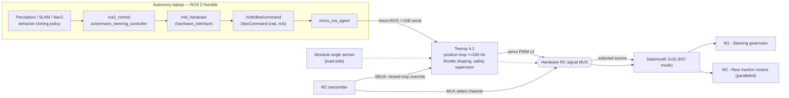
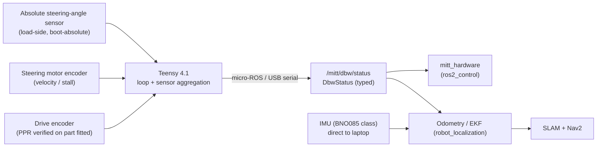
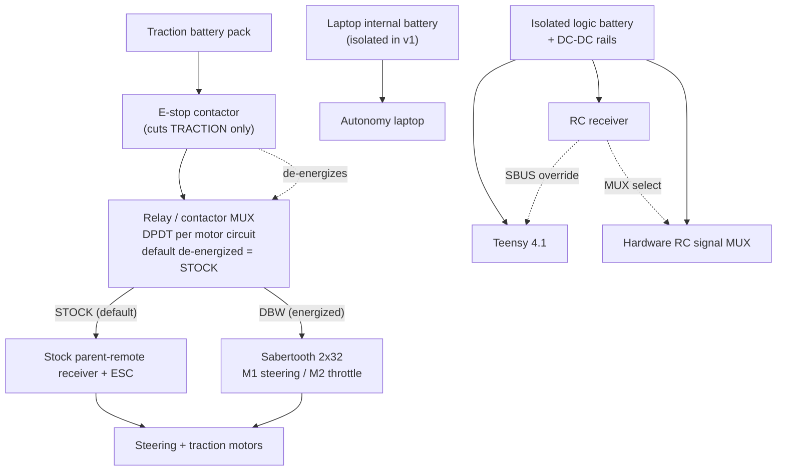

# MRider System Architecture

MRider ("MITT" — Michigan Intelligent Transportation Tech) converts a kids' ride-on
electric vehicle into a drive-by-wire (DBW), self-driving-ready research and education
platform. This document defines the **system architecture**: the command path from the
autonomy laptop down to the motors, the feedback path back up, the power tree, the
safety/authority chain, and the timing contract that binds them together.

It is the top of the design-document tree. Subsystem detail lives in the sibling
documents, cross-linked throughout:
[`dbw.md`](dbw.md) (drive-by-wire core),
[`safety.md`](safety.md) (failsafe matrix, authority arbitration),
[`vehicle.md`](vehicle.md) (chassis selection),
[`sensors.md`](sensors.md) (camera/LiDAR/IMU/GNSS),
[`calibration.md`](calibration.md) (zeroing and extrinsics),
[`software.md`](software.md) (ROS 2 stack),
[`bom.md`](bom.md) (bill of materials),
[`adr-dbw-architecture-review.md`](adr-dbw-architecture-review.md) (how the controller
topology was decided).

**Audience:** researchers reproducing the platform and students learning autonomous-vehicle
engineering. Where a design choice is made, it is recorded as a short ADR
(Decision / Alternatives / Rationale).

---

## 1. Design provenance and reuse posture

MRider is the 4th generation of the author's platform line:
AVCS Kit (IEEE AFRICON 2017) → Ridon Vehicle (Energies 2021) → OSCAR/thesis platform
(2022) → **B-MROVER** (`jrkwon/mrover`, ROS 2 Humble).

The governing principle remains **reuse before invent** — but a
[direct re-reading of the B-MROVER source](adr-dbw-architecture-review.md) established
where the reuse is real and where it was assumed. **Reuse is real** at the chassis
conversion (connector taps, motor selection, shaft-adapter encoder method), the Sabertooth
power stage, and the entire autonomy stack above the vehicle interface —
`robot_localization`, slam_toolbox, Nav2, `data_collection`, and the `neural_net`
behavior-cloning pipeline, all of which are transport-agnostic. **Reuse was weaker than
documented** at the controller: B-MROVER's `carlikebot_system.cpp` is an unmodified upstream
demo stub (F3), its estimator is `robot_localization` on the laptop with PX4 supplying raw
IMU only (F11), and its MAVLink hop happens laptop-side rather than inside PX4 (F5).

**Two genuinely new control problems**, neither of which B-MROVER solves:

1. **A closed-loop steering-angle servo.** B-MROVER has *no steering position control of any
   kind* — the stick maps to a raw effort and the human closes the loop by eye (F2, verified:
   `joystick_control.py:70,75,100-109`; no PID anywhere in the repository). Nav2 commands an
   angle, so this must be built.
2. **Authority arbitration and failsafes.** Previously delegated to PX4; now explicit project
   design, layered across hardware and firmware (§5, [`safety.md`](safety.md)).

**Controller topology.** A **single Teensy 4.1 running micro-ROS** owns all actuation and
low-level sensing, replacing the Pixhawk 6C + Arduino Nano pair of the superseded design.
This is decision **D3**, adopted 2026-08-07 —
[full reasoning, costs, and the conditions of adoption](adr-dbw-architecture-review.md#46-decision-adopted-2026-08-07).
It was chosen because the previous three platform generations fell short on **sensing/feedback
quality and integration complexity**, and the multi-board topology was the principal source
of the second.

All B-MROVER claims below were verified against the local checkout at
`/mnt/data/projects/mrover`; concrete file paths are cited inline.

---

## 2. Component inventory

| # | Component | Role in MRider | B-MROVER lineage |
|---|-----------|----------------|------------------|
| 1 | **Autonomy laptop** | On-board computer. Runs ROS 2 Humble: perception, SLAM, Nav2, EKF, the `micro_ros_agent`, and `ros2_control`. Powered by its own internal battery (no traction→19 V rail in v1). | Same on-board-laptop topology. |
| 2 | **Teensy 4.1 (DBW controller)** | Single MCU owning all actuation and vehicle sensing. Subscribes `DbwCommand`, publishes `DbwStatus` over micro-ROS. Closes the steering **position loop at ≥ 200 Hz**, shapes throttle, reads the absolute angle sensor and both encoders, decodes SBUS, and runs the safety supervisor. Commands the Sabertooth over **servo PWM through the RC signal MUX**. | Replaces both the Pixhawk 6C and the Nano (D3). Encoder-read *logic* traces to `code/code.ino`. |
| 3 | **Sabertooth 2x32** | Dual-channel motor driver. **M1** steering gearmotor, **M2** paralleled rear traction motors. Configured in **independent R/C (PWM) mode**; both signal lines come from the Teensy via the hardware RC signal MUX. | Same as B-MROVER's mode. Packetized serial was briefly adopted and reverted — it cannot coexist with an RC signal MUX ([dbw.md §4](dbw.md#4-adr-sabertooth-control-mode-independent-rc-pwm-teensy-as-both-masters)). |
| 4 | **Relay/contactor MUX** | Authority arbitration. A DPDT relay per motor circuit selects **STOCK** vs **DBW** source. Default (de-energized) = STOCK, so power loss reverts to the parent remote. | New. See [`safety.md`](safety.md). |
| 5 | **Hardware RC signal MUX** | **The condition of D3's adoption.** An RC channel drives a signal multiplexer selecting Teensy output *or* direct RC input into the Sabertooth — making override a *wiring* property, independent of Teensy firmware. | New. Replaces PX4's software RC override with a stronger guarantee ([dbw.md §11.2](dbw.md#112-hardware-rc-signal-mux-the-d3-condition)). |
| 6 | **RC transmitter + receiver** | Two roles: SBUS into the Teensy for normal closed-loop manual override, and a dedicated channel driving the hardware MUX (#5) as the independent fallback. | B-MROVER binds RC to the Pixhawk; here the RX serves both layers directly. |
| 7 | **Absolute steering-angle sensor** | Boot-absolute road-wheel angle, **mounted load-side** (downstream of the steering gearbox) so backlash appears as measured error, not invisible bias. AS5600-class magnetic, pot fallback — [ADR](dbw.md#6-adr-angle-sensor-technology-magnetic-encoder-vs-potentiometer). | New — fixes B-MROVER's incremental-only steering and its runtime auto-ranging (F4). |
| 8 | **IMU (BNO085 class)** | 9-DoF with onboard fusion, straight to the laptop, feeding `robot_localization`. | Replaces the Pixhawk's internal IMU. Note the estimator was *already* `robot_localization` (F11), so this is a driver swap, not an estimator change. |
| 9 | **Motor encoders** | Incremental encoder on the drive-motor shaft for distance/velocity; incremental encoder on the steering motor for velocity/stall. Both on Teensy **hardware quadrature decoders**. | `code/code.ino` method and the shaft-adapter approach. **PPR must be verified on the part fitted** — the source project conflicts with itself (F7). |
| 10 | **Sensors** | Minimum set: one front camera + one 2D LiDAR. Optional GNSS/RTK (phase 2). Detailed in [`sensors.md`](sensors.md). | B-MROVER camera + YDLidar. |
| 11 | **Traction battery pack** | Traction source, feeding the Sabertooth. An **isolated logic rail** supplies the Teensy so motor transients cannot brown it out. Laptop is **not** on this rail in v1. | Same class. |

**Deleted from the superseded design:** Pixhawk 6C, PM02 power module, Arduino Nano,
USB-TTL adapter, the Micro-XRCE-DDS agent, `mavlink_bridge.py`, the `px4_msgs` dependency,
PX4 version pinning, the PWM input-capture firmware block, the ASCII serial protocol, and the
retained I²C register map. See
[adr §4.3](adr-dbw-architecture-review.md#43-what-it-deletes).

---

## 3. Command path (laptop → motors)

The autonomy stack produces a steering angle (radians) and a speed (m/s). Both travel as a
single typed ROS 2 message to the Teensy, which closes the steering loop locally and drives
both Sabertooth channels over one serial link.

**There is exactly one command datapath.** No PWM round trip, no protocol translation, no
second controller. This single-path rule is the pinned
[ADR E datapath](dbw.md#3-adr-e-steering-control-loop-location-the-key-dbw-decision)
and a hard acceptance gate.

**Key command-path facts** (full contract in [`dbw.md §12`](dbw.md#12-numeric-interface-contract)):

- Command stream ≥ 50 Hz; staleness > 500 ms drops the vehicle to `ESTOP`.
- The steering loop runs at ≥ 200 Hz on the Teensy, decoupled from the command rate.
- **The actuation frame rate is an open item, and deliberately visible.** A standard servo
  frame is ~50 Hz, which would cap closed-loop performance regardless of loop rate — the defect
  the superseded design carried unstated. **Measure it at Stage 1 and pin it**
  ([`dbw.md §4`](dbw.md#4-adr-sabertooth-control-mode-independent-rc-pwm-teensy-as-both-masters)).
- The Sabertooth's **R/C signal-loss timeout is inherent in this mode** — motors stop when
  pulses stop, with no configuration. One more layer independent of Teensy firmware.

---

## 4. Feedback path (sensors → ROS 2)

All vehicle feedback aggregates on the Teensy and arrives in ROS 2 as a **typed message** —
no framing to parse, no register map to decode, no MAVLink round trip.

**Key feedback-path facts:**

- Transport: micro-ROS over USB serial, ≥ 50 Hz — the *same* link and the *same* clock as the
  command path. Under the superseded design, command and feedback shared neither, which is
  what made latency and dropout faults hard to localize.
- `DbwStatus` carries measured angle, setpoint, wheel speed, cumulative ticks, mode, and a
  fault bitfield — so a single `ros2 topic echo` shows both sides of the loop.
- Lineage traces to B-MROVER `mrover_control/msg/Control.msg` (fields
  `timestamp, throttle, steer, steer_angle`); MRider extends it with mode and faults.
- The B-MROVER `WHEEL_DISTANCE` → `/rover` path (`mavlink_bridge.py:231-260`) is **not**
  reused; note in particular its runtime min/max auto-ranging (`:47-50`, `:243-250`), which
  rescales past values and makes boot centre arbitrary (F4).

---

## 5. Power tree and safety/authority chain

Power and authority are one diagram because the **relay MUX and E-stop sit on the traction
rail**. Full per-rail current analysis, brownout isolation, and FMEA are in
[`safety.md`](safety.md); this is the block-level view.

**Authority arbitration (safety-critical).** Four layers, three of them independent of Teensy
firmware — see the [authority table](dbw.md#113-authority-layers). The stock parent-remote
receiver and the Sabertooth must never drive the motors simultaneously; the DPDT relay MUX
selects one source per motor circuit, **de-energized default = STOCK**.

**Why the hardware RC MUX exists.** Under a single controller, one MCU would otherwise hold
the steering loop, throttle output, override, and arming — a firmware hang loses all four.
The MUX moves override out of firmware and into wiring, which is a *stronger* guarantee than
the software override the superseded PX4 design relied on. The trade: through the MUX,
override commands raw **effort**, open-loop, rather than an angle. That is acceptable for an
emergency mode — and it is what B-MROVER does in *normal* operation (F2) — but it is a
behavioral change to be re-analysed, not assumed.

**E-stop semantics.** The E-stop cuts **traction power only**, and works with the laptop
powered off and the Teensy hung. The steering column is non-self-centering, so which rail the
steering motor sits on determines freewheel-vs-hold on power loss — specified explicitly in
[`safety.md`](safety.md).

**Power isolation.** The laptop runs on its own battery. The Teensy sits on an **isolated
logic rail** with its own battery and DC-DC conversion, from day one rather than as a
retrofit — motor transients must not reset the controller that holds the safety supervisor.
This replaces the Pixhawk power module's role in the superseded design.

---

## 6. Timing / heartbeat contract

Every control link has a rate and a loss behavior. System-level numbers here; the full numeric
interface contract is pinned in [`dbw.md §12`](dbw.md#12-numeric-interface-contract).

### 6.1 Rates and timeouts

| Link / loop | Direction | Nominal rate | Timeout / failsafe | Owner |
|-------------|-----------|--------------|--------------------|-------|
| Command stream (`DbwCommand`) | laptop → Teensy | **≥ 50 Hz** | staleness > 500 ms → `ESTOP` | Teensy supervisor |
| Steering position loop | Teensy-local | **≥ 200 Hz** | at limit → clamp effort toward center only | Teensy |
| **Actuation frame (→ Sabertooth)** | Teensy → MUX → driver | **measure & pin at Stage 1** | R/C signal-loss timeout → motors stop | Sabertooth |
| Status feedback (`DbwStatus`) | Teensy → laptop | **≥ 50 Hz** | driver flags stale; EKF coasts on IMU | ROS 2 driver |
| IMU | IMU → laptop | **≥ 100 Hz** (EKF input) | EKF degrades; Nav2 slows/stops | robot_localization |
| RC override (SBUS) | RX → Teensy | ~50 Hz | RC-loss → `ESTOP` | Teensy supervisor |
| RC MUX select | RX → signal MUX | ~50 Hz | **hardware path — independent of firmware** | wiring |

### 6.2 Link-loss behavior

| Loss scenario | Detected by | System behavior |
|---------------|-------------|-----------------|
| Command stream stalls (> 500 ms) | Teensy supervisor | `ESTOP`: throttle zeroed, steering centered |
| USB link lost entirely | Teensy (no session) + laptop driver | Teensy → `ESTOP`; `/mitt/dbw/status` stale; Nav2 halts |
| **Teensy firmware hang** | Sabertooth serial timeout | Motors stop. RC MUX still selectable, relay MUX still revertible, E-stop still cuts traction |
| RC link lost | Teensy supervisor | `ESTOP` per failsafe matrix |
| DBW logic power lost | Relay MUX (de-energizes) | Reverts to **STOCK** (parent remote) |
| E-stop pressed | Traction contactor | Traction power cut; steering freewheels/holds per rail assignment |
| Traction brownout | Isolated logic rail | Logic rail holds; controller does not reset |

The full failsafe matrix and FMEA are in [`safety.md`](safety.md).

---

## 7. B-MROVER files reused (verified locally)

| B-MROVER artifact | Path (in `/mnt/data/projects/mrover`) | Reuse in MRider |
|-------------------|----------------------------------------|-----------------|
| Nano firmware | `code/code.ino` | **Encoder-read logic only**, ported to Teensy hardware quadrature decoders. PPR *not* inherited (F7). |
| Control message | `mrover_control/msg/Control.msg` | Lineage for `DbwStatus`; extended with mode + faults. |
| Platform notes | `Note/overview.md`, `projects/vehicle_setup.md` | Vehicle-modification recipe, connector taps, shaft-adapter method ([`vehicle.md`](vehicle.md), [`dbw.md`](dbw.md)). |
| ROS 2 stack config | `config/` (EKF, SLAM, Nav2), `description/ackermann`, `worlds/` | Ported directly — same distro, minimal change ([`software.md`](software.md)). |
| Behavior cloning | `neural_net/`, `data_collection` | Reused intact (phase 2) — sits above the vehicle interface. |
| MAVLink ↔ ROS 2 bridge | `mavlink_bridge.py` | **Not reused.** Reference only, for the ±22.5° range and as the documented example of the auto-ranging defect (F4). |
| `carlikebot_system.cpp` | `dev_ws/src/mrover/hardware/` | **Not reused** — unmodified upstream demo stub with no hardware I/O (F3). |

---

## 8. Architecture ADR (summary)

- **Decision.** Single **Teensy 4.1 + micro-ROS** DBW controller owning actuation and vehicle
  sensing; steering position loop on the Teensy at ≥ 200 Hz against a **load-side absolute
  angle sensor**; Sabertooth in **independent R/C (PWM)** behind the signal MUX; **layered authority** —
  hardware E-stop, relay MUX to STOCK, hardware RC signal MUX, SBUS closed-loop override;
  typed `DbwCommand`/`DbwStatus` on one transport with one clock.
- **Alternatives.** Pixhawk + PX4 with a Nano smart-servo (the superseded design — full trade
  in [the review](adr-dbw-architecture-review.md)); Arduino-only with ASCII serial (no timing
  determinism, unframed protocol); laptop-side or PX4-internal steering loop (latency,
  teachability); dedicated motion-controller hardware (**pre-registered fallback**, E4).
- **Rationale.** The previous three generations fell short on sensing/feedback quality and
  integration complexity. This topology attacks both: absolute load-side sensing removes the
  homing and auto-ranging defects, and collapsing four boards into one removes the integration
  surface. The reuse given up was thinner than documented (F2, F3, F5, F11); the one
  load-bearing thing PX4 provided — RC override — is replaced by a hardware guarantee.
- **Consequences.** Override, arming, and failsafes become project responsibility, layered
  across hardware and firmware. The platform's replication claim now rests on **MRider's own
  measured bring-up numbers** rather than an upstream autopilot's provenance — a heavier
  documentation obligation, accepted deliberately, and the reason §7 of the acceptance
  criteria gates on quantified accuracy. **BOM effect of D3 alone is −$123** (Pixhawk + PM02 +
  Nano + USB-TTL out; Teensy, IMU, hardware RC MUX, and isolated logic rail in); the larger
  −$488 total reduction comes mostly from scoping sensors to semester-1 needs — a deferral,
  not an architectural saving. See
  [`bom.md`](bom.md).

---

*Cross-references:* [`dbw.md`](dbw.md) · [`safety.md`](safety.md) · [`vehicle.md`](vehicle.md) ·
[`sensors.md`](sensors.md) · [`calibration.md`](calibration.md) · [`software.md`](software.md) ·
[`bom.md`](bom.md) · [`adr-dbw-architecture-review.md`](adr-dbw-architecture-review.md)
