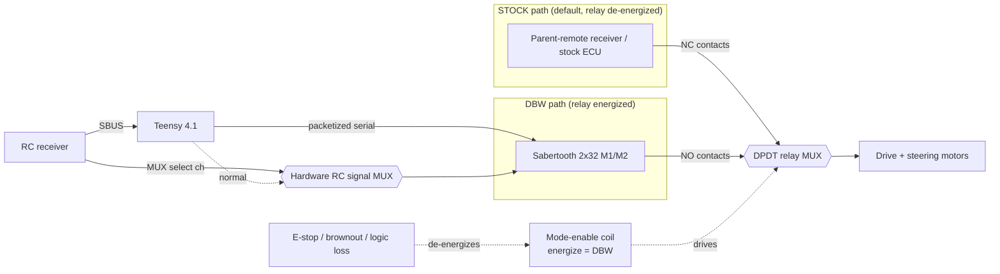

# MRider Drive-By-Wire (DBW) Design

This is the core drive-by-wire design document for MRider. It specifies how a stock kids' ride-on car (MITT) is converted into a computer-steerable, computer-throttled platform.

**Architecture note (2026-08-07).** This document formerly specified a Pixhawk 6C + PX4 + Arduino Nano topology inherited from `jrkwon/mrover`. That topology was superseded by **decision D3** in [adr-dbw-architecture-review.md §4.6](adr-dbw-architecture-review.md#46-decision-adopted-2026-08-07): a **single Teensy 4.1 running micro-ROS** replaces both the flight controller and the Nano. The reasoning, including what the Pixhawk path had going for it, is preserved in that review. What follows is the adopted specification.

MRider still reuses mrover at the layers where mrover is strong — the chassis conversion method, the connector-tap approach, the Sabertooth power stage, and the entire autonomy stack above the vehicle interface. It departs at the controller.

Sibling documents: [architecture.md](architecture.md) (system block diagram, command/feedback flow), [vehicle.md](vehicle.md) (chassis selection), [safety.md](safety.md) (failsafe matrix, authority arbitration, FMEA), [sensors.md](sensors.md), [calibration.md](calibration.md) (zeroing, counts→degrees, ticks→distance), [software.md](software.md) (ROS 2 stack), [bom.md](bom.md).

Read for two audiences: exact numbers and file citations for researchers; short "why" explanations for students. Every design choice is recorded as an ADR with **Decision / Alternatives considered / Rationale / Consequences**.

---

## 1. Scope and reuse baseline

| Layer | mrover (baseline) | MRider | Status |
|---|---|---|---|
| Controller hardware | Pixhawk 6C (PX4) + Arduino Nano | **Teensy 4.1**, single MCU | **REPLACED** (D3) |
| Command transport | laptop → Micro-XRCE-DDS → PX4; MAVLink `MANUAL_CONTROL` emitted laptop-side (`mavlink_bridge.py:79-82`, `:105-126`) | laptop → **micro-ROS over USB serial** → Teensy | **REPLACED** (D3) |
| Steering channel | `MANUAL_CONTROL.roll` → PX4 servo out (`mavlink_bridge.py:123`) | `DbwCommand.steering_angle`, **radians**, read directly by the loop | **REPLACED** |
| Throttle channel | `MANUAL_CONTROL.throttle` (`mavlink_bridge.py:124`) | `DbwCommand.speed` | **REPLACED** |
| Sabertooth drive | 2x32, S1←PX4 PWM pin2, S2←PX4 PWM pin7 (`vehicle_setup.md:54-55`) | 2x32, **packetized serial, single master** | **ADAPTED** (§4) |
| Steering angle sensing | incremental quadrature encoder (`code.ino:36-39`) + relative auto-ranging (`mavlink_bridge.py:243-252`) | **absolute sensor, load-side** + motor incremental encoder | **REPLACED** (ADR B) |
| Steering position loop | **none — open-loop effort, human closes the loop by eye** (verified: `joystick_control.py:70,75,100-109`; no PID in repo) | **Teensy-local closed loop ≥ 200 Hz** | **NEW** (ADR E) |
| Drive distance | encoder on drive shaft (`code.ino:27`), shaft-adapter method (`vehicle_setup.md:70-72`) | same method, wheel-diameter cal | **REUSED** (ADR C) |
| Feedback path | Nano → I²C `0x02` → PX4 module → `WHEEL_DISTANCE` → `Control.msg` | Teensy → **micro-ROS typed `DbwStatus`** | **REPLACED** |
| Chassis conversion, 3-tap harness | connector taps (`vehicle_setup.md:5-23`) | same | **REUSED** (§11) |
| Autonomy stack | `robot_localization`, slam_toolbox, Nav2, `data_collection`, `neural_net` | same | **REUSED** — sits above the vehicle interface, transport-agnostic |

The **NEW** row is the one genuinely new control problem. mrover has no steering position control of any kind; the human closes the loop by eye, which is adequate for teleoperation and inadequate for Nav2, which commands an *angle*.

---

## 2. Steering actuation design

### 2.1 Actuator

The stock steering column is mechanically linked to the front wheels but has **no servo** — it is turned by hand (or, on RC models, by a stock DC gearmotor driven by the parent remote). MRider drives the column with a **DC gearmotor equipped with an incremental encoder**, coupled to the existing steering linkage, and driven by **Sabertooth 2x32 channel 1 (M1 output)**.

!!! note "M1/M2 assignment — intentional departure (resolves finding F6)"

    mrover assigns **M1 = throttle, M2 = steering** (`vehicle_setup.md:51-52`). MRider inverts this: **M1 = steering, M2 = throttle**, consistently across this document, [architecture.md](architecture.md), and §11.3. The swap is deliberate — steering is the channel with the tighter loop and it is kept on channel 1 throughout the documentation set for teachability — and it is recorded here so that anyone reusing an mrover harness or 3D-printed enclosure routing knows the wiring differs.

The gearmotor is sized from a measured column torque (§2.2) with a **≥2× margin**. If a suitable geared DC motor with the required torque and a shaft encoder cannot be sourced, the fallback is a **12 V automotive wiper motor** (high stall torque, built-in worm gearing that resists back-driving) with an external encoder or an absolute sensor on the column — see §2.4.

### 2.2 Torque-measurement procedure (before sizing the gearmotor)

Torque required to steer an unmodified column is unknown and vehicle-specific (tire scrub, caster, king-pin friction). Measure it, do not guess:

1. Put the vehicle on the ground at full load (laptop + LiDAR + payload) so tire scrub torque is realistic. Repeat on the target operating surface (carpet/asphalt).
2. Attach a **spring scale** (fish/luggage scale, 0–20 kg) to the steering-wheel rim (or to the tie-rod arm if driving the linkage directly).
3. Pull tangentially and record the **peak force `F` (N)** needed to turn the wheels from center to full lock **while stationary** (worst case — moving eases it).
4. Compute stall torque at the column: `τ_column = F × r`, where `r` is the lever radius (wheel rim radius, or the effective linkage arm).
5. **Size the gearmotor for ≥ 2 × τ_column** at its rated (not stall) torque, referred through the chosen gear/coupling ratio. The 2× margin covers surface variation, aging friction, and dynamic loads.
6. Record `F`, `r`, `τ_column`, chosen motor, and gear ratio in [calibration.md](calibration.md) and the [bom.md](bom.md) line item.

> Rule of thumb from the ride-on ecosystem: a two-seater on carpet typically needs on the order of a few N·m at the column; a wiper motor (often 10–30 N·m stall) is comfortably oversized, which is why it is the safe fallback.

### 2.3 Why the Sabertooth receives an effort command

The Sabertooth outputs a **bidirectional motor drive** (PWM-controlled H-bridge). The Teensy does not command "go to angle X" to the Sabertooth; it commands a **signed effort** that is the *output* of the Teensy's position loop. Angle regulation lives entirely in the Teensy (ADR E). This keeps the Sabertooth a dumb, fast power stage — exactly its role in mrover.

### 2.4 Wiper-motor fallback

If the encoder-gearmotor path is blocked at build time, substitute a wiper motor on Sabertooth M1. Consequences: (a) the wiper's internal worm gear is largely non-back-drivable, so on power loss the steering **holds** rather than freewheels — this changes the E-stop analysis and **must** be re-evaluated against [safety.md](safety.md); (b) wiper motors rarely have a usable shaft encoder, so the **absolute sensor becomes the sole angle source** and the motor-side incremental encoder (for stall/velocity) is lost — acceptable because ADR B already makes the absolute sensor authoritative.

---

## 3. ADR E — Steering control-loop location (the key DBW decision)

**Decision.** Close the steering **position loop on the Teensy 4.1**, locally, at **≥ 200 Hz**, against the absolute angle sensor. The setpoint arrives as a **typed ROS 2 message** (`DbwCommand.steering_angle`, radians) that the loop reads directly.

**Pinned datapath (exactly one, no alternates):**

```
laptop  /mitt/dbw/command  (DbwCommand, steering_angle in rad)
              │
              │  micro-ROS over USB serial  (micro_ros_agent on the laptop)
              ▼
      Teensy 4.1  ── reads setpoint from the subscription callback
              │  ── closes position loop ≥200 Hz vs. absolute angle sensor
              │  ── outputs signed effort
              ▼
      Sabertooth 2x32  ── packetized serial, M1 → steering gearmotor
```

**What this deletes.** The previous design carried the setpoint through PX4 as a servo-PWM pulse that a second MCU had to capture and decode. That entire round trip — `roll` → servo PWM → PWM input capture → degrees — existed *only* because the setpoint had to cross from PX4 to another board. With one controller the setpoint is a message the loop reads. The PWM input-capture firmware block, the ASCII framing, and the I²C register map all disappear with it.

**Setpoint rate vs. loop rate.** Setpoint refresh (≥ 50 Hz from the laptop) and the control loop (≥ 200 Hz on the Teensy) are decoupled: each iteration uses the most recent setpoint and the current measured angle. A 600 MHz Cortex-M7 with an FPU makes the loop rate a non-constraint; 200 Hz is chosen for margin, not because it is hard.

**Alternatives considered.**

- **E2 — close the loop in the laptop `ros2_control` hardware interface.** The loop would cross USB each cycle, adding latency and jitter that scales with laptop load. Rejected. Note the reuse argument once made for E2 does not exist: mrover's `carlikebot_system.cpp` is the **unmodified upstream demo stub** — namespace `ros2_control_demo_example_11` (`:27`), `read()` echoes the command back as state (`:280`), `write()` only logs (`:304`), both bracketed by the upstream "do not copy to your production code" comment. There is no hardware I/O in it. **Fallback acceptance bound:** if E1 is ever abandoned at build time, E2 is acceptable **only if** measured setpoint→actuation latency is **≤ 30 ms at p95 over ≥ 60 s of logged operation**.
- **E3 — close the loop inside PX4** (custom PX4 module). Moot under D3; retained in the record as rejected — PX4 C++ module work, hardest to teach, couples the controller to PX4 release churn.
- **E4 — dedicated closed-loop motion-controller hardware** (Kangaroo x2 class). **Pre-registered fallback**, not primary: it adds a part and replaces the project's best teaching artifact with a self-tuning black box. See [adr §3.5](adr-dbw-architecture-review.md#35-new-option-e4-dedicated-closed-loop-motion-controller) for the full trade and the verification checklist.

!!! info "E4 trigger (pre-registered)"

    **If, at the end of [bring-up Stage 1](safety.md#6-bring-up-protocol-staged-wheels-off-first), the Teensy loop cannot hold ≤ 1° steady-state error with no sustained oscillation, adopt E4 rather than continuing to tune.** Firmware tuning is unbounded work; this bounds it.

**Rationale.** The one genuinely new control problem is placed in the layer that solves it best: a dedicated MCU with direct, deterministic access to the sensor and the motor driver. It also doubles as the honest core of the education tier ("here is a position controller you can read in 100 lines of C") — and since mrover has no position loop at all (finding F2), there is no prior implementation for students to read instead.

**Consequences.** All actuation and vehicle sensing now terminate on one MCU. That concentrates authority, which is the serious objection to D3 — answered in §11 by making the override a wiring property rather than firmware. Firmware scope is real (PID, limits, watchdog, RC decode, encoder read, micro-ROS) but smaller than it looks: the superseded design was already committed to most of it on a far less capable board.

---

## 4. ADR (Sabertooth control mode) — packetized serial, single master

**Decision.** Configure the Sabertooth 2x32 in **packetized serial mode**, with the **Teensy as the single bus master** addressing both channels over one wire.

| Sabertooth | Driven by | Motor output | Function |
|---|---|---|---|
| Channel 1 | Teensy, packetized serial | M1 | steering gearmotor |
| Channel 2 | Teensy, packetized serial | M2 | drive motors (paralleled) |

**Why this is now available.** The superseded design rejected packetized serial *solely* because two independent masters (Nano for steering, PX4 for throttle) cannot share one bus without an arbiter. **D3 leaves one master**, so the rejection's premise is gone.

**What it fixes.** It closes an open problem the previous design carried: in R/C (PWM) mode the actuation command reaches the driver at the servo frame rate — roughly **50 Hz** with the standard Arduino `Servo` library — so *actuation bandwidth*, not loop rate, set the closed-loop performance ceiling, regardless of a ≥100 Hz control loop. Packetized serial removes that ceiling and gives exact, high-rate commands on both channels.

**Alternatives considered.**

- **Independent R/C (PWM) mode**, one signal line per channel. Still viable and is the fallback if packetized serial proves troublesome at bring-up. Its advantage is the Sabertooth's built-in R/C signal-loss timeout (motors stop when pulses stop) — a free failsafe layer. See the consequence below for how that layer is preserved.
- **Analog mode** (0–5 V). Rejected: coarser, noise-prone, and no timeout behavior.

**Consequences.**

- One Teensy hardware serial port is consumed; signal grounds between Teensy, Sabertooth, and the logic rail must be tied ([architecture.md](architecture.md) power tree).
- **The signal-loss failsafe must be re-established explicitly.** R/C mode gave it for free. In packetized serial the Sabertooth's **serial timeout** must be configured and its behavior verified on hardware — this is a required bring-up check, not an assumption, and it backs [failsafe matrix row 6](safety.md#2-failsafe-matrix).
- Actuation frame rate becomes a pinned number in §12 rather than an unstated consequence of the output library.

!!! warning "Verify at bring-up"

    Confirm on hardware: (a) packetized serial mode is correctly configured via the Sabertooth DIP switches for the chosen baud and address; (b) the serial timeout stops both motors when the Teensy stops transmitting; (c) measured actuation frame rate matches §12. If (b) cannot be established, revert this ADR to independent R/C mode and accept the ~50 Hz ceiling.

---

## 5. ADR B — Steering angle encoding

**Decision.** **Absolute angle sensor on the steering axis**, read by the Teensy, **plus** the steering motor's incremental encoder for velocity and stall detection. The absolute sensor is authoritative for angle; the incremental encoder is auxiliary.

**Mount it load-side.** Where the sensor mounts matters as much as which sensor it is. Mount it **downstream of the steering gearbox** — on the kingpin/road-wheel axis, or on the linkage — not on the motor shaft. Load-side mounting measures what the road wheels actually do, so **gearbox backlash and coupling slip appear as measured error rather than as invisible bias**. Motor-side mounting hides exactly the errors the sensor exists to catch.

**Alternatives considered.**

- **B2 — incremental encoder on the steering motor only** (the mrover recipe). Rejected. It **requires homing on every boot** and loses its absolute reference on any linkage slip or power glitch. mrover's own implementation shows the failure mode concretely: `mavlink_bridge.py:47-50` initializes asymmetric defaults (`min_value=-600`, `max_value=180`), and `:243-250` **expands those bounds at runtime and rescales all past values** — so the reported "center" depends on the range observed so far, and boot centre is arbitrary. This is worse than drift: the mapping changes retroactively.

**Rationale.** Mapping and Nav2 need a repeatable, boot-stable angle. An absolute sensor gives angle-at-power-on with no homing dance and survives linkage slip. Keeping the motor incremental encoder as well costs nothing (the Teensy has four hardware quadrature decoders) and gives free stall/velocity signals.

**Consequences.** Two angle sensors on one axis; fusion is trivial (absolute = truth, incremental = rate). The absolute sensor's mounting and range must match the mechanical travel of the shaft it is on — its own ADR (§6). Calibration gains a "counts→degrees" step ([calibration.md](calibration.md)).

---

## 6. ADR (angle-sensor technology) — magnetic encoder vs. potentiometer

**Decision.** Use an **AS5600-class absolute magnetic rotary encoder** (I²C, 12-bit, contactless), mounted on a shaft whose **total travel stays within one turn** — which, given the load-side mounting of ADR B, is the road-wheel/kingpin axis at **±22.5°**. **Fall back to a single-turn conductive-plastic potentiometer** if no shaft with ≤ 340° of travel is mechanically accessible for a magnet mount.

!!! danger "Bench gate — measure before ordering"

    **Measure the actual lock-to-lock travel of every candidate mounting shaft on the delivered vehicle before committing.** The magnetic encoder is single-turn (0–360° absolute): if the shaft it is on rotates past one turn, it wraps and silently loses absolute meaning — the exact failure class ADR B exists to eliminate. Record the measured travel in [calibration.md](calibration.md). Budget for either part; they are within a few dollars of each other.

**Alternatives considered.**

- **Single-turn potentiometer coupled to the steering column.** This was the previous decision, and it remains the fallback. Its virtue is that it maps monotonically across whatever travel its shaft sees, within one mechanical turn, and it is trivially teachable (voltage ∝ angle). Its drawbacks are wiper wear, analog noise requiring median + low-pass filtering, and a ratiometric-reference dependency so supply drift cancels.
- **Multi-turn magnetic / hall-array absolute encoder.** Solves wrap outright but is markedly more expensive and less student-friendly. Reserved for a future chassis that gears the column past one turn.

**Rationale for flipping the default.** The previous ADR pinned the pot because it feared column wrap — a real hazard when the sensor sits on a geared-down *column*. ADR B moves the sensor **load-side**, where travel is ±22.5° and wrap cannot occur. Once the mounting point is settled, the wrap objection no longer applies and the magnetic encoder's advantages are uncontested: contactless (no wiper to wear at the small, high-duty-cycle oscillations a steering servo makes), digital (no ADC noise, no ratiometric reference, no analog filtering), and 12-bit — roughly 0.09° resolution over a full turn.

**Consequences.** One Teensy I²C bus is consumed. A diametrically-magnetized magnet must be mounted concentric to the sensed shaft, with the air gap held within the sensor's specified range — a mechanical precision requirement the pot does not impose, and the main reason the pot fallback is retained rather than deleted. Check for magnetic interference from the nearby steering motor during bench validation.

---

## 7. Throttle path

The stock vehicle has **two rear drive motors**, electrically **paralleled onto Sabertooth channel 2 (M2 output)**. Throttle command originates as `DbwCommand.speed` and is issued by the Teensy over the same packetized serial link as steering.

The Teensy applies **ramp limiting, a speed cap, and a direction interlock** (no reversal above a threshold speed) before commanding the driver. These were previously PX4's responsibility and are now explicit project firmware — see [safety.md](safety.md).

Paralleling is acceptable because the two motors are mechanically coupled through the ground and share a load; the consequence for **odometry** (only one shaft is instrumented) is handled in ADR C. Verify the **paralleled stall current against the Sabertooth's 32 A/channel rating** in [vehicle.md](vehicle.md); if the pair can exceed 32 A stalled, current-limit in the Sabertooth config or select lower-draw motors.

---

## 8. ADR C — Drive distance encoding

**Decision.** A **quadrature/Hall incremental encoder on the drive-motor shaft** (the mrover **3.15 mm → 5 mm shaft-adapter** method, `vehicle_setup.md:70-72`), read by a Teensy **hardware quadrature decoder**, converted to distance with a wheel-diameter calibration ([calibration.md](calibration.md)). Odometry is **fused with the IMU in the EKF** to bound error.

!!! note "PPR is unverified — resolves finding F7"

    mrover's firmware pins **52 PPR** (`code.ino:27`) while its own BOM lists a **16 PPR** encoder motor (`Note/overview.md` BOM row 2). The conflict is inside the source project, so the number cannot be inherited safely. **Verify PPR on the encoder actually fitted** and record it in [calibration.md](calibration.md). The [roll-out calibration](calibration.md#2-drive-distance-encoder-ticksmeters) is authoritative and bypasses PPR entirely, so the *result* is safe either way — but do not treat 52 as a fact.

**Alternatives considered.**

- **C2 — magnetic ring / hall array on the wheel hub** (true wheel odometry, immune to gearbox backlash and drivetrain slip). Rejected as the default: a **more invasive, per-vehicle mechanical mount** on the hub, against the "minimally invasive" principle. Kept as the upgrade path if odometry proves inadequate against the §12 acceptance bound.

**Rationale.** Instrumenting the motor shaft reuses mrover's proven encoder + adapter method and mounts inside the drivetrain rather than on the wheel. Minimally invasive and cheap.

**Consequences (stated explicitly).** The two rear motors are paralleled on one channel and **only one motor shaft is observed**. Motor-side measurement therefore inherits (a) **gearbox backlash** between encoder and wheel, (b) **wheel slip** and tire deformation, and (c) **differential wheel speed** in turns (only one side measured). These bias raw odometry; `robot_localization` fuses the encoder with the IMU (and GNSS when present) to bound drift. Documented so students understand *why* the odometry is fused rather than trusted raw.

---

## 9. Teensy 4.1 firmware platform and version pinning

- **Controller:** Teensy 4.1 (600 MHz Cortex-M7, FPU, 1024 K RAM). Peripheral budget against MRider's needs: **4 hardware quadrature decoders** (2 used: steering motor, drive shaft), **8 hardware serial ports** (used: Sabertooth packetized serial, SBUS in, debug), **18 analog inputs** (pot fallback), I²C for the AS5600. Everything fits with spare capacity.
- **Toolchain:** PlatformIO with the Teensy platform. Firmware lives in `firmware/mitt_dbw/`.
- **ROS 2 transport:** `micro_ros_arduino`, USB serial, with `micro_ros_agent` on the laptop.

!!! warning "Verify before firmware work"

    - [ ] A `micro_ros_arduino` release exists for **Humble** specifically, with Teensy 4.1 support (the vendor lists Teensy 4.1 as supported under Teensyduino 1.58.x; confirm the Humble pairing).
    - [ ] `micro_ros_arduino` officially provides **USB serial transports only** — native Ethernet is not offered out of the box. Accept USB serial, or scope a custom transport deliberately.
    - [ ] **This link now carries the steering setpoint**, which the superseded design's USB link did not. Re-analyse it against [failsafe matrix row 2](safety.md#2-failsafe-matrix).

    **If no Humble release exists**, the fallback is a framed **binary** protocol with CRC and sequence numbers over the same USB serial link — never unframed ASCII. This keeps every architectural gain of D3 except typed-message convenience.

- **Version pinning:** pin the exact `micro_ros_arduino` release, PlatformIO platform version, and Teensyduino version in [software.md](software.md) so results reproduce. Do not float on `main`. This obligation is heavier than it was under PX4 — see the consequence recorded in [adr §4.6](adr-dbw-architecture-review.md#46-decision-adopted-2026-08-07): the platform's replication claim now rests on MRider's own measured bring-up numbers rather than on an upstream autopilot's provenance.

---

## 10. Teensy firmware interface

### 10.1 Primary transport — micro-ROS typed messages

Two topics form the entire vehicle interface. There is no ASCII protocol to parse and no I²C register map to decode; both existed in the superseded design only to move data into ROS 2 by hand.

**`/mitt/dbw/command` — `mitt_msgs/DbwCommand` (laptop → Teensy, ≥ 50 Hz):**

| Field | Type | Notes |
|---|---|---|
| `stamp` | `builtin_interfaces/Time` | command origin time |
| `steering_angle` | `float32` | **radians**, road-wheel angle, clamped to ±22.5° (±0.3927 rad) |
| `speed` | `float32` | m/s, signed |

**`/mitt/dbw/status` — `mitt_msgs/DbwStatus` (Teensy → laptop, ≥ 50 Hz):**

| Field | Type | Notes |
|---|---|---|
| `stamp` | `builtin_interfaces/Time` | measurement time |
| `steering_angle` | `float32` | radians, measured absolute, load-side |
| `steering_setpoint` | `float32` | radians, what the loop is currently tracking |
| `wheel_speed` | `float32` | m/s from the drive encoder |
| `drive_ticks` | `int32` | cumulative, for odometry |
| `mode` | `uint8` | `ESTOP` / `MANUAL_RC` / `AUTONOMOUS` |
| `faults` | `uint16` | bitfield: encoder fault, setpoint-stale, at-limit, stall, RC-loss, over-current |

Diagnostic/config traffic (PID gains, zeroing) uses ROS 2 **parameters and services**, not a side-channel.

### 10.2 Firmware blocks

1. **micro-ROS node**: publisher, subscriber, session time synchronisation. Session sync replaces the MAVLink `TIMESYNC` offset estimation the superseded design needed — see [calibration.md](calibration.md) §6.
2. **Absolute-sensor read**: AS5600 over I²C (or ADC + median/low-pass for the pot fallback), counts→radians per [calibration.md](calibration.md).
3. **Position PID** at ≥ 200 Hz: error = setpoint − measured, output = signed effort.
4. **Motor output**: packetized serial to the Sabertooth, both channels, at the §12 frame rate.
5. **Throttle shaping**: ramp limit, speed cap, direction interlock.
6. **RC decode**: SBUS on a hardware serial port — mode switch and closed-loop manual override.
7. **Safety supervisor**: setpoint-staleness watchdog, mechanical-limit clamp (effort toward center only), stall detection, hardware watchdog timer resetting outputs to neutral.

### 10.3 Safety state machine

```
        ┌──────────┐  E-stop released + RC arm
        │  ESTOP   │◄──────────────────────────┐
        └────┬─────┘                           │
             │                          E-stop / RC kill /
             ▼                          setpoint stale / watchdog
        ┌──────────┐  RC mode switch          │
        │MANUAL_RC │◄────────────┐            │
        └────┬─────┘             │            │
             │ RC mode switch    │            │
             ▼                   │            │
        ┌──────────┐─────────────┘            │
        │AUTONOMOUS│───────────────────────────┘
        └──────────┘
```

Invariants:

- Any transition into `ESTOP` zeroes throttle and centers steering immediately.
- `AUTONOMOUS` requires a live `DbwCommand` stream; staleness > 500 ms drops to `ESTOP`.
- RC override is honored from any state within 200 ms.
- **These invariants are firmware, and firmware can hang.** They are the *inner* layer only; §11 provides the independent outer layers.

---

## 11. Authority arbitration — relay MUX and hardware RC signal MUX

### 11.1 Purpose

Two independent mechanisms, neither of which depends on Teensy firmware being alive.

The stock parent-remote receiver and the Sabertooth **cannot both drive the motors at once**. A **DPDT relay/contactor MUX** selects STOCK vs. DBW mode per motor circuit. **Default (de-energized) = STOCK**, so any power or logic failure reverts to the safe, factory-controlled vehicle.

### 11.2 Hardware RC signal MUX — the D3 condition

!!! danger "Not optional"

    D3's adoption is **conditional** on this. Under a single controller, one MCU otherwise holds the steering loop, the throttle output, RC override, and arming — a firmware hang loses all four at once. The layered override is what makes that objection answerable, and it must be built.

**Layer 1 (normal): SBUS into the Teensy.** RC override in `MANUAL_RC` mode commands an *angle*, with the position loop still closed behind it. This is the everyday manual mode and it is better than raw effort.

**Layer 2 (independent): a hardware RC signal MUX.** A dedicated RC channel drives a **signal multiplexer** that selects either Teensy output *or* direct RC input into the Sabertooth. This makes override a **wiring property, not a firmware property** — a stronger guarantee than the software override the superseded PX4 design relied on.

**The trade, stated plainly.** Through Layer 2 the override commands raw **effort**, open-loop — not an angle. That is a behavioral change from Layer 1 and from the superseded design, and it must be re-analysed rather than assumed. It is nonetheless exactly what mrover does in normal operation (finding F2), and it is acceptable for an emergency mode.

### 11.3 Authority layers

| Layer | Authority | Independent of Teensy firmware? |
|---|---|---|
| Hardware E-stop → contactor | 1 (highest) | **Yes** — hardwired, cuts traction power |
| Relay MUX → STOCK | 2 | **Yes** — de-energize-to-safe |
| **Hardware RC signal MUX** | 3 | **Yes** — signal-path selection, no firmware |
| SBUS override into the Teensy | 4 | No — closed-loop, normal manual mode |
| Sabertooth serial timeout | — | **Yes** — motors stop when the Teensy stops transmitting (§4, verify at bring-up) |
| Teensy hardware watchdog | — | Internal; resets outputs to neutral |

A total Teensy failure still leaves: motors stopped (serial timeout), authority revertible (relay MUX), traction cuttable (E-stop), and steering under human control (RC MUX).

### 11.4 MUX diagram



- **NC contacts** route the **stock** controller to the motors when the coil is de-energized.
- **NO contacts** route the **Sabertooth** to the motors when the coil is energized (DBW mode).
- Any event that drops the coil (E-stop, logic-rail brownout, deliberate mode switch) reverts to STOCK.

### 11.5 3-tap connector spec (minimally invasive)

Following mrover's connector-tap approach (`vehicle_setup.md:5-23`), three inline connectors let MRider intercept the stock harness reversibly:

| Tap | Intercepts | MUX side | Notes |
|---|---|---|---|
| **Throttle tap** | stock throttle motor leads | NC→stock ECU, NO→Sabertooth M2 | paralleled rear motors (§7) |
| **Steering tap** | stock steering motor leads | NC→stock ECU, NO→Sabertooth M1 | MRider adds the gearmotor if the column had none. **Note the M1/M2 inversion vs. mrover — §2.1.** |
| **Power tap** | main battery pack | feeds Sabertooth B+ and the isolated logic rail | fused; brownout isolation per [safety.md](safety.md) |

All three are keyed inline connectors so the stock wiring is restorable without cutting. Unplug the three taps and the vehicle is factory-stock.

---

## 12. Numeric interface contract

The pinned, testable contract for the DBW interface.

| Parameter | Value | Source / rationale |
|---|---|---|
| Steering angle range (road wheels) | **±22.5°** (±0.3927 rad) | inherited working range; verify against measured mechanical lock-to-lock |
| Steering command | `DbwCommand.steering_angle`, **radians**, clamped to range | §10.1 |
| Throttle command | `DbwCommand.speed`, **m/s**, signed | §10.1 |
| Steering position loop rate | **≥ 200 Hz** on the Teensy | ADR E |
| **Actuation frame rate (Teensy→Sabertooth)** | **≥ 200 Hz**, packetized serial | §4 — pinned explicitly; this was the previously unpinned ceiling |
| Command stream rate (laptop→Teensy) | **≥ 50 Hz** | §10.1 |
| Command-staleness failsafe | **> 500 ms** → `ESTOP`, throttle zeroed, steering centered | §10.3 |
| Feedback rate (Teensy→laptop) | **≥ 50 Hz** | odometry/telemetry needs |
| RC override response | **≤ 200 ms** from any state | §11 |
| E-stop traction cut | **≤ 200 ms**, works with laptop powered off | [safety.md](safety.md) |
| Absolute sensor resolution | **12-bit** over one turn (AS5600 class) | §6 |
| Drive encoder resolution | **verify on the encoder fitted** — do not inherit 52 | §8, finding F7 |
| Sabertooth mode | **packetized serial**, single master (Teensy) | §4 |
| Steering steady-state accuracy | **≤ 1.0°** error, RMS **≤ 1.5°** over ±20° sweep | acceptance gate; E4 trigger if unmet |
| Steering step response | 10° step to 90% in **≤ 400 ms**, overshoot **≤ 15%** | acceptance gate |
| Odometry drift | **≤ 2%** of distance over 20 m straight | acceptance gate |

---

## 13. Cross-checks and open follow-ups

- **Bench gate:** measured lock-to-lock travel of each candidate sensor shaft → confirms magnetic vs. pot (§6). **Before ordering.**
- Torque measurement on the actual chassis → gearmotor spec and wiper-motor fallback decision (§2.2).
- Paralleled drive-motor stall current vs. Sabertooth 32 A/channel → [vehicle.md](vehicle.md).
- **Sabertooth serial timeout behavior** verified on hardware → backs [failsafe row 6](safety.md#2-failsafe-matrix); revert §4 to R/C mode if unverifiable.
- `micro_ros_arduino` Humble availability and USB-serial transport acceptance → §9.
- Hardware RC signal MUX part selection and wiring → §11.2. **Blocks the safety chain build.**
- Drive encoder PPR on the part actually fitted → §8 (finding F7).
- Steering-motor power-rail assignment (freewheel vs. hold on E-stop) → [safety.md](safety.md).

**Citation verification.** Every mrover claim cited in this document was verified against the local checkout at `/mnt/data/projects/mrover` during the [architecture review](adr-dbw-architecture-review.md), which re-read the source directly rather than arguing from the design side. Two findings from that review corrected earlier drafts of this document: `carlikebot_system.cpp` is an unmodified demo stub (F3), and mrover has no steering position control at all (F2).
