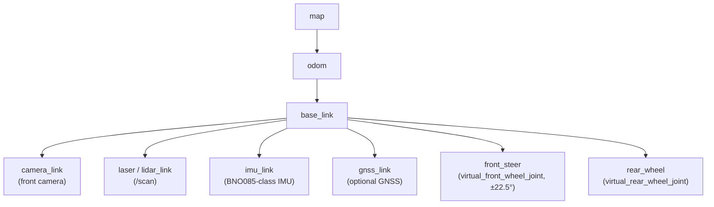
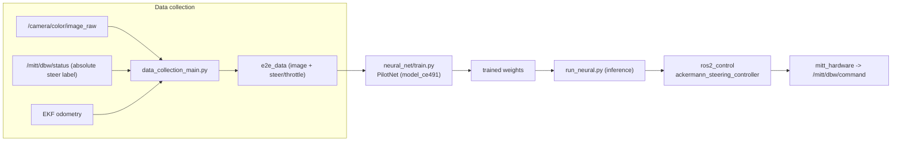

# MRider Software Design

This document specifies the **ROS 2 software stack** for MRider: which B-MROVER
(`jrkwon/mrover`) packages are reused verbatim, which are adapted, and which are new; the
topic/interface contract between the autonomy laptop and the vehicle; the TF tree and
Ackermann kinematics; the SLAM / Nav2 / EKF configuration plan; and the data-collection +
end-to-end neural-network pipeline for behavior cloning.

It is a sibling of [`architecture.md`](architecture.md) (system architecture),
[`dbw.md`](dbw.md) (drive-by-wire + numeric interface contract),
[`safety.md`](safety.md), [`sensors.md`](sensors.md), [`calibration.md`](calibration.md),
[`vehicle.md`](vehicle.md), and [`bom.md`](bom.md).

**Target:** ROS 2 **Humble** on Ubuntu 22.04 (B-MROVER's validated distro), vehicle interface
via **micro-ROS**. All reuse claims were verified against the local checkout at
`/mnt/data/projects/mrover`; file paths are cited inline.

---

## 1. Reuse posture

The guiding rule is **reuse before invent** — applied honestly. A
[direct re-reading of the B-MROVER source](adr-dbw-architecture-review.md) established which
reuse claims hold and which did not survive contact with the code.

**Reuse that is real, and carries most of MRider's autonomy.** `robot_localization` EKF,
slam_toolbox mapping, Nav2 navigation, the URDF/xacro Ackermann structure, the Gazebo worlds,
the data-collection recorder, and the Keras end-to-end training/inference pipeline. All of it
sits **above** the vehicle interface and is transport-agnostic, so the controller change
below does not touch it. Same distro (Humble), so these port with minimal change.

**Three things change:**

1. **The controller topology** — a single **Teensy 4.1 running micro-ROS** replaces the
   Pixhawk 6C + Arduino Nano pair ([D3](adr-dbw-architecture-review.md#46-decision-adopted-2026-08-07)).
   This retires `mavlink_bridge.py`, the `px4_msgs` dependency, and the XRCE agent from the
   command path (ADR-SW1).
2. **The vehicle interface** — typed `DbwCommand`/`DbwStatus` on one transport with one clock,
   replacing the split MAVLink-command / I²C-feedback arrangement.
3. **Kinematic and frame parameters** — re-parameterized for the chassis, and three B-MROVER
   config artifacts corrected (§4).

!!! warning "One reuse claim was withdrawn (finding F3)"

    Earlier drafts marked the `ros2_control` hardware interface **REUSE**, citing B-MROVER's
    `carlikebot_system.cpp`. That file is the **unmodified upstream demo stub**: namespace
    `ros2_control_demo_example_11` (`:27`), `read()` assigns
    `state.position = command.position` — echoing the command back as state (`:280`) — and
    `write()` only calls `RCLCPP_INFO` (`:304`). Both are bracketed by the upstream comment
    *"This part here is for exemplary purposes - Please do not copy to your production code"*.
    **There is no hardware I/O in it**, so B-MROVER's `steering_position_controller` is wired
    to a mock. What was reusable is an interface *shape*, not working code. That row is now
    **NEW**.

---

## 2. ROS 2 stack: reused / adapted / new

Legend: **REUSE** = used essentially as-is; **ADAPT** = kept but reconfigured/retargeted;
**NEW** = MRider-authored.

| Subsystem | B-MROVER artifact (verified path) | Status | MRider change |
|-----------|-----------------------------------|--------|---------------|
| MAVLink ↔ ROS 2 command bridge | `dev_ws/src/mrover/mrover/mavlink_bridge.py:79-126` | **RETIRED** | Not used. Note the path it implemented was **MAVLink emitted laptop-side** (`:79-82`, `:105-126` call `mav.manual_control_send()` over its own `mavutil` connection), not XRCE-to-PX4 as earlier diagrams showed (finding F5). Retained as reference for the ±22.5° range only. |
| **Encoder feedback path** | `mavlink_bridge.py:231-260` (`wheel_distance_callback_mavlink`) → `Control` on `/rover` (`:76`) | **RETIRED** | Replaced by typed `DbwStatus` over micro-ROS. Its runtime auto-ranging (`:47-50`, `:243-250`) expands min/max *during operation* and rescales past values, with asymmetric defaults (`-600`, `180`) making boot centre arbitrary (F4) — a defect to avoid, not a design to inherit. |
| Micro-XRCE-DDS agent | `agent_config.xml` (domainId 10) | **REPLACED** | `micro_ros_agent` (USB serial transport) instead. Must be **built from source** via `micro_ros_setup` — not available in the Humble apt repositories. |
| PX4 message set | `dev_ws/src/px4_msgs/` | **RETIRED** | Replaced by `mitt_msgs` (`DbwCommand`, `DbwStatus`). Dependency removed entirely. |
| Robot-localization EKF | `dev_ws/src/mrover/config/ekf.yaml` | **ADAPT** | Reuse dual-EKF structure (local `odom` + global `map`+GPS) and `two_d_mode`; retarget inputs (§4), fix magnetic declination. **Note this was already the estimator** — PX4 supplied raw IMU only (F11) — so removing PX4 changes the IMU *driver*, not the estimator. |
| SLAM (slam_toolbox) | `dev_ws/src/mrover/config/slam/mapper_params_online_async.yaml` | **ADAPT** | Reuse CeresSolver online-async mapping; reconcile `base_frame` (§4.1). |
| Nav2 | `dev_ws/src/mrover/config/slam/nav2_params.yaml` | **ADAPT** | Reuse NavFn planner + costmaps; re-evaluate DWB controller for Ackermann (§4.3); re-parameterize `robot_radius`/velocities. |
| ros2_control hardware interface | `dev_ws/src/mrover/hardware/carlikebot_system.cpp` | **NEW** (was mis-marked REUSE — F3) | `mitt_hardware`: a real `hardware_interface` bridging `ros2_control` to the micro-ROS `DbwCommand`/`DbwStatus` topics. B-MROVER's file is an unmodified demo stub with no hardware I/O — see the §1 warning. The reusable part is the *interface shape*: front steer = **position**, rear drive = **velocity**. |
| ros2_control **sim** interface | — | **REUSE (upstream)** | `gz_ros2_control` in simulation. The same controller stack and configs run in sim and on hardware; only this plugin swaps. This is what makes the twin a development vehicle rather than a demo. |
| Ackermann controller | `dev_ws/src/mrover/config/ackermann/carlike_controllers.yaml` | **REPLACE with upstream** | Use `ackermann_steering_controller` from `ros2_controllers` (`ros-humble-ackermann-steering-controller`, available from apt) rather than B-MROVER's fork of `ros2_control_demo_example_11`. |
| Bicycle steering controller | `dev_ws/src/mrover/config/ackermann/carlike_controllers.yaml` | **ADAPT** | `BicycleSteeringController`; re-parameterize `wheelbase`/`wheel_radius` for real chassis (§3.2). |
| URDF / xacro | `dev_ws/src/mrover/description/ackermann/robot_core2_urdf.xacro` | **ADAPT** | Reuse Ackermann structure; replace placeholder dimensions with measured chassis values (§3.2). |
| LiDAR driver | `dev_ws/src/ydlidar_ros2_driver/`, `config/ydlidar_params.yaml` | **REUSE/ADAPT** | Reuse if YDLidar retained; swap driver if a different LiDAR is chosen ([`sensors.md`](sensors.md)). |
| Data-collection recorder | `dev_ws/src/data_collection/data_collection/data_collection_main.py:69-71` | **ADAPT** | Reuse ROS 2 recorder (Control + Odometry + Image); retarget `vehicle_control_topic` to `/mitt/dbw/status`. Phase 2. |
| End-to-end NN training | `neural_net/net_model.py`, `neural_net/train.py`, `drive_train.py` | **REUSE** | Keras PilotNet-class models unchanged. Phase 2. |
| End-to-end NN inference | `dev_ws/src/run_neural/run_neural/run_neural.py` (+ `run_neural_rn.py`) | **REUSE** | Runtime inference node. Phase 2. |
| Teensy firmware | `code/code.ino` | **PORT (logic only)** | Encoder-read logic ported to Teensy hardware quadrature decoders. **PPR not inherited** — the source conflicts with itself (52 PPR in `code.ino:27` vs 16 PPR in its own BOM), so it must be verified on the part fitted (F7). The I²C register map and ASCII prints are dropped. |
| Vehicle interface messages | `mrover_control/msg/Control.msg` | **ADAPT** | `mitt_msgs/DbwCommand`, `DbwStatus` — lineage from `Control.msg` (`timestamp, throttle, steer, steer_angle`), extended with setpoint, ticks, mode, and a fault bitfield. |
| Odometry node | — | **NEW** | Bicycle-model odometry from `DbwStatus` (steer angle + drive ticks) → `wheel/odometry` for the EKF. |
| Validation bench | — | **NEW** | `mitt_bench`: scripts producing the quantified acceptance numbers (steering accuracy, odometry drift, latency). See §8. |

### ADR-SW1 — One transport, one clock, typed messages

- **Decision.** The entire vehicle interface is two typed micro-ROS topics —
  `/mitt/dbw/command` and `/mitt/dbw/status` — over a single USB serial link to the Teensy.
  Retire the MAVLink command path, the `WHEEL_DISTANCE` feedback path, the ASCII serial
  protocol, and the I²C register map.
- **Alternatives.** (a) The superseded split arrangement: MAVLink command via PX4, feedback via
  a separate Nano→I²C/USB path. (b) A hand-rolled framed binary protocol on the same link
  (**retained as the fallback** if no Humble `micro_ros_arduino` release exists — see
  [`dbw.md §9`](dbw.md#9-teensy-41-firmware-platform-and-version-pinning)).
- **Rationale.** Under the split arrangement, command and feedback shared **neither a clock nor
  a transport**. A symptom observed at the ROS layer could originate in any of four subsystems,
  and no single log contained both sides of the loop — which is precisely the "integration
  complexity" the lab diagnosed as a root cause of the previous generations falling short.
  One transport with one clock makes `ros2 topic echo` authoritative and `ros2 bag` complete.
- **Consequence.** The link now carries the **steering setpoint** as well as feedback, so a USB
  dropout removes the setpoint — a genuine regression analysed and accepted in
  [safety.md failsafe row 2](safety.md#2-failsafe-matrix). USB session stability is a Stage 0
  measured gate, not an assumption.

---

## 3. Interfaces, topics, and kinematics

### 3.1 Topic / interface contract

| Topic | Type | Direction | Notes |
|-------|------|-----------|-------|
| `/mitt/dbw/command` | `mitt_msgs/DbwCommand` | `mitt_hardware` → Teensy (micro-ROS) | `steering_angle` (**rad**), `speed` (m/s). ≥ 50 Hz; staleness > 500 ms → `ESTOP`. |
| `/mitt/dbw/status` | `mitt_msgs/DbwStatus` | Teensy → stack (micro-ROS) | Measured angle, setpoint, wheel speed, cumulative ticks, mode, fault bitfield. ≥ 50 Hz. |
| `/imu/data` | `sensor_msgs/Imu` | IMU driver → EKF | BNO085-class, direct to laptop. EKF `imu0`. |
| `/scan` | `sensor_msgs/LaserScan` | LiDAR → SLAM | slam_toolbox `scan_topic: /scan`. |
| `/camera/color/image_raw` | `sensor_msgs/Image` | camera → recorder/NN | Data-collection default (`config/data_collection/rover_template.yaml`). |
| `wheel/odometry` | `nav_msgs/Odometry` | odometry node → EKF | Bicycle model from `DbwStatus`. EKF `odom0` (`ekf.yaml`). |
| `odometry/gps` | `nav_msgs/Odometry` | navsat → map-EKF | EKF `odom1` (global). Phase 2. |

Nav2 and the behavior-cloning policy both drive `ros2_control`'s
`ackermann_steering_controller`, which reaches the vehicle through `mitt_hardware` — so
teleop, Nav2, and the learned policy all use **the same single datapath**, in both simulation
and hardware.

**Message lineage.** `DbwStatus` descends from `dev_ws/src/mrover_control/msg/Control.msg`,
whose verified fields are:

```
uint64  timestamp     # microseconds since system start
float64 throttle
float64 steer
float64 steer_angle
```

MRider retains `timestamp` and `steer_angle` (now **radians**, from the absolute load-side
sensor) and adds `steering_setpoint`, `wheel_speed`, `drive_ticks`, `mode`, and `faults`.
Full field tables are in [`dbw.md §10.1`](dbw.md#101-primary-transport-micro-ros-typed-messages).

### 3.2 Ackermann kinematic parameters

The chassis is **TBD** ([`vehicle.md`](vehicle.md)), so kinematics are **parameterized**.
B-MROVER's values are the reference model, to be replaced with measured values after purchase
and set once in [`calibration.md`](calibration.md).

| Parameter | B-MROVER reference (verified) | Source | MRider action |
|-----------|-------------------------------|--------|---------------|
| Steering range | **±22.5°** | `robot_core2_urdf.xacro:26` (`steer_limit_deg=22.5`); cross-confirmed by the bridge count→±22.5° map (`mavlink_bridge.py:251-253`) and `steering_angle_max: 22.5` (`config/data_collection/rover_template.yaml`) | Keep as design target; re-verify mechanical limit on real column ([`calibration.md`](calibration.md)). |
| Wheelbase | `0.325` m (controller) / placeholder `1.3` m chassis in URDF | `carlike_controllers.yaml:13`; `robot_core2_urdf.xacro:15` | Measure on real chassis; set `wheelbase`. |
| Track (wheel separation) | `wheel_separation_w = 0.4` m (sim placeholder) | `robot_core2_urdf.xacro:9-10` | Measure; set track. |
| Wheel radius | `0.1397` m | `robot_core2_urdf.xacro:19` | Measure; also drives `robot_radius` sanity in Nav2. |
| Steer joint type | `revolute`, limits ±22.5° | `robot_core2_urdf.xacro:148-156` (`virtual_front_wheel_joint`) | Keep. |
| Drive joint type | `continuous` | `robot_core2_urdf.xacro:187-193` (`virtual_rear_wheel_joint`) | Keep. |

> **Note (honest caveat):** B-MROVER's URDF mixes a simulation chassis (`chassis_length=1.3`)
> with a much smaller controller `wheelbase=0.325`; these are simulation artifacts, not a
> real measurement. MRider treats **all** dimensions as placeholders until measured. The one
> value that is consistent across three independent files — the **±22.5° steering range** — is
> adopted as the design target.

### 3.3 TF tree

MRider follows REP-105: `map` → `odom` → `base_link` → sensor frames. The `map`→`odom`
transform is published by the global (map) EKF / SLAM; `odom`→`base_link` by the local EKF;
sensor frames are static (URDF).



Extrinsics (camera/LiDAR → `base_link`), IMU alignment, and steering zero are established in
[`calibration.md`](calibration.md).

---

## 4. SLAM / Nav2 / EKF configuration plan

Grounded in B-MROVER's existing configs, with three specific corrections MRider must make.

### 4.1 robot_localization EKF — `config/ekf.yaml`

B-MROVER runs a **dual-EKF** setup (verified):

- `ekf_filter_node` (local): `world_frame: odom`, fuses `odom0: wheel/odometry` (vx, vy,
  vyaw) and `imu0: imu/data` (yaw, vyaw, ax). `two_d_mode: true`, `frequency: 30.0`,
  `sensor_timeout: 0.1`, frames `map`/`odom`/`base_link`.
- `ekf_filter_node_map` (global): `world_frame: map`, adds `odom1: odometry/gps` (x, y) plus
  a `navsat_transform` node for GNSS fusion.

**MRider plan:**
- Keep the dual-EKF structure and `two_d_mode` (planar ride-on).
- Retarget `odom0: wheel/odometry` to odometry derived from `/mitt/dbw/status` (bicycle model
  from steer angle + drive ticks) — a new odometry node performs the conversion.
- Keep `imu0: imu/data`, now sourced from the **BNO085-class IMU driver** directly. Note this
  is a *driver* swap only: B-MROVER's estimator was already `robot_localization` with PX4
  supplying raw `sensor_combined` (finding F11), so the fusion structure is unchanged.
- **Correction:** `navsat_transform.magnetic_declination_radians` is set for **Lisbon** in
  B-MROVER (`ekf.yaml`, `# For lat/long of Lisbon, Portugal`). MRider must set the local
  (Ann Arbor) declination — tracked in [`calibration.md`](calibration.md). GNSS is optional
  ([`sensors.md`](sensors.md)); the map-EKF runs GNSS-free until a receiver is added.

### 4.2 slam_toolbox — `config/slam/mapper_params_online_async.yaml`

Verified: `solver_plugin: CeresSolver`, `mode: mapping`, `odom_frame: odom`, `map_frame: map`,
`scan_topic: /scan`, `resolution: 0.05`, `max_laser_range: 10.0`, `transform_publish_period:
0.02`.

**MRider plan:** reuse as-is for mapping; switch `mode` to `localization` (with a saved map)
for repeat runs. **Correction:** `base_frame: base_footprint` here, but the EKF uses
`base_link`. MRider must reconcile these to one convention (recommend `base_link` throughout,
or add a static `base_link`→`base_footprint` transform) so TF stays consistent.

### 4.3 Nav2 — `config/slam/nav2_params.yaml`

Verified plugins: controller `FollowPath: dwb_core::DWBLocalPlanner` (`max_vel_x: 0.26`,
`max_vel_theta: 1.0`, `max_vel_y: 0.0`), planner `GridBased: NavfnPlanner`
(`expected_planner_frequency: 20.0`), recoveries `spin`/`back_up`/`wait`, `robot_radius:
0.1397`.

**MRider plan:** reuse NavFn planner and costmap layers; re-parameterize `robot_radius` and
velocity limits for the real (larger) chassis. **Design note (ADR-SW2 below):** DWB is a
diff-drive/omni-oriented local planner; on a true Ackermann vehicle with a ±22.5° steering
limit, a curvature-aware controller (e.g., Regulated Pure Pursuit) is often a better fit.
MRider keeps DWB as the reused default for first bring-up and flags RPP as the evaluation
alternative.

#### ADR-SW2 — Nav2 local controller for Ackermann

- **Decision.** Start with B-MROVER's DWB (reuse), evaluate Regulated Pure Pursuit as a
  swap after basic navigation works.
- **Alternatives.** DWB only (max reuse, but ignores the non-holonomic turning constraint);
  RPP from the start (better kinematic fit, less directly reused).
- **Rationale.** Reuse-first for bring-up velocity; the ±22.5° minimum-turn-radius constraint
  is real and may make DWB paths infeasible, so RPP is pre-registered as the fallback with a
  concrete trigger (path-tracking error or infeasible commands during turning tests).

---

## 5. Data collection + end-to-end NN pipeline

MRider reuses B-MROVER's behavior-cloning pipeline nearly verbatim.

### 5.1 Data collection

`dev_ws/src/data_collection/data_collection/data_collection_main.py` (ROS 2) subscribes
(verified `:69-71`):

- `Control` on `vehicle_control_topic` (steering + throttle label),
- `Odometry` on `base_pose_topic` (pose/velocity),
- `Image` on `camera_image_topic` (front camera),

and records synchronized samples to `e2e_data`. Config
`config/data_collection/rover_template.yaml` sets `camera_image_topic:
/camera/color/image_raw`, `vehicle_control_topic: /rover`, `steering_angle_max: 22.5`, and the
image crop/size.

**MRider change:** retarget `vehicle_control_topic` from `/rover` to **`/mitt/dbw/status`**
(the steering-angle-labeled source), and `base_pose_topic` to the EKF odometry output.
The legacy ROS 1 `data_collection_board.py` (rospy / `ScoutControl`) is **not** used.

!!! note "Phase 2"

    Behavior cloning is deferred out of semester 1 (§8). It is documented here because the
    pipeline is reused intact and the **label quality depends on the DBW work**: B-MROVER's
    steering labels came from a runtime-auto-ranged incremental encoder whose zero drifts
    (F4), which is a poor training signal. MRider's absolute load-side angle is a materially
    better label, and that is a research contribution in its own right.

### 5.2 End-to-end model

`neural_net/net_model.py` defines Keras models (verified): `model_ce491` is the classic
PilotNet architecture (Conv 24→36→48→64→64 with a normalization `Lambda x/127.5−1.0`, then
Dense 100→50→10→`num_outputs`), plus `model_agribot` and `model_jaerock` variants and a
ResNet inference path (`run_neural_rn.py`). Config `config/neural_net/rover_template.yaml`:
`num_outputs: 1` (steering; optionally throttle), input image `160×160×3`, selectable
`network_type`.

**Pipeline (reused):** `neural_net/train.py` / `drive_train.py` train from `e2e_data`;
`dev_ws/src/run_neural/run_neural/run_neural.py` runs inference at drive time. In MRider the
inference output drives the **same `ros2_control` stack** as Nav2 and teleop, so the learned
policy uses the exact single pinned datapath ([`dbw.md`](dbw.md)) — and can be exercised in
simulation first, because the twin and the vehicle differ only in the `hardware_interface`
plugin.



---

## 6. Toolchain, environment, and version pinning

### 6.1 Verified on the lab machine

| Component | Status |
|---|---|
| Ubuntu 22.04.5, ROS 2 Humble | installed |
| `slam_toolbox`, `nav2_bringup`, `ros_gz`, `controller_manager` | installed |
| `ackermann_steering_controller`, `gz_ros2_control`, `robot_localization`, `rplidar_ros`, `joint_state_broadcaster` | available from apt |
| `micro_ros_agent` | **not in apt** — build from source via `micro_ros_setup` |
| Gazebo | **Harmonic (gz-sim 8.14.0) installed**; Humble's apt `ros_gz` (0.244.x) and `gz_ros2_control` (0.7.x) target **Fortress** |

### 6.2 Gazebo pairing — RESOLVED 2026-08-08

!!! success "Closed. Humble + Harmonic works, and the gate was narrower than written."

    This section previously treated the whole Gazebo stack as at risk, and advised against a
    source build. Both halves turned out to be wrong, in opposite directions.

    **`ros_gz` was never the problem.** The lab machine has
    **`ros-humble-ros-gzharmonic` 0.244.12** — OSRF publishes a Harmonic-paired variant under
    that name, distinct from the Fortress-targeted `ros-humble-ros-gz-*`. Bridge, sim and
    interfaces all work against Harmonic out of the box.

    **`gz_ros2_control` was the whole gate.** There is *no* Harmonic build of it for Humble in
    apt — only 0.7.20, which targets Fortress. Since [ADR-SW4](#7-software-adr-summary) makes
    the shared controller stack the entire justification for the twin, that package had to be
    built from source:

    ```bash
    cd ros2_ws/src && git clone -b humble https://github.com/ros-controls/gz_ros2_control.git
    cd .. && GZ_VERSION=harmonic colcon build --packages-select gz_ros2_control
    ```

    It builds cleanly — all `libgz-sim8-dev` headers were already present — and the resulting
    plugin links against **`libgz-sim8`**, confirming Harmonic. Verified by running the twin:
    both controllers activate and `slam_toolbox` maps the depot world.

    Set `COLCON_IGNORE` in `gz_ros2_control_demos`, `gz_ros2_control_tests`,
    `ign_ros2_control` and `ign_ros2_control_demos` — the demos need `control_toolbox`
    (absent, and unnecessary), and the `ign_*` packages are the Fortress variants.

    **The advice not to source-build was wrong for this package specifically.** It was written
    to protect the schedule, and would instead have cost the twin its main property.
    A one-package source build is not the same risk as forking `ros_gz`.

### 6.2.1 RMW: use FastRTPS, not CycloneDDS — open issue

`~/.bashrc` sets `RMW_IMPLEMENTATION=rmw_cyclonedds_cpp`. CycloneDDS is installed and works
for ordinary topics and services, but **the twin does not come up under it.**

`controller_manager` runs inside the Gazebo process (the `gz_ros2_control` plugin), and the
spawner's calls to `/controller_manager/list_controllers` never receive a *response*:

```
Failed getting a result from calling /controller_manager/list_controllers in 10.0.
(Attempt 1 of 3.)
```

The service is discovered and the model spawns; only the reply fails to arrive. Under
FastRTPS everything works — both controllers activate, odometry runs at ~100 Hz, and
`slam_toolbox` maps the world.

**Workaround:** `source ros2_ws/setup_env.sh` in every terminal. It must be consistent across
the whole session — setting the RMW only for the launch would leave your `ros2 topic list` on
CycloneDDS and unable to see any of the sim's topics, which looks like a dead simulator.

**Unresolved, and worth someone's time:** `ip link show lo` reports `LOOPBACK` **without**
`MULTICAST`, and CycloneDDS discovers via multicast by default. A unicast/loopback
`CYCLONEDDS_URI` config is the obvious next thing to try; it was drafted but not conclusively
tested before this was parked. Enabling multicast on `lo` is the other candidate. Until then
FastRTPS is the supported configuration for the twin, and that should be stated in the build
docs rather than left for the next person to rediscover.

### 6.3 Version pinning

Pin and record: the `micro_ros_arduino` release, the PlatformIO Teensy platform version,
Teensyduino version, ROS 2 package versions for the controllers, and the Gazebo pairing chosen
in §6.2. Do not float on `main`.

This obligation is **heavier than it was under PX4**, and deliberately so. As recorded in
[adr §4.6](adr-dbw-architecture-review.md#46-decision-adopted-2026-08-07), the platform's
replication claim no longer rests on an upstream autopilot's provenance — it rests on MRider's
own pinned toolchain and its measured bring-up numbers (§8).

### 6.4 Fallbacks

- **No Humble `micro_ros_arduino` release** → framed **binary** protocol with CRC and sequence
  numbers over the same USB serial link. Never unframed ASCII. Keeps every architectural gain
  of D3 except typed-message convenience.
- **Steering loop cannot meet accuracy at bring-up Stage 1** → adopt the pre-registered E4
  motion-controller fallback rather than tuning without bound
  ([`dbw.md §3`](dbw.md#3-adr-e-steering-control-loop-location-the-key-dbw-decision)).
- **Actuation frame rate caps below what the loop needs** → accept it and restate the loop
  figure as a sampling rate, per option 2 of the
  [§4 warning](dbw.md#4-adr-sabertooth-control-mode-independent-rc-pwm-teensy-as-both-masters).
  Packetized serial is *not* an available escape — it cannot coexist with the RC signal MUX.

---

## 7. Software ADR summary

| ID | Decision | Rationale |
|----|----------|-----------|
| ADR-SW1 | One transport, one clock: typed `DbwCommand`/`DbwStatus` over micro-ROS; retire MAVLink, ASCII framing, and the I²C register map | The split command/feedback arrangement shared neither clock nor transport, which is what made faults unlocalizable. |
| ADR-SW2 | Nav2: DWB first (reuse), RPP as pre-registered Ackermann swap | Reuse-first bring-up; ±22.5° turn constraint may need a curvature-aware controller. |
| ADR-SW3 | `mitt_hardware` is **NEW**, not reused | B-MROVER's `carlikebot_system.cpp` is an unmodified demo stub with no hardware I/O (F3). Only the interface *shape* was reusable. |
| ADR-SW4 | Same `ros2_control` stack in sim and on hardware; only the plugin swaps (`gz_ros2_control` ↔ `mitt_hardware`) | Makes the twin a real development vehicle and gives sim-to-real parity by construction rather than by discipline. |
| — | Reuse EKF/SLAM/Nav2/NN configs, re-parameterize for real chassis | These carry most of MRider's autonomy and are transport-agnostic, so D3 does not touch them. |
| — | Pin the full toolchain (§6.3); three named fallbacks (§6.4) | Reproducibility now rests on MRider's own pinning, not upstream provenance. |

**Config corrections MRider must make (found during verification):**

1. SLAM `base_frame: base_footprint` vs EKF `base_link` — reconcile to one convention (§4.2).
2. `navsat_transform` magnetic declination set for Lisbon — set local (Ann Arbor) value (§4.1).
3. Nav2 DWB controller — re-evaluate for Ackermann kinematics (§4.3).
4. Treat **all** B-MROVER URDF dimensions as placeholders until measured (§3.2 caveat), and
   **do not inherit 52 PPR** — the source project conflicts with itself (F7).

---

## 8. Semester-1 scope and software acceptance gates

Semester 1 (~14 weeks, 1–3 students) commits to a **trustworthy DBW, a working twin, and an
indoor SLAM map**. Nav2 autonomous goal-seeking is the stretch. **Deferred to phase 2:**
outdoor GNSS waypoint following, the `docs/learn/` course kit, and behavior cloning.

The scoping rationale is that the previous generations did not fall short on planning or
perception — so the semester's prize is a vehicle whose feedback can be *believed*, evidenced
by numbers. Autonomy on trustworthy feedback is comparatively fast; autonomy on untrustworthy
feedback is what burned the earlier attempts.

**Two tracks run in parallel from week 1**, because a simulator structurally cannot test
backlash, encoder noise, USB latency, or motor stall — the layers that actually failed:

| Weeks | Track A — Twin (no hardware needed) | Track B — Hardware |
|---|---|---|
| 1–4 | Settle the Gazebo pairing (§6.2); build `micro_ros_agent` from source; scaffold `ros2_ws`; port `mitt_description` Ackermann URDF with parameterized dimensions; `gz_ros2_control` + `ackermann_steering_controller`; joystick teleop in sim | **Bench gate: measure steering-shaft travel before ordering** ([dbw.md §6](dbw.md#6-adr-angle-sensor-technology-magnetic-encoder-vs-potentiometer)); order parts; steering spike — AS5600 + PID on the bench, no ROS ([safety.md Stage 0–1](safety.md#6-bring-up-protocol-staged-wheels-off-first)) |
| 5–8 | `mitt_hardware` plugin; odometry node; EKF bring-up | micro-ROS on the Teensy; throttle shaping; **both override layers demonstrated** (Stage 2); relay MUX + E-stop (Stage 3); teleop on the real vehicle (Stage 5) |
| 9–11 | Feed measured values back into the twin so sim and real agree within 10% | `mitt_bench` validation — the numbers below |
| 12–14 | Nav2 params for the real chassis | LiDAR + camera, TF/extrinsics, `slam_toolbox` hallway map |

### Software acceptance gates

- [ ] `colcon build && colcon test` clean; twin teleop launch runs headless in a scripted check
- [ ] `ros2 topic hz /mitt/dbw/status` sustains **≥ 50 Hz**; **zero USB session dropouts over ≥ 30 min** (safety.md row 2)
- [ ] Joystick → wheel motion latency **≤ 100 ms at p95**
- [ ] Identical teleop launch runs in sim and on hardware, differing **only** in the `hardware_interface` plugin (ADR-SW4)
- [ ] Twin's steering range, rate limit, wheelbase, and command latency match measured hardware within **10%**
- [ ] Odometry: translational drift **≤ 2%** of distance over 20 m straight; heading error **≤ 5°** after a closed 20 m figure-8
- [ ] `slam_toolbox` closes a **≥ 30 m** hallway loop; repeated observations of the same wall agree within **≤ 10 cm**; map loads in Nav2 without manual editing
- [ ] All numbers recorded in `docs/build/` — this report *is* the replication claim (§6.3)

Hardware and safety gates are in [`dbw.md §12`](dbw.md#12-numeric-interface-contract) and
[`safety.md`](safety.md).

---

*Cross-references:* [`architecture.md`](architecture.md) · [`dbw.md`](dbw.md) ·
[`safety.md`](safety.md) · [`sensors.md`](sensors.md) · [`calibration.md`](calibration.md) ·
[`vehicle.md`](vehicle.md) · [`bom.md`](bom.md)
